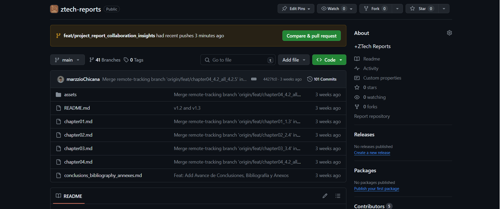
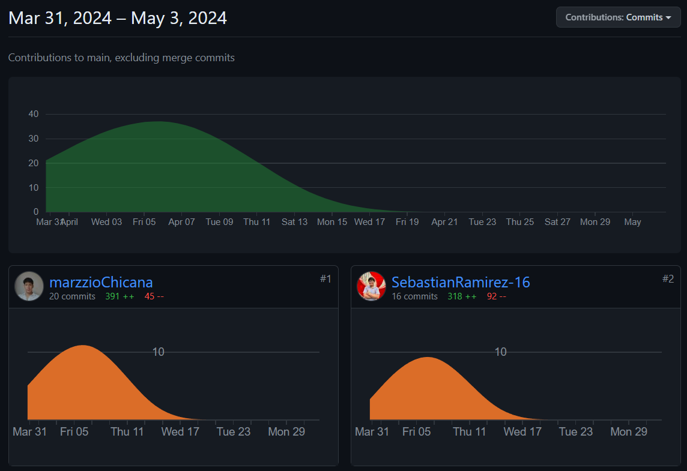
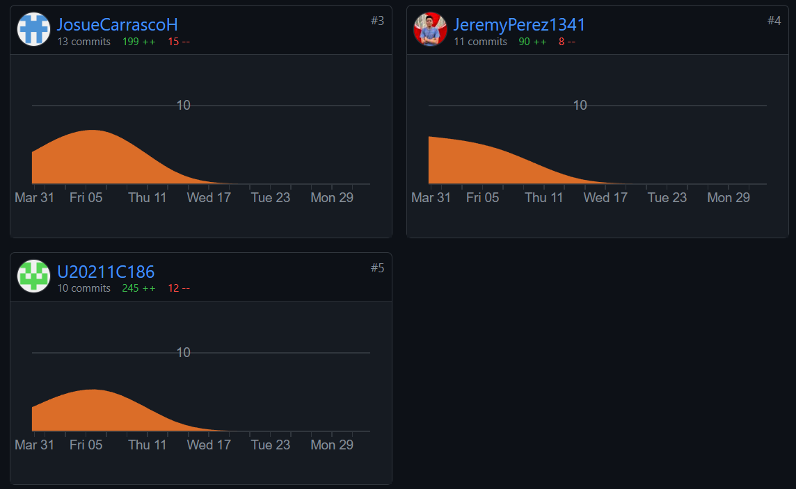

### Universidad Peruana de Ciencias Aplicadas
### SI572 | WS71 | Desarrollo de Soluciones IoT
### Profesor: Angel Augusto Velasquez Nuñez
### Ingeniería de Software
.
# ZTech
### TB1 REPORT - LOS CHIFEROS
================================
#### Team members
- Chicana Romero, Marzzio Braulio (U202022228)
- Pastrana León, Aldo Francisco (U20211C186)
- Carrasco Hernandez, Florentino Josue (U202020727)
- Ramirez Zapata, Sebastián Jesús (U20201C031)
- Perez Pizarro, Pedro Jeremy (U202022237)

#### Ciclo 2024-01

---
# Registro de Versiones del Informe
| 
Versión
 | 
Fecha
 | 
Autor
 | Descripción de modificación |
|:---------:|:-------:|:-------:|-----------------------------|
| **v1.1** | 04-04-2024 | Los Chiferos | Para esta versión, hemos priorizado los capítulos que abordan directamente la startup, el problema a resolver y el producto que se planea desarrollar. Además, hemos definido con mayor claridad los segmentos objetivos y hemos llevado a cabo un proceso de investigación para identificar las necesidades del mercado, conocido como "needfinding". |
| **v1.2** | 08-04-2024 | Los Chiferos | Para esta versión, hemos procedido a actualizar los user persona centrándonos en los resultados de nuestras entrevistas. Además, el equipo llevó a cabo una sesión de "event storming" con el fin de definir el dominio y los contextos acotados de nuestra solución. |
| **v1.3** | 13-04-2024 | Los Chiferos | Para esta versión, hemos desarrollado la arquitectura de software utilizando diagramas de contexto y contenedores. Además, hemos llevado a cabo una exhaustiva verificación de errores y hemos actualizado puntos previamente identificados. |
| **v2.1** | 25-04-2024 | Los Chiferos | Para esta versión, hemos realizado correciones en puntos como el Lean UX, entrevistas y EventStorming guiándonos del feedback que nos dió el profesor. Además, hemos verificado y corregido diversos errores. |
| **v2.2** | 03-05-2024 | Los Chiferos | Para esta versión, hemos desarrollado la Landing Page y una versión inicial de nuestra Aplicación Web junto a un fake api usando json-server. También, realizamos el primer sprint junto al despliegue de la Landing Page y la Aplicación Web. |
| **v3.1** | 31-05-2024 | Los Chiferos | Para esta versión, nos centramos en desarrollar la aplicacion web de nuestro proyecto, realizamos varios features. Cada integrante participo en el desarrollo de la aplicacion. |
| **v3.2** | 07-06-2024 | Los Chiferos | Para esta versión, el equipo se enfoco en hacer el desarrollo del web service, mobile application y embedded application. No se logro terminar al 100% las aplicacion, pero tenemos un gran avance de cada una. |
---
# Project Report Collaboration Insights

**Project Report**

Link: https://github.com/LosChiferos-WS71/ztech-reports

TB1: El equipo ha abordado con éxito los puntos requeridos para la entrega solicitada. Durante el proceso de adaptación al entorno documental, nos enfrentamos a algunos desafíos al estructurar y convertir el archivo. Sin embargo, a pesar de estos contratiempos, nos complace informar que logramos alcanzar los objetivos establecidos.

TP: En el marco de la segunda entrega, el equipo ha consolidado una mayor destreza en la elaboración del informe mediante el uso de Markdown, capitalizando la versatilidad de esta interfaz para integrar código HTML. Nos complace informar que hemos cumplido de manera integral con los puntos requeridos en el entregable. Además, es importante destacar que se ha registrado un progreso sustancial tanto en la optimización de la página de inicio como en el desarrollo de la aplicación web.

> Analíticos para el TP

---
# Contenido
- [Capítulo I: Introducción](/chapter01.md#capítulo-i-introducción)
  - [1.1. Startup Profile](/chapter01.md#11-startup-profile)
    - [1.1.1. Descripción de la Startup](/chapter01.md#111-descripción-de-la-startup)
    - [1.1.2. Perfiles de integrantes del equipo](/chapter01.md#112-perfiles-de-integrantes-del-equipo)
  - [1.2. Solution Profile](/chapter01.md#12-solution-profile)
    - [1.2.1 Antecedentes y problemática](/chapter01.md#121-antecedentes-y-problemática)
    - [1.2.2 Lean UX Process](/chapter01.md#122-lean-ux-process)
      - [1.2.2.1. Lean UX Problem Statements](/chapter01.md#1221-lean-ux-problem-statements)
      - [1.2.2.2. Lean UX Assumptions](/chapter01.md#1222-lean-ux-assumptions)
      - [1.2.2.3. Lean UX Hypothesis Statements](/chapter01.md#1223-lean-ux-hypothesis-statements)
      - [1.2.2.4. Lean UX Canvas](/chapter01.md#1224-lean-ux-canvas)
  - [1.3. Segmentos objetivo](/chapter01.md#13-segmentos-objetivo)
- [Capítulo II: Requirements Elicitation \& Analysis](/chapter02.md#capítulo-ii-requirements-elicitation--analysis)
  - [2.1. Competidores](/chapter02.md#21-competidores)
    - [2.1.1. Análisis competitivo](/chapter02.md#211-análisis-competitivo)
    - [2.1.2. Estrategias y tácticas frente a competidores](/chapter02.md#212-estrategias-y-tácticas-frente-a-competidores)
  - [2.2. Entrevistas](/chapter02.md#22-entrevistas)
    - [2.2.1. Diseño de entrevistas](/chapter02.md#221-diseño-de-entrevistas)
    - [2.2.2. Registro de entrevistas](/chapter02.md#222-registro-de-entrevistas)
    - [2.2.3. Análisis de entrevistas](/chapter02.md#223-análisis-de-entrevistas)
  - [2.3. Needfinding](/chapter02.md#23-needfinding)
    - [2.3.1. User Personas](/chapter02.md#231-user-personas)
    - [2.3.2. User Task Matrix](/chapter02.md#232-user-task-matrix)
    - [2.3.3. User Journey Mapping](/chapter02.md#233-user-journey-mapping)
    - [2.3.4. Empathy Mapping](/chapter02.md#234-empathy-mapping)
    - [2.3.5. As-is Scenario Mapping](/chapter02.md#235-as-is-scenario-mapping)
  - [2.4. Ubiquitous Language](/chapter02.md#24-ubiquitous-language)
- [Capítulo III: Requirements Specification](/chapter03.md#capítulo-iii-requirements-specification)
  - [3.1. To-Be Scenario Mapping](/chapter03.md#31-to-be-scenario-mapping)
  - [3.2. User Stories](/chapter03.md#32-user-stories)
  - [3.3. Impact Mapping](/chapter03.md#33-impact-mapping)
  - [3.4. Product Backlog](/chapter03.md#34-product-backlog)
- [Capítulo IV: Solution Software Design](/chapter04.md#capítulo-iv-solution-software-design)
  - [4.1. Strategic-Level Domain-Driven Design](/chapter04.md#41-strategic-level-domain-driven-design)
    - [4.1.1. EventStorming](/chapter04.md#411-eventstorming)
      - [4.1.1.1 Candidate Context Discovery](/chapter04.md#4111-candidate-context-discovery)
      - [4.1.1.2 Domain Message Flows Modeling](/chapter04.md#4112-domain-message-flows-modeling)
      - [4.1.1.3 Bounded Context Canvases](/chapter04.md#4113-bounded-context-canvases)
    - [4.1.2. Context Mapping](/chapter04.md#412-context-mapping)
    - [4.1.3. Software Architecture](/chapter04.md#413-software-architecture)
      - [4.1.3.1. Software Architecture System Landscape Diagram](/chapter04.md#4131-software-architecture-system-landscape-diagram)
      - [4.1.3.2. Software Architecture Context Level Diagrams](/chapter04.md#4132-software-architecture-context-level-diagrams)
      - [4.1.3.3. Software Architecture Container Level Diagrams](/chapter04.md#4133-software-architecture-container-level-diagrams)
      - [4.1.3.4. Software Architecture Deployment Diagrams](/chapter04.md#4134-software-architecture-deployment-diagrams)
  - [4.2. Tactical-Level Domain-Driven Design](/chapter04.md#42-tactical-level-domain-driven-design)
    - [4.2.1. Bounded Context: Account](/chapter04.md#421-bounded-context-account)
      - [4.2.1.1. Domain Layer](/chapter04.md#4211-domain-layer)
      - [4.2.1.2. Interface Layer](/chapter04.md#4212-interface-layer)
      - [4.2.1.3. Application Layer](/chapter04.md#4213-application-layer)
      - [4.2.1.4. Infrastructure Layer](/chapter04.md#4214-infrastructure-layer)
      - [4.2.1.5. Bounded Context Software Architecture Component Level Diagrams](/chapter04.md#4215-bounded-context-software-architecture-component-level-diagrams)
      - [4.2.1.6. Bounded Context Software Architecture Code Level Diagrams](/chapter04.md#4216-bounded-context-software-architecture-code-level-diagrams)
        - [4.2.1.6.1. Bounded Context Domain Layer Class Diagrams](/chapter04.md#42161-bounded-context-domain-layer-class-diagrams)
        - [4.2.1.6.2. Bounded Context Database Design Diagram](/chapter04.md#42162-bounded-context-database-design-diagram)
    - [4.2.2. Bounded Context: Inventory](/chapter04.md#422-bounded-context-inventory)
      - [4.2.2.1. Domain Layer](/chapter04.md#4221-domain-layer)
      - [4.2.2.2. Interface Layer](/chapter04.md#4222-interface-layer)
      - [4.2.2.3. Application Layer](/chapter04.md#4223-application-layer)
      - [4.2.2.4. Infrastructure Layer](/chapter04.md#4224-infrastructure-layer)
      - [4.2.2.5. Bounded Context Software Architecture Component Level Diagrams](/chapter04.md#4225-bounded-context-software-architecture-component-level-diagrams)
      - [4.2.2.6. Bounded Context Software Architecture Code Level Diagrams](/chapter04.md#4226-bounded-context-software-architecture-code-level-diagrams)
        - [4.2.2.6.1. Bounded Context Domain Layer Class Diagrams](/chapter04.md#42261-bounded-context-domain-layer-class-diagrams)
        - [4.2.2.6.2. Bounded Context Database Design Diagram](/chapter04.md#42262-bounded-context-database-design-diagram)
    - [4.2.3. Bounded Context: Flowerpot](/chapter04.md#423-bounded-context-flowerpot)
      - [4.2.3.1. Domain Layer](/chapter04.md#4231-domain-layer)
      - [4.2.3.2. Interface Layer](/chapter04.md#4232-interface-layer)
      - [4.2.3.3. Application Layer](/chapter04.md#4233-application-layer)
      - [4.2.3.4. Infrastructure Layer](/chapter04.md#4234-infrastructure-layer)
      - [4.2.3.5. Bounded Context Software Architecture Component Level Diagrams](/chapter04.md#4235-bounded-context-software-architecture-component-level-diagrams)
      - [4.2.3.6. Bounded Context Software Architecture Code Level Diagrams](/chapter04.md#4236-bounded-context-software-architecture-code-level-diagrams)
        - [4.2.3.6.1. Bounded Context Domain Layer Class Diagrams](/chapter04.md#42361-bounded-context-domain-layer-class-diagrams)
        - [4.2.3.6.2. Bounded Context Database Design Diagram](/chapter04.md#42362-bounded-context-database-design-diagram)
    - [4.2.4. Bounded Context: Claim](/chapter04.md#424-bounded-context-claim)
      - [4.2.4.1. Domain Layer](/chapter04.md#4241-domain-layer)
      - [4.2.4.2. Interface Layer](/chapter04.md#4242-interface-layer)
      - [4.2.4.3. Application Layer](/chapter04.md#4243-application-layer)
      - [4.2.4.4. Infrastructure Layer](/chapter04.md#4244-infrastructure-layer)
      - [4.2.4.5. Bounded Context Software Architecture Component Level Diagrams](/chapter04.md#4245-bounded-context-software-architecture-component-level-diagrams)
      - [4.2.4.6. Bounded Context Software Architecture Code Level Diagrams](/chapter04.md#4246-bounded-context-software-architecture-code-level-diagrams)
        - [4.2.4.6.1. Bounded Context Domain Layer Class Diagrams](/chapter04.md#42461-bounded-context-domain-layer-class-diagrams)
        - [4.2.4.6.2. Bounded Context Database Design Diagram](/chapter04.md#42462-bounded-context-database-design-diagram)
    - [4.2.5. Bounded Context: IOT Solution](/chapter04.md#425-bounded-context-iot-solution)
      - [4.2.5.1. Domain Layer](/chapter04.md#4251-domain-layer)
      - [4.2.5.2. Interface Layer](/chapter04.md#4252-interface-layer)
      - [4.2.5.3. Application Layer](/chapter04.md#4253-application-layer)
      - [4.2.5.4. Infrastructure Layer](/chapter04.md#4254-infrastructure-layer)
      - [4.2.5.5. Bounded Context Software Architecture Component Level Diagrams](/chapter04.md#4255-bounded-context-software-architecture-component-level-diagrams)
      - [4.2.5.6. Bounded Context Software Architecture Code Level Diagrams](/chapter04.md#4256-bounded-context-software-architecture-code-level-diagrams)
        - [4.2.5.6.1. Bounded Context Domain Layer Class Diagrams](/chapter04.md#42561-bounded-context-domain-layer-class-diagrams)
        - [4.2.5.6.2. Bounded Context Database Design Diagram](/chapter04.md#42562-bounded-context-database-design-diagram)    
- [Capítulo V: Solution UI/UX Design](/chapter05.md#capítulo-v-solution-uiux-design)
  - [5.1. Style Guidelines](/chapter05.md#51-style-guidelines)
    - [5.1.1. General Style Guidelines](/chapter05.md#511-general-style-guidelines)
    - [5.1.2. Web, Mobile and IoT Style Guidelines](/chapter05.md#512-web-mobile-and-iot-style-guidelines)
  - [5.2. Information Architecture](/chapter05.md#52-information-architecture)
    - [5.2.1. Organization Systems](/chapter05.md#521-organization-systems)
    - [5.2.2. Labeling Systems](/chapter05.md#522-labeling-systems)
    - [5.2.3. SEO Tags and Meta Tags](/chapter05.md#523-seo-tags-and-meta-tags)
    - [5.2.4. Searching Systems](/chapter05.md#524-searching-systems)
    - [5.2.5. Navigation Systems](/chapter05.md#525-navigation-systems)
  - [5.3. Landing Page UI Design](/chapter05.md#53-landing-page-ui-design)
    - [5.3.1. Landing Page Wireframe](/chapter05.md#531-landing-page-wireframe)
    - [5.3.2. Landing Page Mock-up](/chapter05.md#532-landing-page-mock-up)
  - [5.4. Applications UX/UI Design](/chapter05.md#54-applications-uxui-design)
    - [5.4.1. Applications Wireframes](/chapter05.md#541-applications-wireframes)
    - [5.4.2. Applications Wireflow Diagrams](/chapter05.md#542-applications-wireflow-diagrams)
    - [5.4.3. Applications Mock-ups](/chapter05.md#543-applications-mock-ups)
    - [5.4.4. Applications User Flow Diagrams](/chapter05.md#544-applications-user-flow-diagrams)
  - [5.5. Applications Prototyping](/chapter05.md#55-applications-prototyping)
- [Capítulo VI: Product Implementation, Validation & Deployment](/chapter06.md#capítulo-vi-product-implementation-validation--deployment)
  - [6.1. Software Configuration Management](/chapter06.md#61-software-configuration-management)
    - [6.1.1. Software Development Environment Configuration](/chapter06.md#611-software-development-environment-configuration)
    - [6.1.2. Source Code Management](/chapter06.md#612-source-code-management)
    - [6.1.3. Source Code Style Guide & Conventions](/chapter06.md#613-source-code-style-guide--conventions)
    - [6.1.4. Software Deployment Configuration](/chapter06.md#614-software-deployment-configuration)
  - [6.2. Landing Page, Services & Applications Implementation](/chapter06.md#62-landing-page-services--applications-implementation)
    - [6.2.1. Sprint 1](/chapter06.md#621-sprint-1)
      - [6.2.1.1. Sprint Planning 1](/chapter06.md#6211-sprint-planning-1)
      - [6.2.1.2. Sprint Backlog 1](/chapter06.md#6212-sprint-backlog-1)
      - [6.2.1.3. Development Evidence for Sprint Review](/chapter06.md#6213-development-evidence-for-sprint-review)
      - [6.2.1.4. Testing Suite Evidence for Sprint Review](/chapter06.md#6214-testing-suite-evidence-for-sprint-review)
      - [6.2.1.5. Execution Evidence for Sprint Review](/chapter06.md#6215-execution-evidence-for-sprint-review)
      - [6.2.1.6. Services Documentation Evidence for Sprint Review](/chapter06.md#6216-services-documentation-evidence-for-sprint-review)
      - [6.2.1.7. Software Deployment Evidence for Sprint Review](/chapter06.md#6217-software-deployment-evidence-for-sprint-review)
      - [6.2.1.8. Team Collaboration Insights during Sprint](/chapter06.md#6218-team-collaboration-insights-during-sprint)
    - [6.2.2. Sprint 2](/chapter06.md#622-sprint-2)
      - [6.2.2.1.Sprint Planning 2](/chapter06.md#6221-sprint-planning-2)
      - [6.2.2.2.Sprint Backlog 2](/chapter06.md#6222-sprint-backlog-2)
      - [6.2.2.3.Development Evidence for Sprint Review](/chapter06.md#6223-development-evidence-for-sprint-review)
      - [6.2.2.4.Testing Suite Evidence for Sprint Review](/chapter06.md#6224-testing-suite-evidence-for-sprint-review)
      - [6.2.2.5.Execution Evidence for Sprint Review](/chapter06.md#6225-execution-evidence-for-sprint-review)
      - [6.2.2.6.Services Documentation Evidence for Sprint Review](/chapter06.md#6226-services-documentation-evidence-for-sprint-review)
      - [6.2.2.7.Software Deployment Evidence for Sprint Review](/chapter06.md#6227-software-deployment-evidence-for-sprint-review)
      - [6.2.2.8.Team Collaboration Insights during Sprint](/chapter06.md#6228-team-collaboration-insights-during-sprint)
    - [6.2.3. Sprint 3](/chapter06.md#623-sprint-3)
      - [6.2.3.1. Sprint Planning 3](/chapter06.md#6231-sprint-planning-3)
      - [6.2.3.2. Sprint Backlog 3](/chapter06.md#6232-sprint-backlog-3)
      - [6.2.3.3. Development Evidence for Sprint Review](/chapter06.md#6233-development-evidence-for-sprint-review)
      - [6.2.3.4. Testing Suite Evidence for Sprint Review](/chapter06.md#6234-testing-suite-evidence-for-sprint-review)
      - [6.2.3.5. Execution Evidence for Sprint Review](/chapter06.md#6235-execution-evidence-for-sprint-review)
      - [6.2.3.6. Services Documentation Evidence for Sprint Review](/chapter06.md#6236-services-documentation-evidence-for-sprint-review)
      - [6.2.3.7. Software Deployment Evidence for Sprint Review](/chapter06.md#6237-software-deployment-evidence-for-sprint-review)
      - [6.2.3.8. Team Collaboration Insights during Sprint](/chapter06.md#6238-team-collaboration-insights-during-sprint)
  - [6.3. Validation Interviews](/chapter06.md#63-validation-interviews)
    - [6.3.1. Diseño de Entrevistas](/chapter06.md#631-diseño-de-entrevistas)
    - [6.3.2. Registro de Entrevistas](/chapter06.md#632-registro-de-entrevistas)
    - [6.3.3. Evaluaciones según heurísticas](/chapter06.md#633-evaluaciones-según-heurísticas)
  - [6.4. Video About-the-Product](/chapter06.md#64-video-about-the-product)
- [Avance de Conclusiones, Bibliografía y Anexos](/conclusions_bibliography_annexes.md#avance-de-conclusiones-bibliografía-y-anexos)
---

# Student Outcome
|Criterio específico|Acciones realizadas|Conclusiones|
| :-: | :-: | :-: |
|
Participa en equipos multidisciplinarios con eficacia, eficiencia y objetividad, en el marco de un proyecto en soluciones de ingeniería de software.
|
- **TB1**

**Chicana Romero, Marzzio Braulio (U202022228)**

Organice sesiones de trabajo donde miembros de diferentes disciplinas (diseño, desarrollo, negocio) colaboren en la creación de Lean UX Canvas. Además, Asegure que cada aspecto del diseño y desarrollo del producto esté informado por diversas perspectivas, lo que aumenta la relevancia y viabilidad del producto final. Asimismo, programe reuniones regulares de brainstorming y revisión, utilizando herramientas colaborativas en línea para documentar suposiciones, problemas e hipótesis de UX.

**Pastrana León, Aldo Francisco (U20211C186)**

Integre aportes de marketing, análisis de datos y desarrollo de producto para realizar un análisis competitivo exhaustivo. Además, desarrolle estrategias más robustas y creativas para enfrentar a los competidores, considerando diferentes puntos de vista y áreas de expertise. Asimismo, cree un panel de discusión interdepartamental para compartir hallazgos y estrategias, utilizando herramientas de visualización de datos para presentar la información de manera clara y efectiva.

**Carrasco Hernandez, Florentino Josue (U202020727)**

Involucre a proveedores y dueños de plantas en el diseño y análisis de las entrevistas con los usuarios. Además, asegure que las entrevistas no solo sean técnicamente adecuadas, sino que también profundicen en el entendimiento del comportamiento y necesidades del usuario. Asimismo, estableci un protocolo de entrevista que incluya preparación, ejecución y análisis de resultados, con roles claramente definidos para cada miembro del equipo.

**Ramirez Zapata, Sebastián Jesús (U20201C031)**

Colabore estrechamente con todos los stakeholders, incluyendo ingenieros, diseñadores, y especialistas en negocio, para desarrollar user stories y un product backlog detallado. Asimismo, cree un conjunto de requisitos bien priorizados que reflejen las necesidades reales de los usuarios y los objetivos del negocio. Además, utilice sesiones de story mapping para visualizar y priorizar las necesidades del producto, facilitando workshops donde cada disciplina pueda aportar desde su especialización.

**Perez Pizarro, Pedro Jeremy (U202022237)**

Realice sesiones de diseño arquitectónico que incluyan expertos en seguridad, infraestructura, y desarrollo de software. Además, desarrolle una arquitectura de software que no solo sea robusta y escalable, sino también segura y eficiente desde el punto de vista del rendimiento. Asimismo, organice talleres regulares de revisión de arquitectura, donde cada especialista pueda aportar sobre los diferentes diagramas y modelos, utilizando software de modelado para facilitar la colaboración.

- **TP1**

**Pastrana León, Aldo Francisco (U20211C186)**

Realice el diseño y desarrollo de la aplicación web y landing page en la optimización de la arquitectura de la información. Asimismo, participe en la correción del Event Storming, asegurando que las necesidades del usuario final y los objetivos de la empresa esten alineados con las soluciones tecnicas propuestas.

**Carrasco Hernández, Florentino Josué (U202020727)**

Colaboré con mi equipo para hacer una mejora continua del trabajo revisando los puntos en los que estuvimos mal y corregirlos. Además de ponernos de acuerdo en las US que ibamos a trabajar para poder desarrollar la Landing Page, Web App y App Mobile. 

**Perez Pizarro, Pedro Jeremy (U202022237)**

Contribui con soluciones innovadoras para mejorar los sistemas de búsqueda y navegación de la aplicación web. Mi enfoque proactivo y habilidad para resolver problemas técnicos complejos facilitaron el desarrollo de características que significativamente mejoraron la experiencia del usuario final

**Ramirez Zapata, Sebastián Jesús (U20201C031)**

Mostre habilidades sobresalientes en comunicación y colaboración dentro de mi equipo multidisciplinario durante el desarrollo de la aplicación web. Participe activamente en en desarollo del proyecto facilitando la alineación de los objetivos del negocio con las necesidades técnicas, flujos de trabajo y requisitos.

**Chicana Romero, Marzzio Braulio (U202022228)**

Demostre liderazgo técnico al guiar a mi equipo al momento de implementar cambios críticos en el proyecto. Mi capacidad para gestionar tareas, priorizar actividades y mantener a los miembros del equipo enfocados y motivados fue esencial para cumplir con los plazos del proyecto y alcanzar los estándares de calidad esperados.

- **TB2**

**Chicana Romero, Marzzio Braulio (U202022228)**

Demostré capacidad de adaptación y mejora continua al implementar feedback y resolver problemas de manera eficiente después de cada revisión de sprint, asegurando que el proceso se ajusta a las necesidades del proyecto y contribuye a la mejora del rendimiento del equipo.

**Pastrana León, Aldo Francisco (U20211C186)**

 Demostré una comunicación efectiva y colaborativa, resolviendo conflictos y compartiendo conocimientos de manera transparente y constructiva para avanzar colectivamente hacia los objetivos del proyecto.

**Carrasco Hernandez, Florentino Josue (U202020727)**

 Emplee pruebas para garantizar la calidad del software desarrollado, incluyendo pruebas unitarias, de integración y de sistema, asegurando que el software cumple con los requisitos establecidos y funciona correctamente en diferentes entornos.
 
**Ramirez Zapata, Sebastián Jesús (U20201C031)**

 Documente adecuadamente el software y sus servicios, así como demostrar competencia en despliegues efectivos y eficientes que minimicen los tiempos de inactividad y maximicen la funcionalidad del sistema en entornos de producción.
 
**Perez Pizarro, Pedro Jeremy (U202022237)**

 Utilice el feedback de los usuarios a través de entrevistas y evaluaciones heurísticas para entender mejor las necesidades del usuario final, ajustar el producto según sea necesario, y asegurar que el software es tanto funcional como usable en escenarios reales.

- **TF1**

**Chicana Romero, Marzzio Braulio (U202022228)**

Desarrolle habilidades de comunicación técnica y no técnica que permitan la explicación clara y precisa de las funcionalidades y limitaciones de las soluciones de software IoT a miembros de equipo con diversos antecedentes, asegurando un entendimiento común y facilitando decisiones informadas.

**Pastrana León, Aldo Francisco (U20211C186)**

Demostré la capacidad de asumir roles de liderazgo cuando sea necesario y colaborar como parte de un equipo, coordinando esfuerzos en la creación de aplicaciones móviles, aplicaciones web, backend de edge, aplicaciones embebidas y soluciones de backend, maximizando la eficiencia y la calidad del proyecto.

**Carrasco Hernandez, Florentino Josue (U202020727)**

Aplique conocimientos técnicos para identificar, analizar y resolver problemas complejos en la integración de sistemas IoT, adaptándose a las diversas necesidades y desafíos que surgen en equipos multidisciplinarios y en diferentes etapas del desarrollo de software.

**Ramirez Zapata, Sebastián Jesús (U20201C031)**

Contribuí con ideas innovadoras y soluciones creativas en el desarrollo de proyectos de software para IoT, fomentando una cultura de innovación dentro del equipo y explorando nuevas tecnologías y metodologías para mejorar los procesos y productos existentes.

**Perez Pizarro, Pedro Jeremy (U202022237)**

Mostré una alta capacidad para aprender nuevas herramientas y tecnologías rápidamente, adaptándose a las dinámicas cambiantes de un entorno multidisciplinario y manteniendo la competencia técnica necesaria para el desarrollo efectivo de soluciones IoT.
|
- **TB1**

En conclusión, un enfoque colaborativo y multidisciplinario en el desarrollo de soluciones de ingeniería de software. Cada uno de estos estudiantes ha destacado la importancia de la integración efectiva de diversas disciplinas y experticias para enriquecer cada etapa del proceso de desarrollo, desde el diseño inicial y el análisis de la competencia hasta la interacción directa con los usuarios y la arquitectura del software. Este enfoque no solo asegura que los productos finales sean técnicamente sólidos y estén bien alineados con las necesidades del mercado, sino que también subraya la relevancia de la colaboración y la comunicación eficiente entre diferentes áreas de especialización para superar retos complejos y alcanzar soluciones innovadoras y efectivas. Este modelo de trabajo interdisciplinario, por lo tanto, no solo mejora la calidad del desarrollo de productos, sino que también prepara a los futuros ingenieros para enfrentar y liderar proyectos en ambientes cada vez más integrados y tecnológicamente avanzados.

- **TP1**

En conclusión, el equipo demostró una excepcional habilidad para colaborar y comunicarse de manera efectiva en el desarrollo de una solución de software integral que incluye una aplicación web, landing page y aplicación móvil. Desarrollamos la arquitectura de la información, asegurando que las necesidades del usuario y los objetivos empresariales estuvieran alineados mediante su participación en la corrección del Event Storming. Además, nos enfocamos en la mejora continua y coordinación de las user stories a trabajar, fortaleciendo el proceso de desarrollo colaborativo. Asimismo, aportamos soluciones innovadoras que mejoraron significativamente los sistemas de búsqueda y navegación, mejorando la experiencia del usuario. También, destacamos la comunicación y colaboración dentro del equipo, facilitando la alineación de los objetivos del proyecto con las necesidades técnicas. Finalmente, se gestiono y priorizo las actividades del equipo para cumplir con los plazos y estándares de calidad del proyecto. Juntos, su integración y gestión aseguró el éxito del proyecto, demostrando la eficacia en un entorno multidisciplinario.

- **TB2**

En conclusión, el equipo demostró un alto nivel de competencia en la planificación, ejecución, y revisión de proyectos de software. Esto incluye la capacidad de adaptarse y mejorar continuamente los procesos de desarrollo, asegurar una colaboración y comunicación efectivas dentro del equipo, implementar rigurosas pruebas para garantizar la calidad del software, documentar y desplegar efectivamente el software en entornos de producción, y validar el producto final con los usuarios para garantizar su funcionalidad y usabilidad. Todo ello se realiza manteniendo un enfoque en la eficiencia, efectividad y objetividad, lo cual refleja la capacidad del equipo para integrar y aplicar habilidades técnicas y de gestión en un contexto multidisciplinario para entregar soluciones innovadoras y efectivas de ingeniería de software.

- **TF1**

En conclusión, en el desarrollo del proyecto de soluciones IoT, los integrantes del equipo han demostrado competencias esenciales que abarcan desde la comunicación efectiva hasta la adaptabilidad en un entorno tecnológico dinámico. Se destacó principalmente en facilitar la comprensión de las soluciones de software IoT mediante una comunicación clara y precisa. Además, se ejerció roles de liderazgo, optimizando la eficiencia y calidad del proyecto a través de la coordinación en el desarrollo de aplicaciones. Asimismo, se aplicó conocimientos técnicos para resolver problemas complejos, adaptándose a las variadas necesidades del equipo multidisciplinario. También, se impulsó la innovación y la exploración de nuevas tecnologías. Finalmente, se demostró la capacidad de aprendizaje y adaptación rápidos, cruciales para el desarrollo efectivo de las tecnologías emergentes en IoT. Juntos, estos esfuerzos colectivos reflejan un compromiso profundo con la excelencia en ingeniería y una capacidad robusta para enfrentar los desafíos del futuro en la tecnología de IoT.
|
|
Conoce al menos un sector empresarial o dominio de aplicación de soluciones de software.
|
- **TB1**

**Chicana Romero, Marzzio Braulio (U202022228)**

Integre un análisis detallado del sector o dominio en la descripción de la startup, destacando cómo las soluciones propuestas abordan problemáticas específicas de ese sector. Además, establecí la relevancia y el valor de la startup dentro de un contexto de mercado específico, demostrando un conocimiento profundo del mismo. Asimismo, realice estudios de mercado y análisis sectoriales, incluyendo entrevistas con expertos del sector, para incorporar estos datos en el documento de descripción de la startup.

**Pastrana León, Aldo Francisco (U20211C186)**

Adapte el Lean UX Canvas para enfocarse en las necesidades y desafíos únicos del sector elegido, usando problem statements, assumptions, y hypothesis statements específicos del sector. Además, asegure que el diseño del producto esté alineado con las expectativas y requisitos del sector empresarial específico. Asimismo, colabore para definir y refinar estos elementos del Lean UX Canvas durante sesiones de brainstorming y workshops.

**Carrasco Hernandez, Florentino Josue (U202020727)**

Realice un análisis competitivo detallado que no solo examine a los competidores generales, sino que también se enfoque en cómo están abordando el sector específico. Además, identifique oportunidades y amenazas dentro del sector que podrían impactar el desarrollo y lanzamiento del producto. Asimismo, utilice herramientas de inteligencia de mercado y datos de análisis de la industria para compilar un informe competitivo que se discutirá en reuniones estratégicas.

**Ramirez Zapata, Sebastián Jesús (U20201C031)**

Desarrolle user personas y user journey maps que reflejen a los usuarios típicos del sector, teniendo en cuenta sus roles específicos, desafíos y expectativas. Además, cree una experiencia de usuario que sea verdaderamente resonante y eficaz para los usuarios del sector. Asimismo, conduci sesiones de needfinding y entrevistas con usuarios reales del sector para recopilar información precisa que guíe estos procesos de diseño.

**Perez Pizarro, Pedro Jeremy (U202022237)**

Asegure que la arquitectura de software y el diseño de la infraestructura tengan en cuenta las normativas, tecnologías predominantes y necesidades específicas de seguridad del sector. Además, desarrolle soluciones de software que no solo sean robustas y escalables, sino que también cumplan con los requisitos específicos y regulaciones del sector. Asimismo, involucre a consultores de TI y expertos en regulaciones del sector en las fases tempranas del diseño arquitectónico para garantizar la conformidad y la optimización en relación con las necesidades del sector.

- **TP1**

**Pastrana León, Aldo Francisco (U20211C186)**

Demostre un conocimiento profundo en el desarrollo web mediante la aplicacion ded soluciones de software. Se implemento una aplicacion web, landing page y la correcion del Event Storming para asegurar la alineacion de los requisitos del negocio y las soluciones tecnicas. Asimismo, se desarrollo una arquitectura de informacion solida para el sitio web, que incluye sistemas de organizacion estructurado, sistema de etiquetado, integracion de etiquetas y SEO y meta tags para optimizar el posicionamiento en buscadores.

**Carrasco Hernández, Florentino Josué (U202020727)**

Al momento de desarrollar las correciones del Lean Ux pude identificar a fondo el sector empresarial al que vamos dirigidos que es la Jardineria. además de desarrollar parte del software para poder darle una solucion a nuestro problema inicial para los propietarios de las plantas

**Perez Pizarro, Pedro Jeremy (U202022237)**

Demostre una comprensión excepcional de la importancia de los sistemas de navegación intuitiva para las aplicaciones web. Al diseñar una navegación que minimiza el esfuerzo del usuario y maximiza la eficiencia, contribui significativamente a un aspecto crítico del diseño de interfaces de usuario, esencial para mantener la competitividad empresarial en el ámbito digital.

**Ramirez Zapata, Sebastián Jesús (U20201C031)**

Aplique conocimiento del dominio al diseñar e implementar sistemas de búsqueda avanzados en la aplicación web. Este enfoque no solo mejoró la usabilidad y accesibilidad de la aplicación, sino que también demostró cómo las soluciones innovadoras de búsqueda pueden ser cruciales para la retención de clientes.

**Chicana Romero, Marzzio Braulio (U202022228)**

Demostre una sólida comprensión de cómo los sistemas de organización y etiquetado pueden ser diseñados para mejorar la eficiencia empresarial. A través del desarrollo de una arquitectura de información coherente y fácil de navegar, facilitó la interacción del usuario y mejoró la experiencia general en la aplicación web, lo cual es crucial en entornos empresariales competitivos.

- **TB2**

**Chicana Romero, Marzzio Braulio (U202022228)**

Demostré un entendimiento detallado del sector al integrar conocimientos específicos del dominio en la planificación del sprint, asegurando que las características y funcionalidades desarrolladas son relevantes y valiosas para el sector objetivo.

**Pastrana León, Aldo Francisco (U20211C186)**

 Evidencie de que el software desarrollado en el sprint aborde problemas o necesidades específicas del sector, demostrando cómo la solución se adapta o mejora procesos o servicios particulares de ese campo.

**Carrasco Hernandez, Florentino Josue (U202020727)**

 Mostré que las pruebas están diseñadas no solo para evaluar la funcionalidad y rendimiento, sino también para asegurar que el software cumple con las normativas, expectativas y usos específicos del sector empresarial seleccionado.
 
**Ramirez Zapata, Sebastián Jesús (U20201C031)**

 Refleje un conocimiento profundo del sector, incluyendo términos técnicos, procedimientos y mejores prácticas que son particulares al campo empresarial, facilitando así la adopción y operación del software por parte de usuarios del sector.
 
**Perez Pizarro, Pedro Jeremy (U202022237)**

 Recolecte y utilice el feedback de expertos y usuarios del sector para validar que las soluciones desarrolladas satisfacen efectivamente las necesidades y cumplen con las expectativas del mercado objetivo.

- **TF1**

**Chicana Romero, Marzzio Braulio (U202022228)**

Identifique y comprendí los requerimientos específicos y desafíos únicos del sector, incluyendo la regulación y necesidades de seguridad de datos, aplicando este conocimiento en el diseño y desarrollo de aplicaciones móviles y embebidas para la monitorización de pacientes en tiempo real.

**Pastrana León, Aldo Francisco (U20211C186)**

Desarrolle soluciones IoT adaptadas al sector de la agricultura, integrando tecnologías de edge computing y backend para optimizar el riego y la gestión de cultivos mediante el análisis de datos ambientales y del suelo en tiempo real, promoviendo prácticas agrícolas más eficientes y sostenibles.

**Carrasco Hernandez, Florentino Josue (U202020727)**

Demostré la habilidad de integrar soluciones IoT en el sector de la logística, utilizando aplicaciones web y backend para mejorar la cadena de suministro mediante sistemas avanzados de seguimiento y gestión de inventarios, asegurando la compatibilidad con sistemas existentes y la escalabilidad.
 
**Ramirez Zapata, Sebastián Jesús (U20201C031)**

Aplique conocimientos de IoT para innovar en el sector, diseñando y desarrollando aplicaciones móviles y sistemas embebidos que faciliten sean seguros y personalizados, como sistemas de gestión que mejoren la experiencia del cliente.
 
**Perez Pizarro, Pedro Jeremy (U202022237)**

Evalué la efectividad de las soluciones IoT implementadas en el sector minorista, utilizando feedback de aplicaciones web y análisis de datos backend para adaptar y mejorar continuamente las estrategias y la experiencia del usuario en las plataformas en línea.
|
- **TB1**

En conclusión, una estrategia meticulosa y enfocada para el desarrollo de soluciones de software en un sector específico. Cada una de estas acciones subraya la importancia de un enfoque profundamente arraigado en el conocimiento del sector, desde la fase inicial de descripción y conceptualización de la startup hasta el diseño final y la implementación de la arquitectura del software. Hemos demostrado cómo un entendimiento exhaustivo del sector no solo facilita un diseño de producto más alineado con las necesidades y regulaciones del mercado objetivo, sino que también permite anticipar desafíos y adaptarse a las oportunidades de manera más efectiva. Esta aproximación sectorial permite que las soluciones propuestas no solo sean relevantes y valiosas para el mercado específico, sino que también se destaquen por su capacidad de satisfacer o incluso exceder las expectativas y requisitos regulatorios del sector. En conjunto, nuestros esfuerzos refuerzan la visión de que el éxito en el desarrollo de software no solo depende de la solidez técnica, sino también de una comprensión detallada y un compromiso con el dominio de aplicación, garantizando así que los productos finales sean viables, pertinentes y competitivos en su entorno específico.

- **TP1**

En conclusión, el equipo demostró una competencia excepcional en el desarrollo y la optimización de una aplicación web para el sector de la jardinería, abordando múltiples aspectos críticos del diseño de software y la arquitectura de información. Desarrollamos la aplicación web, la landing page y el Event Storming, optimizando el SEO y la estructura de información. Además, identificamos profundamente las necesidades del sector empresarial y desarrolló soluciones específicas en software para los propietarios de plantas. Asimismo, diseñamos sistemas de navegación que mejoran la eficiencia y la competitividad digital. También, enriquecimos la usabilidad y accesibilidad del sitio con sistemas de búsqueda avanzados, y se fortaleció la eficiencia empresarial mediante sistemas organizativos y de etiquetado meticulosos. Mejorando la interacción del usuario, y estableciendo un estándar en la aplicación de soluciones de software en el ámbito de la jardinería, demostrando la eficacia de una colaboración multidisciplinaria.

- **TB2**

En conclusión, el equipo demostró competencia excepcional en la adaptación y creación de software que cumple con las necesidades específicas de un sector empresarial seleccionado. Esto se logra mediante la integración de conocimientos especializados del sector en todas las fases del desarrollo, desde la planificación y desarrollo hasta las pruebas, documentación y validación. Las características del software están diseñadas para resolver problemas específicos del sector, y el proceso incluye evaluaciones rigurosas y feedback de expertos del sector para asegurar que el software no solo es funcional y eficiente, sino también completamente alineado con las regulaciones, expectativas y prácticas del mercado objetivo. Este enfoque asegura que el producto final es de alta relevancia y valor para el sector empresarial, facilitando su adopción y maximizando su impacto.

- **TF1**

En conclusión, en el curso de Desarrollo de Soluciones IoT, cada miembro del equipo ha aplicado sus habilidades para abordar necesidades específicas en distintos sectores empresariales, demostrando una profunda comprensión y adaptabilidad en sus aplicaciones. Nos enfocamos en el sector ambiental, desarrollando aplicaciones para la monitorización de plantas. Además, se optimizó procesos en la agricultura mediante soluciones IoT que integran edge computing. Asimismo, se mejoró la logística con sistemas de gestión de inventarios. También, se aportó a la personalización de servicios. Finalmente, se evaluó y refinó continuamente las soluciones IoT en el sector minorista, asegurando que las estrategias y la experiencia del usuario se alinearan con las expectativas del mercado. Juntos, estos esfuerzos encapsulan la capacidad del equipo para implementar soluciones innovadoras que responden específicamente a las dinámicas de diferentes sectores industriales.
|

