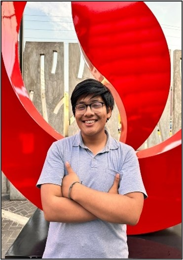
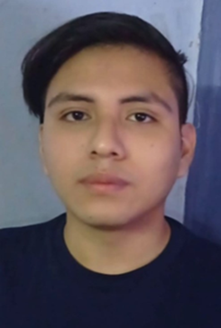
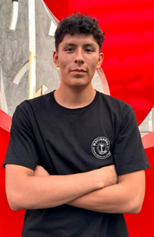
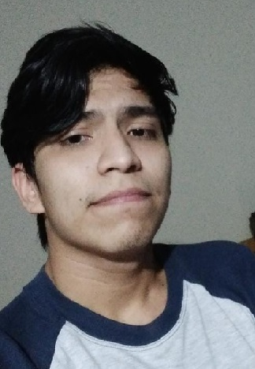

# Capítulo I: Introducción
---
## 1.1. Startup Profile
---
### 1.1.1. Descripción de la Startup
---
### 1.1.2. Perfiles de integrantes del equipo
| Sebastián Jesús Ramirez Zapata |  |
|----------|----------|
|Mi nombre es Sebastián Ramírez Zapata soy un universitario con la edad de 19 años y actualmente estoy estudiando la carrera de Ingeniería de Software en la UPC. Me considero una persona creativa y lógica para resolver problemas que se me presentan día a día. Me apasiona el mundo del diseño de las páginas web, por lo que soy hábil en este apartado. También me gusta el trabajo en equipo y planeo esforzarme al máximo para completar los logros del curso y así realizar un excelente proyecto.| |
|||

| Pedro Jeremy Perez Pizarro |  |
|----------|----------|
|Tengo 20 años y actualmente soy estudiante de la carrera de Ingeniería de Software en la UPC. Me considero puntual y asertivo, en lo que respecta al trabajo en equipo soy minucioso con los requerimientos y rúbricas. Me dedico a esto porque me gusta el mundo de la programación y sus posibilidades que tiene. En mis ratos libres me gusta hacer deporte y escuchar música de todo tipo.| |
|||

| Aldo Francisco Pastrana León |  |
|----------|----------|
|Me llamo Aldo Francisco Pastrana León de la carrera de ingeniería de software y voy a pasar al quinto ciclo de mi carrera. Soy de Lima, tengo 20 años y me gustan las matemáticas. Además, mis pasatiempos son ver series, programar y videojuegos. Elegí mi carrera debido a que me llama la creación de los diversos programas y aplicaciones que existen. Además, para este curso me comprometo a ayudar en todo lo posible para la elaboración de este proyecto cumpliendo con mis responsabilidades.| |
|||

| Marzzio Braulio Chicana Romero |  |
|----------|----------|
|Soy un estudiante de Ingeniería de Software, tengo 20 años y vivo en Lima. Decidí estudiar esta carrera por mi gusto e interés por la programación, algo que me motiva a seguir estudiando esta carrera es saber que tiene y tendrá un gran impacto en la sociedad. Como entretenimiento, me gusta tocar instrumentos y aprender más sobre la música. Para este curso, espero aprender muchas cosas nuevas y cumplir con los objetivos del curso demostrando responsabilidad.| |
|||

| Florentino Josue Carrasco Hernandez |  |
|----------|----------|
|Estudiante de Ingeniería de Software en la Universidad Peruana de Ciencias Aplicadas. Responsable, proactivo, comunicativo, tolerante, empático y orientado a resultados. Tengo conocimientos en desarrollo web HTML, CSS, JavaScript.| |
|||
---

## 1.2. Solution Profile
---
### 1.2.1 Antecedentes y problemática
---
### 1.2.2 Lean UX Process
---
#### 1.2.2.1. Lean UX Problem Statements
---
#### 1.2.2.2. Lean UX Assumptions
---
#### 1.2.2.3. Lean UX Hypothesis Statements
---
#### 1.2.2.4. Lean UX Canvas
---
## 1.3. Segmentos objetivo
---