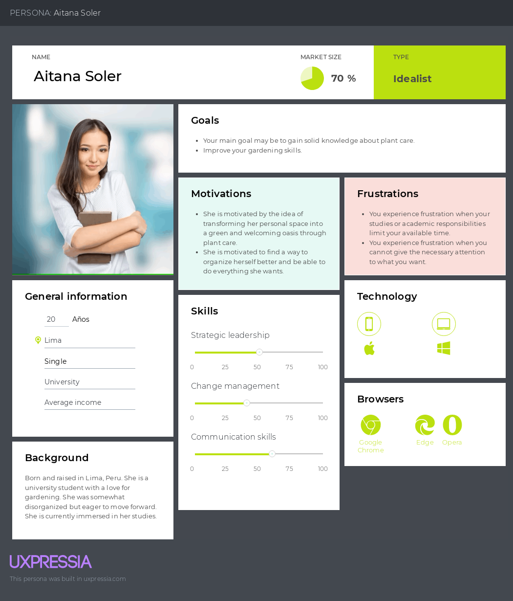
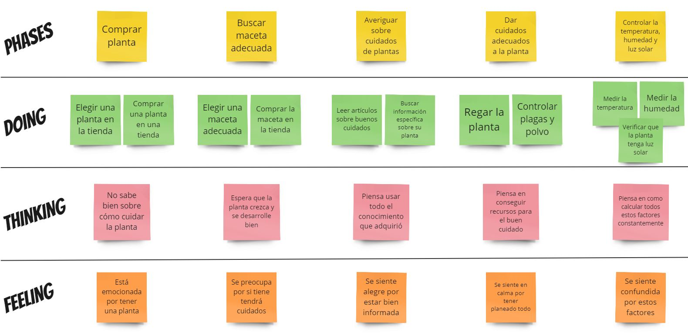
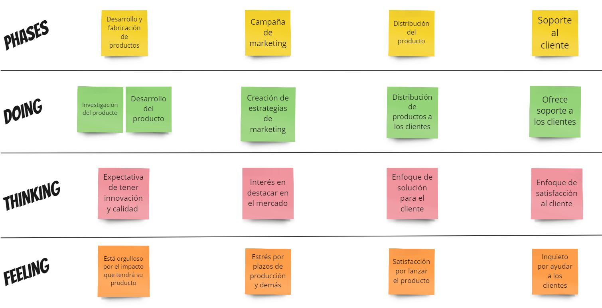

# Capítulo II: Requirements Elicitation & Analysis
---
## 2.1. Competidores
---
### 2.1.1. Análisis competitivo
---
### 2.1.2. Estrategias y tácticas frente a competidores
---
## 2.2. Entrevistas
---
### 2.2.1. Diseño de entrevistas
---
### 2.2.2. Registro de entrevistas
---
### 2.2.3. Análisis de entrevistas
---
## 2.3. Needfinding
---
### 2.3.1. User Personas
Nuestro proyecto se basa en entender las necesidades tanto de los clientes como de los proveedores de sensores para desarrollar artefactos que satisfagan ambas perspectivas. Del análisis de entrevistas y de la competencia, hemos identificado características clave que guían nuestro enfoque.

Los clientes buscan soluciones confiables, integrables y adaptables a sus necesidades, mientras que los proveedores valoran la colaboración, la escalabilidad y la diferenciación competitiva. Esta comprensión nos impulsa a crear artefactos que no solo satisfagan al cliente final, sino que también generen oportunidades para nuestros proveedores y promuevan la innovación en nuestro sector.

> Propietario de Plantas

> Proveedor

---
### 2.3.2. User Task Matrix
En esta sección, se establecen los segmentos que se están considerando para cada user persona: el cliente (usuario final) y el proveedor de sensores. La User Task Matrix proporcionará una visión detallada de las tareas específicas que cada segmento debe realizar en relación con nuestra plataforma de macetas inteligentes y sensores, ayudando así a identificar las responsabilidades y flujos de trabajo clave para cada grupo de usuarios.

|   Tarea                | Propietario de Plantas         | Proveedor                    |
|------------------------|--------------------------------|------------------------------|
|              | **Frecuencia**/ **Importancia** | **Frecuencia**/ **Importancia** |
| Buscar una buena maceta| Baja / Alta                 | Alta /  Alta              |
| Indagar sobre plantas y su cuidado | Media/ Alta     | Media /  Alta             |
| Regar la planta        | Alta / Alta                 | Alta /  Alta              |
| Controlar la humedad de la tierra | Alta / Alt       | Alta /  Alta              |
| Verificar que tenga luz solar | Alta/ Alta           | Alta /  Alta              |
| Medir la temperatura   | Alta / Alta                 | Alta /  Alta              |
| Limpieza del polvo     | Media / Media               | Media /  Media            |
| Control de plagas      | Media / Alta                | Media /  Alta             |

#### Tareas con Mayor Frecuencia e Importancia:
- Propietario de Plantas:
  - Buscar una buena maceta: Aunque la frecuencia es baja, la importancia es alta porque seleccionar la maceta adecuada es crucial para el crecimiento saludable de la planta.
  - Regar la planta: Alta frecuencia y alta importancia, ya que el riego es una tarea fundamental y regular para mantener la salud de la planta.
  - Controlar la humedad de la tierra: Tarea de alta frecuencia e importancia, especialmente para asegurar un entorno óptimo de crecimiento.
  - Verificar que tenga luz solar: Alta frecuencia y alta importancia, ya que la luz solar es esencial para la fotosíntesis y el crecimiento de la planta.
  - Medir la temperatura: Alta frecuencia e importancia para monitorear las condiciones ambientales que afectan la planta.

- Proveedor:
  - Buscar una buena maceta: Alta frecuencia e importancia, ya que la selección de macetas de calidad es esencial para ofrecer productos de alto valor.
  - Indagar sobre plantas y su cuidado: Media frecuencia pero alta importancia, ya que comprender las necesidades de las plantas es fundamental para ofrecer productos y servicios adecuados.
  - Regar la planta: Tarea común con alta frecuencia e importancia, ya que implica proporcionar soluciones efectivas para el cuidado de las plantas.
  - Controlar la humedad de la tierra: Similar al propietario de plantas, alta frecuencia e importancia para garantizar productos de calidad.
  - Verificar que tenga luz solar: Tarea clave con alta frecuencia e importancia, similar al propietario de plantas.
  - Medir la temperatura: Importante para garantizar la calidad de los productos y servicios ofrecidos.

#### Principales Diferencias:
- El propietario de plantas realiza tareas relacionadas directamente con el cuidado y mantenimiento de las plantas en su hogar, como regar, controlar la humedad y la luz solar.
- El proveedor se centra en actividades más relacionadas con la producción y suministro de productos relacionados con el cuidado de plantas, como seleccionar macetas de calidad y comprender las necesidades de las plantas.

#### Coincidencias entre los User Personas:
- Ambos segmentos comparten tareas relacionadas con el cuidado básico de las plantas, como el riego, control de la humedad, luz solar y temperatura.
- La importancia de comprender las necesidades específicas de las plantas y ofrecer soluciones adecuadas es fundamental tanto para el propietario de plantas como para el proveedor

---
### 2.3.3. User Journey Mapping
Resumimos el viaje del cliente desde el descubrimiento de la maceta inteligente hasta su uso continuo y soporte. Se enfoca en la experiencia desde el registro en la app, la compra y configuración de la maceta, hasta la satisfacción o frustración con el soporte.
> Propietario de Plantas

Resumimos el viaje del proveedor desde el registro en la plataforma hasta la gestión de pedidos, entregas y resolución de problemas relacionados con la calidad o logística. Se centra en la experiencia desde la consulta de stock, aceptación de pedidos, entrega y comunicación con el soporte.
> Proveedor

---
### 2.3.4. Empathy Mapping
> Propietario de Plantas

> Proveedor

---
### 2.3.5. As-is Scenario Mapping
> Propietario de Plantas

- Áreas Positivas:
  - Interés y emoción por probar nuevas tecnologías.
  - Satisfacción por la compra y mejoras visibles en el cuidado de las plantas.
  - Confianza en la empresa y la calidad de los productos.
- Áreas Negativas:
  - Frustración por problemas técnicos persistentes.
  - Expectativas de respuestas rápidas en el soporte no siempre cumplidas.
- Blank Areas:
  - Necesidad de aprender más sobre la configuración avanzada de sensores.

> Proveedor

- Áreas Positivas:
  - Interés en colaborar y mejorar la eficiencia en la gestión de pedidos.
  - Expectativas de respuestas efectivas en el soporte.
- Áreas Negativas:
  - Estrés por problemas logísticos y de entrega.
  - Necesidad de identificar y mejorar áreas específicas en la gestión.
- Blank Areas:
  - Necesidad de aprender más sobre la gestión avanzada de pedidos y calidad de productos.
---
## 2.4. Ubiquitous Language
---