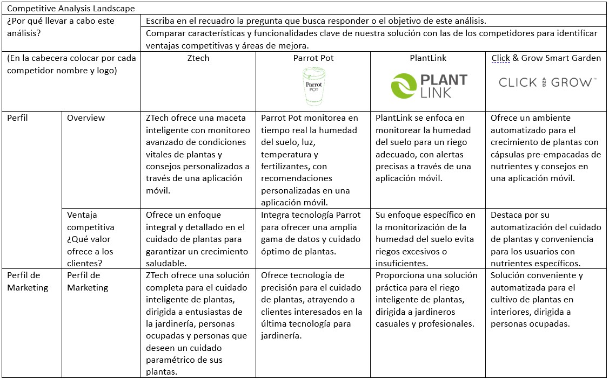

# Capítulo II: Requirements Elicitation & Analysis
---
## 2.1. Competidores

En el mercado de macetas inteligentes para plantas, existen varios competidores destacados. Entre ellos se encuentran:

- **Parrot Pot:** Desarrollado por la reconocida empresa Parrot, monitorea la humedad del suelo, luz solar, temperatura y niveles de fertilizante.
  
- **PlantLink:** Fabricado por Oso Technologies, se especializa en el monitoreo de la humedad del suelo y ofrece alertas de riego.

- **Click & Grow Smart Garden:** Ofrecido por Click & Grow, proporciona un ambiente automatizado para el crecimiento de plantas, utilizando cápsulas pre-empacadas con nutrientes y una aplicación móvil para el seguimiento y consejos de cultivo.

### 2.1.1. Análisis competitivo

### 2.1.2. Estrategias y tácticas frente a competidores
---f
## 2.2. Entrevistas
---
### 2.2.1. Diseño de entrevistas
---
### 2.2.2. Registro de entrevistas
---
### 2.2.3. Análisis de entrevistas
---
## 2.3. Needfinding
---
### 2.3.1. User Personas
---
### 2.3.2. User Task Matrix
---
### 2.3.3. User Journey Mapping
---
### 2.3.4. Empathy Mapping
---
### 2.3.5. As-is Scenario Mapping
---
## 2.4. Ubiquitous Language
---