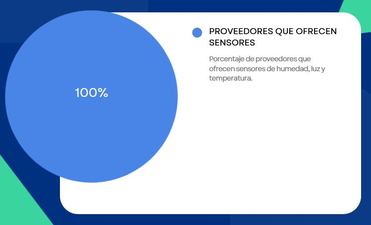
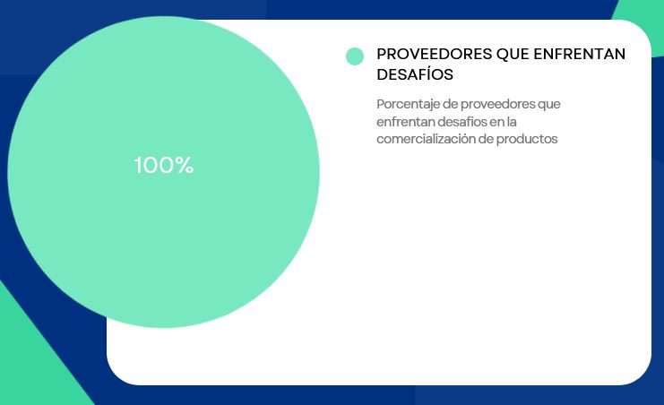
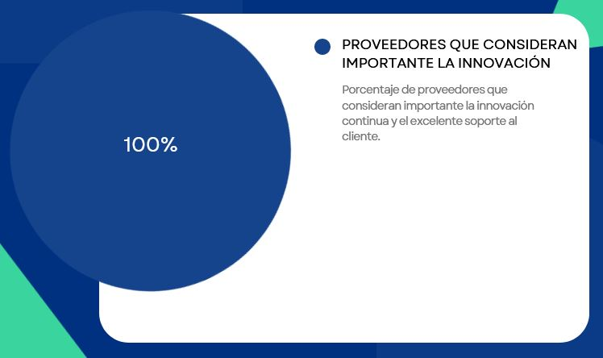
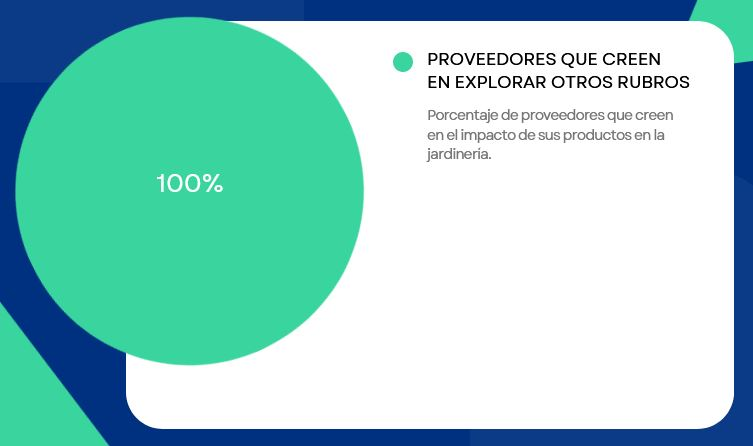
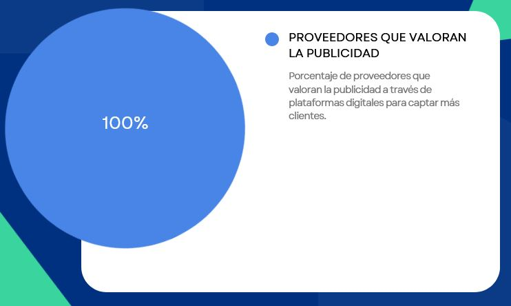
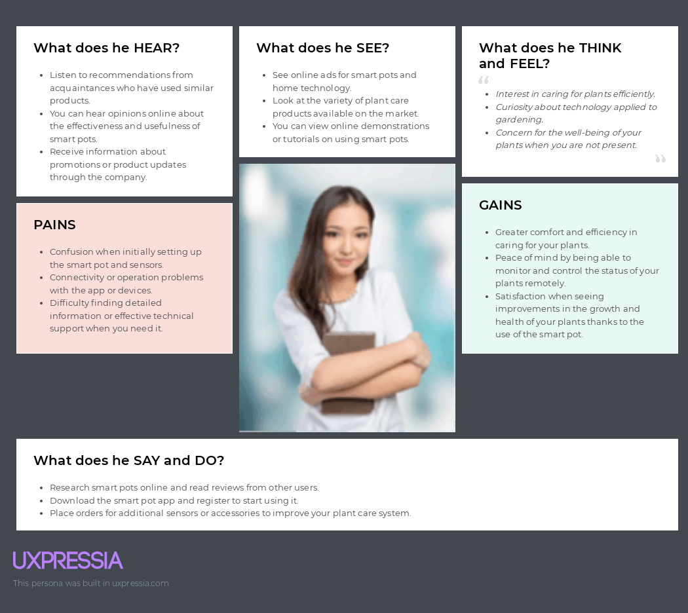
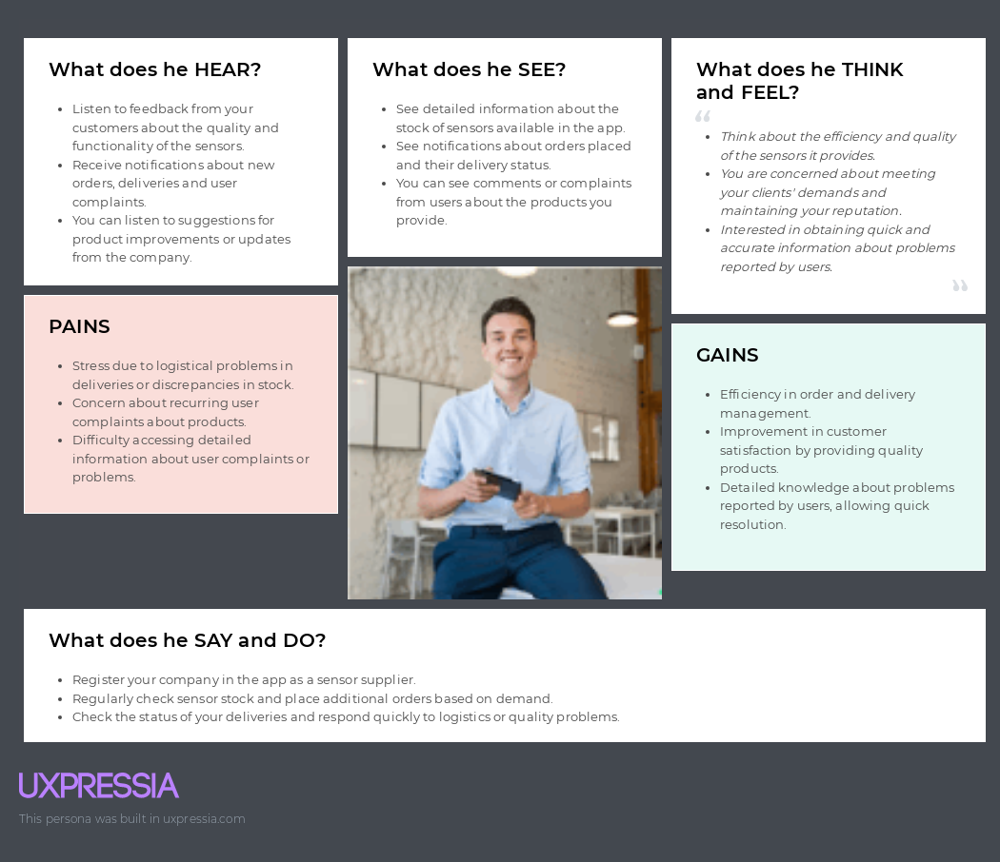

# Capítulo II: Requirements Elicitation & Analysis
---
## 2.1. Competidores

En el mercado de macetas inteligentes para plantas, existen varios competidores destacados. Entre ellos se encuentran:

- **Parrot Pot:** Desarrollado por la reconocida empresa Parrot, monitorea la humedad del suelo, luz solar, temperatura y niveles de fertilizante.
  
- **PlantLink:** Fabricado por Oso Technologies, se especializa en el monitoreo de la humedad del suelo y ofrece alertas de riego.

- **Click & Grow Smart Garden:** Ofrecido por Click & Grow, proporciona un ambiente automatizado para el crecimiento de plantas, utilizando cápsulas pre-empacadas con nutrientes y una aplicación móvil para el seguimiento y consejos de cultivo.

### 2.1.1. Análisis competitivo

En esta sección se presenta el análisis competitivo de las empresas clave en el mercado de macetas inteligentes. A continuación, se muestran las tablas que detallan las fortalezas, debilidades, oportunidades y amenazas de cada empresa en relación con su startup.

<table>
	<tbody>
		<tr>
			<td colspan="6">Competitive Analysis Landscape</td>
		</tr>
		<tr>
			<td colspan="2" rowspan="2">¿Por qué llevar a cabo este análisis?</td>
			<td colspan="4">Escriba en el recuadro la pregunta que busca responder o el objetivo de este análisis.</td>
		</tr>
		<tr>
			<td colspan="4">Comparar características y funcionalidades clave de nuestra solución con las de los competidores para identificar ventajas competitivas y áreas de mejora.</td>
		</tr>
		<tr>
			<td colspan="2">Competidores</td>
			<td>Ztech</td>
			<td>Parrot Pot</td>
			<td>PlantLink</td>
			<td>Click & Grow Smart Garden</td>
		</tr>
		<tr>
			<td rowspan="2">Perfil</td>
			<td>Overview</td>
			<td>ZTech ofrece una maceta inteligente con monitoreo avanzado de condiciones vitales de plantas y consejos personalizados a través de una aplicación móvil.</td>
			<td>Parrot Pot monitorea en tiempo real la humedad del suelo, luz, temperatura y fertilizantes, con recomendaciones personalizadas en una aplicación móvil.</td>
			<td>PlantLink se enfoca en monitorear la humedad del suelo para un riego adecuado, con alertas. precisas a través de una aplicación móvil.</td>
			<td>Ofrece un ambiente automatizado para el crecimiento de plantas con cápsulas pre-empacadas de nutrientes y consejos en una aplicación móvil.</td>
		</tr>
		<tr>
			<td>Ventaja competitiva ¿Qué valor ofrece a los clientes?</td>
			<td>Ofrece un enfoque integral y detallado en el cuidado de plantas para garantizar un crecimiento saludable.</td>
			<td>Integra tecnología Parrot para ofrecer una amplia gama de datos y cuidado óptimo de plantas.</td>
			<td>Su enfoque específico en la monitorización de la humedad del suelo evita riegos excesivos ο insuficientes.</td>
			<td>Destaca por su automatización del cuidado de plantas y conveniencia para los usuarios con nutrientes específicos.</td>
		</tr>
		<tr>
			<td rowspan="2">Perfil de Marketing</td>
			<td>Perfil de Marketing</td>
			<td>ZTech ofrece una solución completa para el cuidado inteligente de plantas, dirigida a entusiastas de la jardineria, personas ocupadas y personas que deseen un cuidado paramétrico de sus plantas.</td>
			<td>Ofrece tecnología de precisión para el cuidado de plantas, atrayendo a clientes interesados en la última tecnología para jardinería.</td>
			<td>Proporciona una solución práctica para el riego inteligente de plantas, dirigida a jardineros casuales y profesionales.</td>
			<td>Solución conveniente y automatizada para el cultivo de plantas en interiores, dirigida a personas ocupadas.</td>
		</tr>
		<tr>
			<td>Estrategias de Marketing</td>
			<td>Utilizará marketing digital, colaboraciones con influencers en jardinería y demostraciones para destacar sus características únicas.</td>
			<td>Campañas centradas en tecnología, demostraciones en tiendas especializadas y publicidad en medios especializados.</td>
			<td>Educación del consumidor sobre el riego adecuado, testimonios de usuarios satisfechos y colaboraciones con tiendas de jardinería.</td>
			<td>Enfoque en la facilidad de uso, videos instructivos en linea y colaboraciones con bloggers y chefs.</td>
		</tr>
		<tr>
			<td rowspan="3">Perfil de Producto</td>
			<td>Productos & Servicios</td>
			<td>Ofrece la maceta inteligente ZTech con monitoreo avanzado de condiciones vitales de plantas y consejos personalizados a través de una aplicación móvil y web.</td>
			<td>a maceta inteligente Parrot Pot monitorea humedad del suelo, luz, temperatura y fertilizantes, con recomendaciones en una aplicación móvil.</td>
			<td>frece sensores de humedad del suelo PlantLink para un riego adecuado, con alertas a través de una aplicación móvil.</td>
			<td>Ofrece kits de jardineria Smart Garden con cápsulas pre-empacadas de nutrientes y consejos en una aplicación móvil.</td>
		</tr>
		<tr>
			<td>Precios & Costos</td>
			<td>Varian según las características de monitoreo, con opciones de compra única o suscripción mensual para acceso premium a la aplicación móvil.</td>
			<td>Precio de compra único, con costos adicionales por accesorios o servicios premium en la aplicación móvil.</td>
			<td>Precio de compra único por el hardware, con acceso gratuito o pago por servicios premium en la aplicación móvil.</td>
			<td>Precios variables según el tamaño del kit y las cápsulas, con opciones de suscripción mensual para acceso premium a la aplicación móvil.</td>
		</tr>
		<tr>
			<td>Canales de distribución (Web y/o Móvil)</td>
			<td>Ventas directas en linea a través de su sitio web y aplicación móvil.</td>
			<td>Venta en linea a través de su sitio web oficial y tiendas de electrónica.</td>
			<td>Venta directa en linea a través de su sitio web y aplicación móvil móvil, además de tiendas especializadas en jardinería.</td>
			<td>Venta en linea a través de su sitio web oficial y aplicaciones móviles, así como en tiendas de productos para el hogar y jardineria.</td>
		</tr>
		<tr>
			<td rowspan="5">Análisis SWOT</td>
			<td colspan="5">Realice esto para su startup y sus competidores. Sus fortalezas deberían apoyar sus oportunidades y contribuir a lo que ustedes definen como su posible ventaja competitiva.</td>
		</tr>
		<tr>
			<td>Fortalezas</td>
			<td>Tecnologia avanzada de monitoreo de plantas, aplicación móvil intuitiva con consejos personalizados, enfoque integral en el cuidado de plantas.</td>
			<td>Integración con tecnología Parrot, amplia gama de datos monitoreados en tiempo real, reconocimiento de marca en tecnología.</td>
			<td>Enfoque específico en monitorización de humedad del suelo, solución simple y efectiva para riego inteligente.</td>
			<td>Sistema automatizado y conveniente para cultivo de plantas en interiores, cápsulas pre-empacadas con nutrientes específicos para un cuidado fácil.</td>
		</tr>
		<tr>
			<td>Debilidades</td>
			<td>Posible alta inversión en investigación y desarrollo, necesidad de establecerse en un mercado competitivo.</td>
			<td>Posible dependencia de la reputación de Parrot en otros sectores, limitaciones en la personalización de consejos para plantas</td>
			<td>Limitación en la variedad de datos monitoreados, posible falta de reconocimiento de marca a nivel global.</td>
			<td>Dependencia de cápsulas específicas para su sistema, posible complejidad en el uso para algunos usuarios.</td>
		</tr>
		<tr>
			<td>Oportunidades</td>
			<td>Creciente interés en la jardinería inteligente, demanda de soluciones tecnológicas para el cuidado de plantas, expansión a nuevos mercados globales.</td>
			<td>Expansión a mercados globales, colaboraciones estratégicas con empresas de jardinería o tecnología.</td>
			<td>Expansión a nuevos mercados, colaboraciones con empresas de jardinería y hogar inteligente.</td>
			<td>Expansión a mercados de jardinería urbana, colaboraciones con chefs y restaurantes para uso de plantas frescas.</td>
		</tr>
		<tr>
			<td>Amenazas</td>
			<td>Competencia fuerte de otras empresas consolidadas en el mercado de macetas inteligentes, cambios en las tendencias del mercado o avances tecnológicos que puedan afectar la demanda.</td>
			<td>Competencia directa de otras macetas inteligentes, avances tecnológicos que puedan obsolescencia de la solución.</td>
			<td>Competencia de otras soluciones de riego. inteligente, cambios en las preferencias del consumidor.</td>
			<td>Competencia de otras soluciones de cultivo interior, cambios en las tendencias de consumo o disponibilidad de productos similares.</td>
		</tr>
	</tbody>
</table>

### 2.1.2. Estrategias y tácticas frente a competidores

**Experiencia de usuario mejorada:** Desarrollar y optimizar la aplicación móvil para proporcionar una experiencia de usuario más intuitiva, informativa y personalizada que las aplicaciones de los competidores.

**Estrategias de marketing digital:** Implementar campañas de marketing digital enfocadas en destacar las fortalezas de ZTech, como el monitoreo integral de plantas y los consejos personalizados, para llegar a un público más amplio y generar reconocimiento de marca.

**Colaboraciones estratégicas:** Establecer asociaciones con influencers en jardinería, expertos en tecnología doméstica y tiendas especializadas para aumentar la visibilidad de ZTech y llegar a nuevos segmentos de mercado.

**Innovación continua:** Mantenerse al tanto de las tendencias del mercado y de los avances tecnológicos para adaptar rápidamente las soluciones de ZTech y mantener su posición como líder en el mercado de macetas inteligentes.

**Servicio al cliente excepcional:** Ofrecer un soporte al cliente excepcional, con tutoriales, servicio técnico eficiente y respuesta ágil a comentarios y sugerencias de los usuarios para fomentar la lealtad y satisfacción del cliente.

## 2.2. Entrevistas
---
### 2.2.1. Diseño de entrevistas

A) Propietarios de plantas

**Preguntas generales:**

    1. ¿Cuál es tu nombre?
    2. ¿Qué edad tiene usted?
    3. ¿En que distrito de residencia vives?
    4. ¿Cuál es tu estado civil?
    5. ¿Cuál es tu ocupación?
    6. ¿Qué tecnología usas más?
    7. ¿Qué habilidades tiene?
    8. ¿Cómo se describiria?
    9. ¿Cual es su navegador favorito?
    10. ¿Qué apps usas regularmente?

**Preguntas específicas:**

    1. ¿Con qué frecuencia cuida de sus plantas domésticas?
    2. ¿Cuáles son los mayores desafíos que enfrenta al cuidar de sus plantas?
    3. ¿Qué herramientas o recursos utiliza actualmente para el cuidado de sus plantas?
    4. ¿Qué características consideraría más útiles en una aplicación de cuidado de plantas?
    5. ¿Cómo le gustaría recibir consejos o recomendaciones sobre el cuidado de sus plantas?
    6. ¿Qué tipo de información específica le gustaría registrar sobre cada una de sus plantas?
    7. ¿Le gustaría recibir notificaciones sobre eventos importantes relacionados con el cuidado de sus plantas,como el riego o la alimentación?
    8. ¿Cómo cree que una aplicación de cuidado de plantas podría mejorar su experiencia como cuidador de plantas?
    9. ¿Qué tipo de funciones le gustaría ver en una herramienta de planificación de jardín?
    10. ¿Qué opina sobre la idea de recibir recomendaciones personalizadas de plantas basadas en sus preferencias y condiciones de cultivo?
    
B) Proovedores

**Preguntas generales:**

    1. ¿Cuál es tu nombre?
    2. ¿Qué edad tiene usted?
    3. ¿En que distrito de residencia vives?
    4. ¿Cuál es tu estado civil?
    5. ¿Cuál es tu ocupación?
    6. ¿Qué tecnología usas más?
    7. ¿Qué habilidades tiene?
    8. ¿Cómo se describiria?
    9. ¿Cual es su navegador favorito?
    10. ¿Qué apps usas regularmente?

**Preguntas específicas:**

    1. ¿Cuáles son los principales productos o servicios que ofrece su empresa?
    2. ¿Qué estrategias utiliza actualmente para satisfacer las necesidades de sus clientes y mantener su competitividad en el mercado?
    3. ¿Cuáles son los mayores desafíos que enfrenta al comercializar sus productos o servicios?
    4. ¿Qué características o funciones considera más importantes sus los clientes en los productos que vende?
    5. ¿Cómo cree que los avances tecnológicos, como los sensores, pueden impactar en la jardineria?
    6. ¿Estaría interesado en integrar sus productos o servicios para un producto relacionado con el cuidado de plantas?
    7. ¿Qué tipo de información le gustaría obtener sobre los usuarios que usen la aplicación y sus necesidades?
    8. ¿Cómo podría una plataforma digital ayudar a su empresa a adaptarse mejor a las demandas y tendencias del mercado?
    9. ¿Qué aspectos de la experiencia del cliente considera más importantes para su empresa?
    10. ¿Cómo cree que una plataforma digital podría ayudar a promover sus productos o servicios entre los propietarios de macetas y otros clientes potenciales?

### 2.2.2. Registro de entrevistas
- Plant Owner

> Rafael Agustin Pacheco Lavado

Resumen: El entrevistado, Rafael Agustín Pacheco Lavado, de 21 años de edad y residente del distrito de Los Olivos, se encuentra inmerso en sus estudios de arquitectura. Como aficionado a la jardinería, ha encontrado afinidad con el proyecto presentado. Sin embargo, enfrenta desafíos para mantener sus plantas en óptimas condiciones debido a las demandas de su agenda estudiantil. Reconoce la importancia y la solidez de las funcionalidades ofrecidas por la aplicación propuesta. Expresa interés en que la aplicación le brinde recordatorios para las tareas cruciales relacionadas con el cuidado de sus plantas. Además, valora la idea de recibir recomendaciones personalizadas, dada la diversidad de especies que cultiva, cada una con sus propias necesidades específicas de crecimiento.

Link de la entrevista: https://upcedupe-my.sharepoint.com/:v:/g/personal/u202022228_upc_edu_pe/Ea54svGJ7tdNolxQcqYYD_wBDG1K09XChoan6CBkSplICg?nav=eyJyZWZlcnJhbEluZm8iOnsicmVmZXJyYWxBcHAiOiJPbmVEcml2ZUZvckJ1c2luZXNzIiwicmVmZXJyYWxBcHBQbGF0Zm9ybSI6IldlYiIsInJlZmVycmFsTW9kZSI6InZpZXciLCJyZWZlcnJhbFZpZXciOiJNeUZpbGVzTGlua0NvcHkifX0&e=PPdGyL

Timing: 05:58 - 11:59

> Ivan Ramirez Chero

Resumen: En esta oportunidad el entrevistado fue Ivan Alonso Ramirez Chero, tiene 21 años, vive en el Callao, su estado civil es soltero, es estudiante universitario, como herramientas tecnologica usa celular y computadora, tiene habilidades como el liderazgo y es entusiasta, su navegador favorito es Vivaldi, las aplicaciones que usa regularmente es Instagram y Youtube. Aunque intenta cuidar sus plantas a diario, a veces se le olvida hacerlo. Los mayores desafíos que enfrenta incluyen el miedo a excederse en el riego o descuidar sus plantas. Iván estaría interesado en una aplicación que clasifique sus plantas por tipo y proporcione información sobre el cuidado adecuado, como riego, cambio de tierra y exposición al sol. Considera importante recibir notificaciones sobre eventos importantes relacionados con el cuidado de sus plantas, ya que le ayudaría a mantener sus plantas saludables y a reducir el estrés de perder alguna. Iván está entusiasmado con la idea de recibir recomendaciones basadas en sus preferencias y condiciones de cultivo.

Link de la entrevista: https://upcedupe-my.sharepoint.com/personal/u202022228_upc_edu_pe/_layouts/15/stream.aspx?id=%2Fpersonal%2Fu202022228%5Fupc%5Fedu%5Fpe%2FDocuments%2FDesarrollo%20de%20Soluciones%20IOT%2FEntrevistas%2FENTREVISTA%20COMPLETA%20PT1%2Emp4&nav=eyJyZWZlcnJhbEluZm8iOnsicmVmZXJyYWxBcHAiOiJPbmVEcml2ZUZvckJ1c2luZXNzIiwicmVmZXJyYWxBcHBQbGF0Zm9ybSI6IldlYiIsInJlZmVycmFsTW9kZSI6InZpZXciLCJyZWZlcnJhbFZpZXciOiJNeUZpbGVzTGlua0NvcHkifX0&ga=1&referrer=StreamWebApp%2EWeb&referrerScenario=AddressBarCopied%2Eview%2Ed6999173%2D89eb%2D4437%2Da71c%2D17e5e8a12bd6 

Timing: 00:00 - 06:00.

> Carlos Alejandro De La Cruz Villarreal

Resumen: En esta oportunidad el entrevistado fue Carlos Alejandro De La Cruz Villarreal, tiene 21 años, vive en los olivos, su estado civil es soltero, actualmente no usa herramientas tecnologicas, tiene habilidades como la tolerancia y responsabilidad, su navegador favorito es Google Chrome y Microsoft Edge, las aplicaciones que usa regularmente es WhatsApp y Tiktok, y actualmente se encuentra trabajando como jardinero. Además, nos comenta que cuida diariamente sus plantas domesticas y que el principal desafío que enfrenta al cuidad sus plantas son las plagas que puedan aparecer es por eso que aplica insecticidas para controlar las plagas, y también utiliza recursos como el agua y herramientas como pala de jardinería. Asimismo, nos dice que le gustaría recibir consejos sobre cómo controlar efectivamente las plagas sin necesidad de usar insecticida y también cada cuanto tiempo regar a las plantas. Además, nos comenta que le gustaría recibir información sobre el tipo de planta y en que parte está ubicada. Asimismo, nos dice que si le gustaría recibir notificaciones importantes sobre el cuidado de plantas como el riego y la alimentación. También, nos comenta que una aplicación de cuidado de plantas si puede mejorar su experiencia como cuidador de plantas y las funciones que le gustaría ver en la aplicación puede ser el tipo de riego, cada cuanto tiempo se debe de regar o el tipo de tierra. Finalmente, nos comenta que recibir recomendaciones personalizadas basadas en preferencias y condiciones de cultivo ya que tendrán un cuidado mas personalizado.

Link de la entrevista: https://upcedupe-my.sharepoint.com/:v:/g/personal/u202022228_upc_edu_pe/ERfTJ9r9L6FCpbDh8KtM1hABFZmx0i0Teoyj9jMJo8_fhA?nav=eyJyZWZlcnJhbEluZm8iOnsicmVmZXJyYWxBcHAiOiJPbmVEcml2ZUZvckJ1c2luZXNzIiwicmVmZXJyYWxBcHBQbGF0Zm9ybSI6IldlYiIsInJlZmVycmFsTW9kZSI6InZpZXciLCJyZWZlcnJhbFZpZXciOiJNeUZpbGVzTGlua0NvcHkifX0&e=CCm6WG

Timing: 12:04 - 19:40

- Supplier
  
> Edith Carrasco Vallejos

Resumen: En esta oportunidad la entrevistada fue Edith Carrasco Vallejos, tiene 44 años, vive en San Martin de porres, su estado civil es casada, se dedica a la venta de sensores de humedad, como herramientas tecnologica usa celular y computadora, tiene habilidades como trabajo en equipo y es alegre, su navegador favorito es Chrome, las aplicaciones que usa regularmente es Facebook e Instagram. Ella dirige una empresa que comercializa sensores para el control de la humedad. Menciona que realiza estudios de mercado constantemente para conocer las necesidades de los clientes y ajustarse al nicho de mercado. Uno de los mayores desafíos que enfrenta la empresa es la falta de comprensión de algunos clientes y está interesada en integrar sus productos en un producto relacionado con el cuidado de las plantas. Le gustaría conocer más sobre los usuarios de su aplicación, como sus necesidades específicas. Señala que la publicidad a través de una plataforma digital puede ayudar a captar una mayor cantidad de clientes. Valora el funcionamiento de los productos, la facilidad de uso y la conectividad a través de dispositivos electrónicos.

Link de la entrevista: https://upcedupe-my.sharepoint.com/personal/u202022228_upc_edu_pe/_layouts/15/stream.aspx?id=%2Fpersonal%2Fu202022228%5Fupc%5Fedu%5Fpe%2FDocuments%2FDesarrollo%20de%20Soluciones%20IOT%2FEntrevistas%2FENTREVISTA%20COMPLETA%20PT1%2Emp4&nav=eyJyZWZlcnJhbEluZm8iOnsicmVmZXJyYWxBcHAiOiJPbmVEcml2ZUZvckJ1c2luZXNzIiwicmVmZXJyYWxBcHBQbGF0Zm9ybSI6IldlYiIsInJlZmVycmFsTW9kZSI6InZpZXciLCJyZWZlcnJhbFZpZXciOiJNeUZpbGVzTGlua0NvcHkifX0&ga=1&referrer=StreamWebApp%2EWeb&referrerScenario=AddressBarCopied%2Eview%2Ed6999173%2D89eb%2D4437%2Da71c%2D17e5e8a12bd6 

Timing: 19:44 - 25:22

> Enzo Villanueva Pastrana

Resumen: En esta oportunidad el entrevistado fue Enzo Villanueva Pastrana, tiene 28 años, vive en comas, su estado civil es soltero, las herramientas tecnologicas que usa son las redes sociales, servicio de publicidad e inteligencia artificial en el ambito del diseño, tiene habilidades como la puntualidad, tolerancia y responsabilidad, su navegador favorito es Google Chrome y Opera, las aplicaciones que usa regularmente es WhatsApp y Tiktok, y actualmente se encuentra trabajando como comunicador y también como proveedor de sensores. Además, nos comenta que los principales productos que ofrece son diversos sensores como humedad, luz y temperatura. Asimismo, nos dice que las estrategias que usa para satisfacer las necesidades de sus clientes son mediante los casos de estudios resolviendo problemáticas y los desafíos que enfrenta principalmente su empresa es la comercialización de sus productos. También, nos dice que las características importantes de sus clientes son personas que cuidan y velan por el medio ambiente y además nos dice que los avances tecnológicos como los sensores tienen un gran impacto ya que miden diversos factores. Asimismo, nos dice que si estaría interesado en integrar sus productos con el cuidado de plantas mediante un buen desarrollo. Además, nos comenta que si le gustaría recibir información sobre usuario que usen la aplicación como saber la opinión de los clientes sobre diversas tecnologías emergentes que surgen. Asimismo, nos dice que una plataforma digital si podría ayudar a su empresa diversificando el producto para que tenga un mayor alcance para todas las personas. También, nos dice que la experiencia del cliente es importante ya que ayuda a nutrir nuestro producto y así poder mejorarlo. Finalmente, nos comenta que una plataforma digital si ayudaría a su empresa a promover sus productos entre los propietarios de macetas para tener un mayor alcance y llegar a más personas.

Link de la entrevista: https://upcedupe-my.sharepoint.com/:v:/g/personal/u202022228_upc_edu_pe/ESbkewdcQfZEtwUaou6G4SwBV9oo5A5s4G5K-C8VZ_--qA?nav=eyJyZWZlcnJhbEluZm8iOnsicmVmZXJyYWxBcHAiOiJPbmVEcml2ZUZvckJ1c2luZXNzIiwicmVmZXJyYWxBcHBQbGF0Zm9ybSI6IldlYiIsInJlZmVycmFsTW9kZSI6InZpZXciLCJyZWZlcnJhbFZpZXciOiJNeUZpbGVzTGlua0NvcHkifX0&e=nqGxNa

Timing: 00:00 - 10:40

> Piero Stefano Márquez

Resumen: El entrevistado se llama Piero Stefano Márquez, tiene 23, reside en San Miguel y es soltero. Posee una empresa de manufacturas, usa tecnologías como Trello para la organización. Es empático y un líder, y se describe como una persona activa. Su navegador favorito es Opera y usa apps como YouTube, Spotify y Facebook. Los principales productos que ofrece su empresa son diversos sensores como de temperatura, humedad o luz. Para satisface a sus clientes se enfoca en la innovación continua de sus productos y brindar un soporte excelente. Cree que sus clientes valoran la precisión de los datos de sus sensores y su facilidad de uso. También cree que sus productos tendrían un gran impacto en la jardinería por los datos en tiempo real que ofrecen. Le gustaría obtener información sobre las necesidades y exigencias de los usuarios con respecto a sus sensores. Considera que la satisfacción del cliente y la facilidad de uso de sus productos son aspectos fundamentales en su empresa.

Link de la entrevista: https://upcedupe-my.sharepoint.com/:v:/g/personal/u202022228_upc_edu_pe/Ea54svGJ7tdNolxQcqYYD_wBDG1K09XChoan6CBkSplICg?nav=eyJyZWZlcnJhbEluZm8iOnsicmVmZXJyYWxBcHAiOiJPbmVEcml2ZUZvckJ1c2luZXNzIiwicmVmZXJyYWxBcHBQbGF0Zm9ybSI6IldlYiIsInJlZmVycmFsTW9kZSI6InZpZXciLCJyZWZlcnJhbFZpZXciOiJNeUZpbGVzTGlua0NvcHkifX0&e=PPdGyL

---
### 2.2.3. Análisis de entrevistas
#### Segmento de Propietarios de Plantas:

- Características Objetivas:
  

- Características Subjetivas:
  

Basándonos en los resúmenes de las entrevistas, podemos observar que las características objetivas y subjetivas comunes entre los clientes son bastante consistentes. El porcentaje del 100% indica una necesidad generalizada en cada una de estas características entre los clientes entrevistados. Esto proporciona una base sólida para la construcción de arquetipos de clientes y el diseño de la aplicación de cuidado de plantas.

#### Segmento de Proveedores:

- Características Objetivas:
  

- Características Subjetivas:
  

Basándonos en los resúmenes de las entrevistas, podemos observar que las características objetivas y subjetivas comunes entre los proveedores también son bastante consistentes. El porcentaje del 100% indica una necesidad generalizada en cada una de estas características entre los proveedores entrevistados. Esto proporciona una base sólida para la construcción de arquetipos de proveedores y el diseño de la colaboración con la aplicación de cuidado de plantas.

---
## 2.3. Needfinding
---
### 2.3.1. User Personas
Nuestro proyecto se basa en entender las necesidades tanto de los clientes como de los proveedores de sensores para desarrollar artefactos que satisfagan ambas perspectivas. Del análisis de entrevistas y de la competencia, hemos identificado características clave que guían nuestro enfoque.

Los clientes buscan soluciones confiables, integrables y adaptables a sus necesidades, mientras que los proveedores valoran la colaboración, la escalabilidad y la diferenciación competitiva. Esta comprensión nos impulsa a crear artefactos que no solo satisfagan al cliente final, sino que también generen oportunidades para nuestros proveedores y promuevan la innovación en nuestro sector.

> Propietario de Plantas

> Proveedor

---
### 2.3.2. User Task Matrix
En esta sección, se establecen los segmentos que se están considerando para cada user persona: el cliente (usuario final) y el proveedor de sensores. La User Task Matrix proporcionará una visión detallada de las tareas específicas que cada segmento debe realizar en relación con nuestra plataforma de macetas inteligentes y sensores, ayudando así a identificar las responsabilidades y flujos de trabajo clave para cada grupo de usuarios.

<table>
	<tbody>
		<tr>
			<td>Task</td>
			<td colspan="2">Plant Owner</td>
			<td colspan="2">Supplier</td>
		</tr>
		<tr>
			<td></td>
			<td>Frecuencia</td>
			<td>Importancia</td>
			<td>Frecuencia</td>
			<td>Importancia</td>
		</tr>
		<tr>
			<td>Buscar una buena maceta</td>
			<td>Baja</td>
			<td>Alta</td>
			<td>Alta</td>
			<td>Alta</td>
		</tr>
		<tr>
			<td>Indagar sobre plantas y su cuidado</td>
			<td>Media</td>
			<td>Alta</td>
			<td>Media</td>
			<td>Alta</td>
		</tr>
		<tr>
			<td>Regar la planta</td>
			<td>Alta</td>
			<td>Alta</td>
			<td>Alta</td>
			<td>Alta</td>
		</tr>
		<tr>
			<td>Controlar la humedad de la tierra</td>
			<td>Alta</td>
			<td>Alta</td>
			<td>Alta</td>
			<td>Alta</td>
		</tr>
		<tr>
			<td>Verificar que tenga luz solar</td>
			<td>Alta</td>
			<td>Alta</td>
			<td>Alta</td>
			<td>Alta</td>
		</tr>
		<tr>
			<td>Medir la temperatura</td>
			<td>Alta</td>
			<td>Alta</td>
			<td>Alta</td>
			<td>Alta</td>
		</tr>
		<tr>
			<td>Limpieza del polvo</td>
			<td>Media</td>
			<td>Media</td>
			<td>Media</td>
			<td>Media</td>
		</tr>
		<tr>
			<td>Control de plagas</td>
			<td>Media</td>
			<td>Alta</td>
			<td>Media</td>
			<td>Alta</td>
		</tr>
	</tbody>
</table>

#### Tareas con Mayor Frecuencia e Importancia:
- Propietario de Plantas:
  - Buscar una buena maceta: Aunque la frecuencia es baja, la importancia es alta porque seleccionar la maceta adecuada es crucial para el crecimiento saludable de la planta.
  - Regar la planta: Alta frecuencia y alta importancia, ya que el riego es una tarea fundamental y regular para mantener la salud de la planta.
  - Controlar la humedad de la tierra: Tarea de alta frecuencia e importancia, especialmente para asegurar un entorno óptimo de crecimiento.
  - Verificar que tenga luz solar: Alta frecuencia y alta importancia, ya que la luz solar es esencial para la fotosíntesis y el crecimiento de la planta.
  - Medir la temperatura: Alta frecuencia e importancia para monitorear las condiciones ambientales que afectan la planta.

- Proveedor:
  - Buscar una buena maceta: Alta frecuencia e importancia, ya que la selección de macetas de calidad es esencial para ofrecer productos de alto valor.
  - Indagar sobre plantas y su cuidado: Media frecuencia pero alta importancia, ya que comprender las necesidades de las plantas es fundamental para ofrecer productos y servicios adecuados.
  - Regar la planta: Tarea común con alta frecuencia e importancia, ya que implica proporcionar soluciones efectivas para el cuidado de las plantas.
  - Controlar la humedad de la tierra: Similar al propietario de plantas, alta frecuencia e importancia para garantizar productos de calidad.
  - Verificar que tenga luz solar: Tarea clave con alta frecuencia e importancia, similar al propietario de plantas.
  - Medir la temperatura: Importante para garantizar la calidad de los productos y servicios ofrecidos.

#### Principales Diferencias:
- El propietario de plantas realiza tareas relacionadas directamente con el cuidado y mantenimiento de las plantas en su hogar, como regar, controlar la humedad y la luz solar.
- El proveedor se centra en actividades más relacionadas con la producción y suministro de productos relacionados con el cuidado de plantas, como seleccionar macetas de calidad y comprender las necesidades de las plantas.

#### Coincidencias entre los User Personas:
- Ambos segmentos comparten tareas relacionadas con el cuidado básico de las plantas, como el riego, control de la humedad, luz solar y temperatura.
- La importancia de comprender las necesidades específicas de las plantas y ofrecer soluciones adecuadas es fundamental tanto para el propietario de plantas como para el proveedor

---
### 2.3.3. User Journey Mapping
Resumimos el viaje del cliente desde el descubrimiento de la maceta inteligente hasta su uso continuo y soporte. Se enfoca en la experiencia desde el registro en la app, la compra y configuración de la maceta, hasta la satisfacción o frustración con el soporte.
> Propietario de Plantas

Resumimos el viaje del proveedor desde el registro en la plataforma hasta la gestión de pedidos, entregas y resolución de problemas relacionados con la calidad o logística. Se centra en la experiencia desde la consulta de stock, aceptación de pedidos, entrega y comunicación con el soporte.
> Proveedor

---
### 2.3.4. Empathy Mapping
> Propietario de Plantas

> Proveedor

---
### 2.3.5. As-is Scenario Mapping
> Propietario de Plantas

- Áreas Positivas:
  - Interés y emoción por probar nuevas tecnologías.
  - Satisfacción por la compra y mejoras visibles en el cuidado de las plantas.
  - Confianza en la empresa y la calidad de los productos.
- Áreas Negativas:
  - Frustración por problemas técnicos persistentes.
  - Expectativas de respuestas rápidas en el soporte no siempre cumplidas.
- Blank Areas:
  - Necesidad de aprender más sobre la configuración avanzada de sensores.

> Proveedor

- Áreas Positivas:
  - Interés en colaborar y mejorar la eficiencia en la gestión de pedidos.
  - Expectativas de respuestas efectivas en el soporte.
- Áreas Negativas:
  - Estrés por problemas logísticos y de entrega.
  - Necesidad de identificar y mejorar áreas específicas en la gestión.
- Blank Areas:
  - Necesidad de aprender más sobre la gestión avanzada de pedidos y calidad de productos.
---
## 2.4. Ubiquitous Language

|**Término**|**Definición**|
| - | - |
|Plant lovers (Amantes de las plantas)|Personas con interés y pasión por el cuidado y cultivo de plantas domésticas.|
|To care for houseplants (Cuidar plantas domésticas)|Proceso de proporcionar las condiciones óptimas de crecimiento y cuidado para plantas que se encuentran en entornos interiores, como hogares u oficinas.|
|Thriving indoor garden (Próspero jardín interior)|Espacio interior de una residencia o edificio donde las plantas se cultivan, crecen y desarrollan de manera saludable y vigorosa.|
|Green and sustainable lifestyle (Estilo de vida verde y sostenible)|Adoptar prácticas y hábitos que promuevan la conservación del medio ambiente y el uso responsable de los recursos naturales, incluyendo la incorporación de plantas de entorno doméstico,|
|Urban gardening (Jardinería urbana)|Práctica de cultivar y cuidar plantas en entornos urbanos, como hogares, balcones, terrazas o jardines, debido a la limitación de espacio y falta de áreas verdes.|
|Small spaces (Espacios reducidos)|Lugares con poco espacio disponible, como apartamentos, oficinas o áreas urbanas densamente pobladas, que presentan desafíos para la jardinería tradicional debido a la falta de espacio físico.|
|Awareness about the importance of nature (Conciencia sobre la importancia de la naturaleza)|Reconocimiento y comprensión de los beneficios que el el cuidado de plantas proporciona a la salud y el bienestar humano.|
|Growth conditions (Condiciones de crecimiento)|Los factores ambientales como la luz, el agua y la temperatura que afectan la salud de las plantas.|
|Plant care routine (Rutina de cuidado de plantas)|Las actividades regulares que se realizan para mantener las plantas saludables.|.
|Green living (Vida verde)|Un estilo de vida que incorpora prácticas sustentables y amigables con el medio ambiente.|
|Nature engagement (Compromiso con la naturaleza)|Interacción activa y consciente con entornos naturales y plantas.|
|Space optimization (Optimización del espacio)|El uso eficiente de áreas limitadas para el cultivo de plantas.|
|Gardening trend (Tendencia de jardinería)|La popularidad creciente y el interés en el cultivo de plantas y jardinería.|
|Plant Care Information (Información de Cuidado de Plantas)|Datos cruciales sobre factores ambientales como la luz, temperatura y humedad del suelo, esenciales para el mantenimiento óptimo de las plantas.|
|Growth Optimization (Optimización del Crecimiento)|Estrategias y prácticas recomendadas destinadas a mejorar el desarrollo y floración de las plantas, asegurando que crezcan de manera saludable y vigorosa.|
|Nutrient Management (Manejo de Nutrientes)|Supervisión y ajuste de los niveles de nutrientes como el potasio en el suelo, crucial para el mantenimiento y la fertilidad de las plantas.|
|Watering Schedule (Programación de Riego)|Planificación automatizada o recomendada del riego para asegurar que las plantas reciban la cantidad adecuada de agua sin exceso ni déficit.|
|Light Management (Gestión de la Luz)|Control de la exposición a la luz ultravioleta y otras formas de luz, ajustándola para satisfacer las necesidades específicas de diferentes tipos de plantas.|