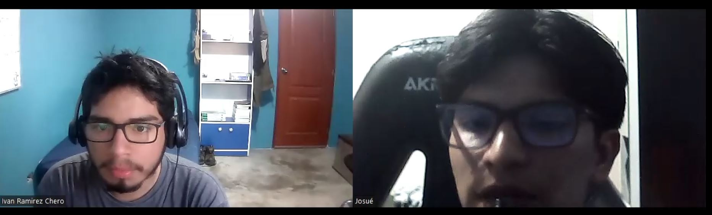

# Capítulo II: Requirements Elicitation & Analysis
---
## 2.1. Competidores
---
### 2.1.1. Análisis competitivo
---
### 2.1.2. Estrategias y tácticas frente a competidores
---
## 2.2. Entrevistas
---
### 2.2.1. Diseño de entrevistas
---
### 2.2.2. Registro de entrevistas

>Edith Carrasco Vallejos

Resumen: La entrevistada se llama Edith Carrasco Vallejos, tiene 44 años, reside en La Perla y es casada. se describe como una persona extrovertida, responsable, puntual, trabajadora en equipo y organizada. Usa tecnologías como computadora y laptop. Su navegador favorito es Google Chrome y usa apps como YouTube, Instagram y Whatsapp. Ella dirige una empresa que comercializa sensores para el control de la humedad. Menciona que realiza estudios de mercado constantemente para conocer las necesidades de los clientes y ajustarse al nicho de mercado. Uno de los mayores desafíos que enfrenta la empresa es la falta de comprensión de algunos clientes y está interesada en integrar sus productos en un producto relacionado con el cuidado de las plantas. Le gustaría conocer más sobre los usuarios de su aplicación, como sus necesidades específicas. Señala que la publicidad a través de una plataforma digital puede ayudar a captar una mayor cantidad de clientes. Valora el funcionamiento de los productos, la facilidad de uso y la conectividad a través de dispositivos electrónicos.

Link de la entrevista:

>Ivan Ramirez Chero

Resumen: En la entrevista con Iván Ramírez, un estudiante universitario de 21 años, se recopilaron datos sobre sus hábitos y preferencias en el cuidado de plantas. Iván utiliza más la computadora que el celular y prefiere el navegador Vivaldi. Aunque intenta cuidar sus plantas a diario, a veces se le olvida hacerlo. Los mayores desafíos que enfrenta incluyen el miedo a excederse en el riego o descuidar sus plantas. Iván estaría interesado en una aplicación que clasifique sus plantas por tipo y proporcione información sobre el cuidado adecuado, como riego, cambio de tierra y exposición al sol. Considera importante recibir notificaciones sobre eventos importantes relacionados con el cuidado de sus plantas, ya que le ayudaría a mantener sus plantas saludables y a reducir el estrés de perder alguna. Iván está entusiasmado con la idea de recibir recomendaciones basadas en sus preferencias y condiciones de cultivo.

Link de la entrevista:

### 2.2.3. Análisis de entrevistas
---
## 2.3. Needfinding
---
### 2.3.1. User Personas
---
### 2.3.2. User Task Matrix
---
### 2.3.3. User Journey Mapping
---
### 2.3.4. Empathy Mapping
---
### 2.3.5. As-is Scenario Mapping
---
## 2.4. Ubiquitous Language
---