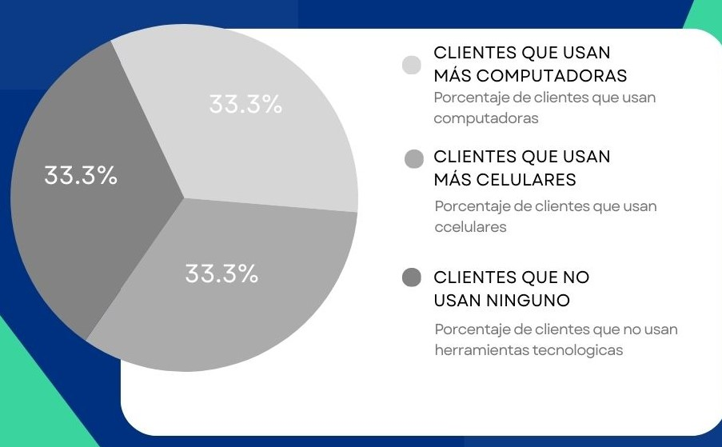
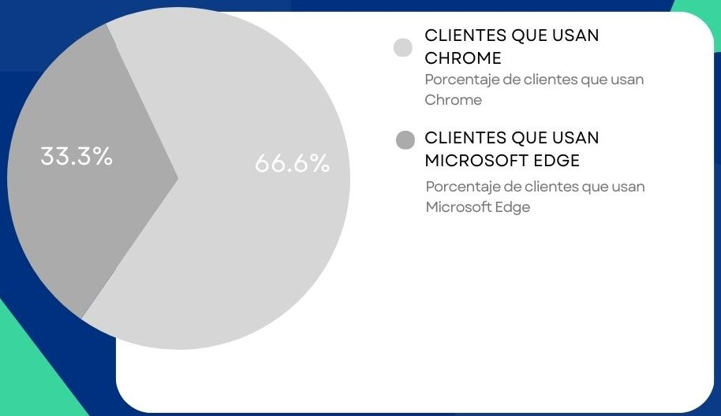
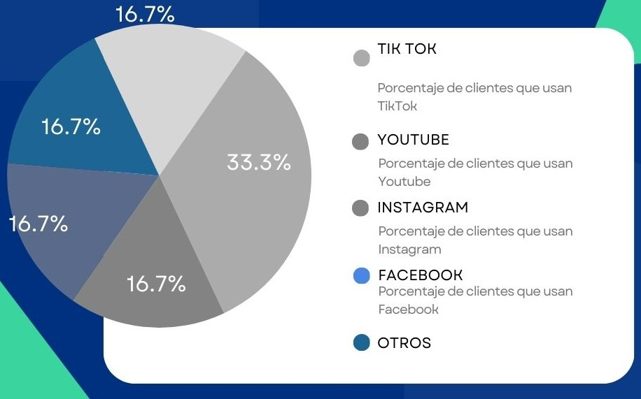
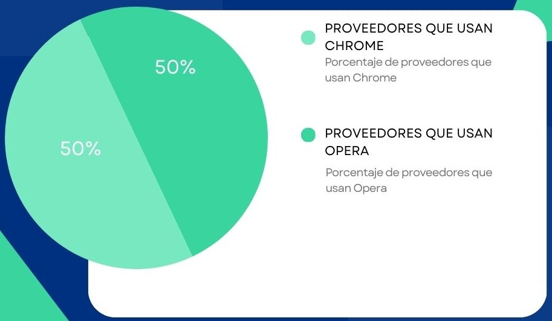
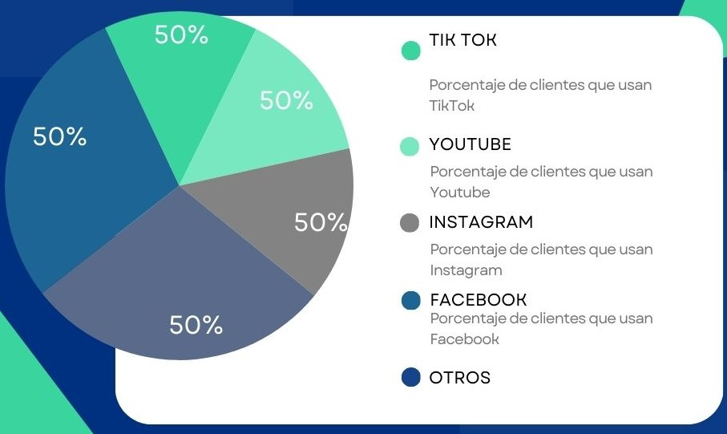
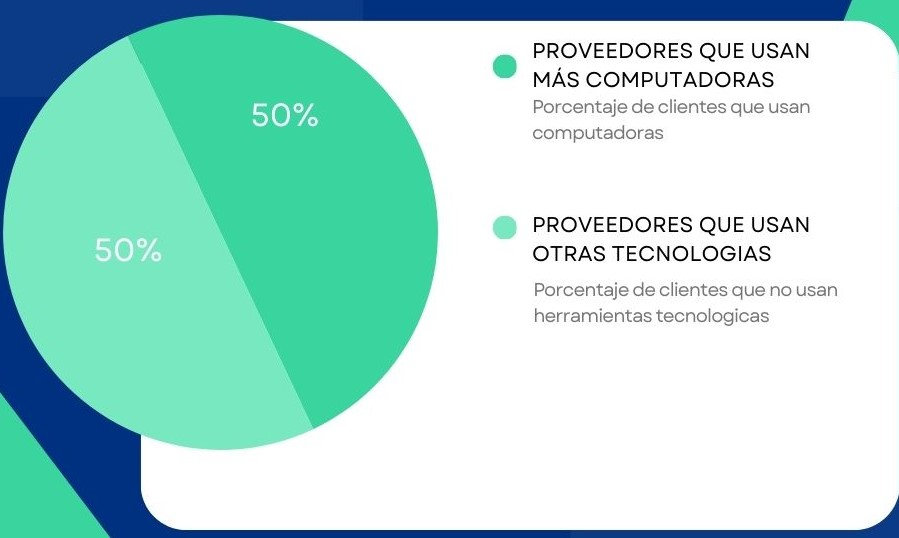

# Capítulo II: Requirements Elicitation & Analysis
---
## 2.1. Competidores
---
### 2.1.1. Análisis competitivo
---
### 2.1.2. Estrategias y tácticas frente a competidores
---
## 2.2. Entrevistas
---
### 2.2.1. Diseño de entrevistas
---
### 2.2.2. Registro de entrevistas
---
### 2.2.3. Análisis de entrevistas
#### Segmento de Propietarios de Plantas:

- Características Objetivas:
  

- Características Subjetivas:
  

- Tecnologia:

Basándonos en los resúmenes de las entrevistas, podemos observar que las características objetivas y subjetivas comunes entre los clientes son bastante consistentes. El porcentaje del 100% indica una necesidad generalizada en cada una de estas características entre los clientes entrevistados. Esto proporciona una base sólida para la construcción de arquetipos de clientes y el diseño de la aplicación de cuidado de plantas.

#### Segmento de Proveedores:

- Características Objetivas:
  

- Características Subjetivas:
  

Tecnología:

Basándonos en los resúmenes de las entrevistas, podemos observar que las características objetivas y subjetivas comunes entre los proveedores también son bastante consistentes. El porcentaje del 100% indica una necesidad generalizada en cada una de estas características entre los proveedores entrevistados. Esto proporciona una base sólida para la construcción de arquetipos de proveedores y el diseño de la colaboración con la aplicación de cuidado de plantas.

---
## 2.3. Needfinding
---
### 2.3.1. User Personas
---
### 2.3.2. User Task Matrix
---
### 2.3.3. User Journey Mapping
---
### 2.3.4. Empathy Mapping
---
### 2.3.5. As-is Scenario Mapping
---
## 2.4. Ubiquitous Language
---