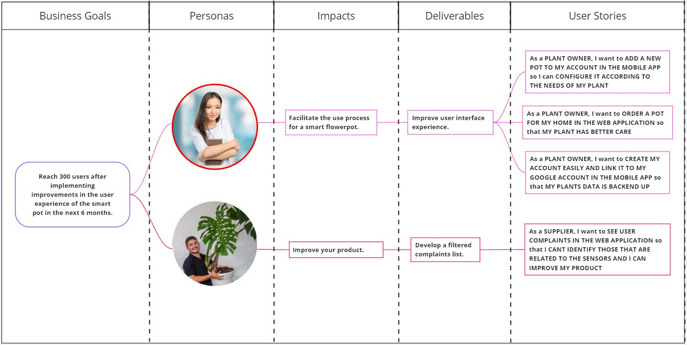

# Capítulo III: Requirements Specification
---
## 3.1. To-Be Scenario Mapping
> Cliente

> Proveedor

## 3.2. User Stories
|**Epic ID**|**Título**|**Descripción**|
| :- | :- | :- |
|EP001|Move between landing page sections|As a user, I want to be able to navigate between different sections of the mobile app home page to explore various functionalities.|
|EP002|View the benefits of the application|As a user, I want to see the benefits of using the app on the home page, including testimonials from other users.|
|EP003|Collect user contact information via a form|As a user, I want to see and complete a contact form on the home page to provide information for potential sales deals.|
|EP004|Manage flowerpots|As a user, I want to be able to add new pots, configure them, place orders, and receive notifications about their status.|
|EP005|Account management|As a user, I want to be able to create an account, recover my password, and file complaints, both in the web app and the mobile app.|
|EP006|Supplier functionalities|As a user, I want to access supplier-related functionalities such as checking stock, tracking orders, and handling complaints, both on the web and mobile app.|
|EP007|API Integration|As a developer, I want to integrate functionality through RESTful APIs, including adding home gardeners, plants, supplies and order management, and sensor data.|

| **Story ID** | **Título** | **Descripción** | **Criterios de Aceptación** | **Relacionado con Epic ID** |
| :- | :- | :- | :- | :- |
|US001|Move between landing page sections|
As a Plant Owner

I want to move between the sections of the mobile application 

So I can see the functionalities
|
--- Scenario: Navigate between landing page sections

**Given** the user is on the home page of the mobile application,

**When** the user clicks an icon or link to navigate to another section,

**Then** the page will take you to the selected section and I can see the corresponding functionalities.

--- Scenario: View a list of sections

**Given** the user is on the landing page of the mobile application,

**When** the user clicks on a menu button or navigation icon,

**Then** the user sees a list of all available sections and can select one to navigate.
| EP001 |
|US002|View the benefits of the application|
As a Plant Owner

I want to see the benefits that using the application offers, 

So you have information to be able to use it.
|
--- Scenario: View benefits on the landing page

**Given** the user is on the landing page of the application,

**When** the user scrolls down the page,

**Then** the user sees a list of benefits provided by the application with a brief description of each benefit.

--- Scenario: Read testimonials about the benefits

**Given** the user is on the landing page of the application,

**When** the user scrolls down or navigates to a section with testimonials,

**Then** the user reads testimonials from other users about the benefits of using the application.
| EP002 |
|US003|View information about company members|
As a Plant Owner 

I want to obtain information about the developers of the application, 

So I can feel more secure.
|
--- Scenario: Viewing the video about the team

**Since** I am in the “About us” section

**When** I press the play button

**Then** the video about the team will then play within the page.

--- Scenario: The user cannot view the About Us video 

**Since** I am in the “About us” section

**When** I press the play button

**Then** the video will not play and the user will have to reload the mobile application.
| EP002 |
|US004|Collect user contact information via a form|
As a Plant Owner, 

I want to contact the developers, 

So we can have a sales agreement
|
--- Scenario: Display the contact form

**Given** the user is on the landing page,

**When** the user scrolls down the page,

**Then** the user sees a contact form with fields for name, email, and a message.

--- Scenario: User submits the form

**Given** the user has filled in the contact form with valid information,

**When** the user clicks the submit button,

**Then** the user's data is sent and a confirmation message is displayed.

--- Scenario: Form validation

**Given** the user has not filled in the contact form correctly 

**When** the user clicks the submit button,

**Then** an error message is displayed, prompting the user to correct the form.

--- Scenario: Receive user data

**Given** the user has successfully submitted the contact form,

**When** the data is received by the server,

**Then** the user receives a thank you message, and the data is stored in a secure database for future follow-up.
| EP003 |
|US005 |Add new flowerpot|
As a Plant Owner

 

I want to add a new pot to my account in the web application  So I can configure it according to the needs of my plant
|
--- Scenario: Successfully inserted and added code of the new flowerpot

**Given** the user already has the new flowerpot in his possession **When** the user enters the flowerpot code and inserts it into the app **Then** the flowerpot is successfully added to the user's account. 

--- Scenario: Could not add new flowerpot

**Given** the user already has the new flowerpot in his possession **When** the user enters the wrong code of the flowerpot code and inserts it into the app **Then** I get an error message when adding the flowerpot.
| EP004 |
|US006|Add new flowerpot|
As a Plant Owner

 

I want to add a new pot to my account in the mobile app  So I can configure it according to the needs of my plant
|
--- Scenario: Successfully inserted and added code of the new flowerpot

**Given** the user already has the new flowerpot in his possession **When** the user enters the flowerpot code and inserts it into the app **Then** the flowerpot is successfully added to the user's account. 

--- Scenario: Could not add new flowerpot

**Given** the user already has the new flowerpot in his possession **When** the user enters the wrong code of the flowerpot code and inserts it into the app **Then** I get an error message when adding the flowerpot.
| EP004 |
|US007|Set up the flowerpot|As a Plant Owner  I want to be able to configure the pot with my plant details in the web application  So that my plant has good care|
--- Scenario: successful plant details configuration

**Given** the user already added the flowerpot to their account **When** the user enters the pot settings and from the list selects their plant **Then** a message of success when entering your plant details will be displayed.

--- Scenario: Manual configuration of plant details successful

**Given** the user already added the flowerpot to their account **When** the user enters the pot settings and does not see their plant in the list, they will enter the necessary details manually **Then** a message of success when entering your plant details will be displayed.
| EP004 |
|US008|Set up the flowerpot|As a Plant Owner  I want to be able to configure the pot with my plant details in the mobile app  So that my plant has good care|
--- Scenario: successful plant details configuration

**Given** the user already added the flowerpot to their account **When** the user enters the pot settings and from the list selects their plant **Then** a message of success when entering your plant details will be displayed.

--- Scenario: Manual configuration of plant details successful

**Given** the user already added the flowerpot to their account **When** the user enters the pot settings and does not see their plant in the list, they will enter the necessary details manually **Then** a message of success when entering your plant details will be displayed.
| EP004 |
|US009|Order flowerpot|As a Plant Owner  I want to order a flowerpot for my home in the web application  So that my plant has better care|
--- Scenario: address information and order placed correctly

**Given** the user has already paid for the subscription **When** the user verifies their delivery address data **Then** we proceed with the shipment of the pot in the detailed time.

--- Scenario: wrong address information

**Given** the user has already paid for the subscription **When** the user incorrectly verifies their delivery address data **Then** we proceed with shipping the pot and it arrives at the wrong place.

| EP004 |
|US010|Order flowerpot|As a Plant Owner  I want to order a flowerpot for my home in the mobile app  So that my plant has better care|
--- Scenario: address information and order placed correctly

**Given** the user has already paid for the subscription **When** the user verifies their delivery address data **Then** we proceed with the shipment of the pot in the detailed time.

--- Scenario: wrong address information

**Given** the user has already paid for the subscription **When** the user incorrectly verifies their delivery address data **Then** we proceed with shipping the pot and it arrives at the wrong place.

| EP004 |
|US011|Generate report|As a Plant Owner  I want to see a report of the humidity, temperature and sunlight that my plant receives in the web application  So that my plant has better care|
--- Scenario: report generated successfully

**Given** the user already has his plant in the flowerpot **When** the user presses the report button **Then** a report will be shown on the data captured by the sensors.

--- Scenario: report not generated

**Given** the user already has his plant in the flowerpot **When** the user presses the report button **Then** the report will not be generated because some sensor is damaged or there is no signal.
| EP004 |
|US012|Generate report|As a Plant Owner  I want to see a report of the humidity, temperature and sunlight that my plant receives in the mobile app  So that my plant has better care|
--- Scenario: report generated successfully

**Given** the user already has his plant in the flowerpot **When** the user presses the report button **Then** a report will be shown on the data captured by the sensors.

--- Scenario: report not generated

**Given** the user already has his plant in the flowerpot **When** the user presses the report button **Then** the report will not be generated because some sensor is damaged or there is no signal.
| EP005 |
|US013|Receive notifications|As a Plant Owner  I want to receive notifications related to the status of my plant in the mobile app  So that I know about the situation of my plant.|
--- Scenario: notification received successfully

**Given** the user already has his plant in the flowerpot **When** the user spends a few hours without entering the app **Then** a notification about the situation of your plant will reach you.
| EP005 |
|US014|Create account|As a Plant Owner  I want to create my account easily and link it to my Google account in the web application  So that my plants data is backed up|
--- Scenario: account created successfully

**Given** the user is in Record view **When** you complete all your information and accept the terms and conditions **Then** the verification email will arrive to confirm your registration
| EP005 |
|US015|Create account|As a Plant Owner  I want to create my account easily and link it to my Google account in the mobile app  So that my plants data is backed up|
--- Scenario: account created successfully

**Given** the user is in Record view **When** you complete all your information and accept the terms and conditions **Then** the verification email will arrive to confirm your registration
| EP005 |
|US016|Recover password|As a Plant Owner  I want to be able to recover my password if it is lost in the web application  So that I do not lose my data or my already made subscriptions.|
--- Scenario: successful password recovery

**Given** the user must log in to the app again and does not have access to their account credentials **When** you press the "Recover Password" button and confirm the message that your email has arrived. **Then** you will change the password and you will be able to log in to your account.

--- Scenario: failed password recovery

**Given** the user must log in to the app again and does not have access to their account credentials **When** you press the "Recover Password" button and cannot confirm the message that your email has arrived. **Then** you will not be able to change your password or log in to your account.
| EP005 |
|US017|Recover password|As a Plant Owner  I want to be able to recover my password in case of loss in the mobile app  So that I do not lose my data or my already made subscriptions.|
--- Scenario: successful password recovery

**Given** the user must log in to the app again and does not have access to their account credentials **When** you press the "Recover Password" button and confirm the message that your email has arrived. **Then** you will change the password and you will be able to log in to your account.

--- Scenario: failed password recovery

**Given** the user must log in to the app again and does not have access to their account credentials **When** you press the "Recover Password" button and cannot confirm the message that your email has arrived. **Then** you will not be able to change your password or log in to your account.
| EP005 |
|US018|File claims|As a Plant Owner  I want to file complaints in case there are any in the web application  So that the company can fix it and take it into account in the future.|
--- Scenario: claim successfully filed

**Given** the user has a claim **When** you press the "Claim" button and insert your claim **Then** the support team will try to resolve your complaint.
| EP005 |
|US019|File claims|As a Plant Owner  I want to file complaints in case there are any in the mobile app  So that the company can fix it and take it into account in the future.|
--- Scenario: claim successfully filed

**Given** the user has a claim **When** you press the "Claim" button and insert your claim **Then** the support team will try to resolve your complaint.
| EP005 |
|US020|Check stock|As a Supplier  I want to consult the company's shares in the web application  So you can be prepared for future orders.|
--- Scenario: stock seen correctly

**Given** the supplier wants to consult the stock **When** you log in to your account **Then** the current stock of the company will appear in the main view
| EP006 |
|US021|Check stock|As a Supplier  I want to check the company's shares in the mobile app  So you can be prepared for future orders.|
--- Scenario: stock seen correctly

**Given** the supplier wants to consult the stock **When** you log in to your account **Then** the current stock of the company will appear in the main view
| EP006 |
|US0022|Track orders|As a Supplier  I want to track the orders I send in the web application  To verify that they are in good condition|
--- Scenario: Successful order tracking

**Given** the supplier has already sent the order **When** you enter the tracking panel **Then** you can see the status of your order if it is approved or not.
| EP006 |
|US0023|Track orders|As a Supplier  I want to track the orders I ship in the mobile app  To verify that they are in good condition|
--- Scenario: Successful order tracking

**Given** the supplier has already sent the order **When** you enter the tracking panel **Then** you can see the status of your order if it is approved or not.
| EP006 |
|US024|Consult user complaints|As a Supplier  I want to see user complaints in the web application  So that I can identify those that are related to the sensors and I can improve my product|
--- Scenario: View complaints correctly

**Given** the provider wants to review user complaints **When** you click on the "Claims" button **Then** the claims the appear in order of seniority.
| EP006 |
|US025|Consult user complaints|As a Supplier  I want to see user complaints in the mobile application  So that I can identify those that are related to the sensors and I can improve my product|
--- Scenario: View complaints correctly

**Given** the provider wants to review user complaints **When** you click on the "Claims" button **Then** the claims the appear in order of seniority.
| EP006 |
|TS026 |
Add 

Domestic Gardener through RESTful API 
|
As a Developer 

 

I want to add a 

Domestic 

Gardener through 

API 

 

So that it can be available to build features for my applications 
|
--- Scenario: Successfully add a domestic gardener through API 

**Given** the API endpoint for adding a domestic gardener **When** a POST request is sent with valid gardener data **Then** the response status code should be 

201 

**And** the response body should contain the details of the added gardener.

 

 

--- Scenario: Fail to add a domestic gardener through API due to invalid data 

**Given** the API endpoint for adding a domestic gardener **When** a POST request is sent with incomplete or invalid gardener data **Then** the response status code should be 

400 

**And** the response body should contain an error message indicating the validation failure.

 

 

--- Scenario: Fail to add a domestic gardener through API due to duplicate email **Given** the API endpoint for adding a domestic gardener **And** an existing domestic gardener with the same email 

**When** a POST request is sent with valid gardener data 

**Then** the response status code should be 409 **And** the response body should contain an error message indicating the duplicate email
| EP007 |
|TS027 |
Delete 

Domestic Gardener through RESTful API 
|
As a Developer 

 

I want to delete a 

Domestic 

Gardener through 

API 

 

So that I can keep my applications database updated 
|
--- Scenario: 

Successfully delete a domestic gardener through API 

**Given** the API endpoint for deleting a domestic gardener **And** an existing domestic gardener in the database **When** a DELETE request is sent with the gardener's ID **Then** the response status code should be 204 **And** the domestic gardener should no 

longer be in the 

database.

 

 

--- Scenario: Fail to delete a domestic gardener through API due to invalid ID  **Given** the API endpoint for deleting a domestic gardener 

**And** an invalid gardener 

ID  **When** a DELETE request 

is sent with the invalid ID **Then** the response status code should be 404 **And** the response body should contain an error message indicating the 

resource not found.

 

 

--- Scenario: Fail to delete a domestic gardener through API due to active foreign key constraints 

**Given** the API endpoint for deleting a domestic gardener **And** the domestic gardener has active foreign key constraints in other tables **When** a DELETE request is sent with the gardener's ID **Then** the response status code should be 409 **And** the response body should contain an error message indicating active foreign key constraints
| EP007 |
|TS028|Add Plant through RESTful API |
As a Developer 

 

I want to add a 

Plant through API 

 

So that users can create their own inventory of plants 
|
--- Scenario: 

Successfully add a plant through API 

**Given** the API endpoint for adding a plant **When** a POST request is sent with valid plant data **Then** the response status code should be 201 **And** the response body should contain the details of the added plant. 

 

 

--- Scenario: Fail to add a plant through API due to missing data 

**Given** the API endpoint for adding a plant **When** a POST request is sent with incomplete plant data **Then** the response status code should be 400 **And** the response body should contain an error message indicating the missing data
| EP007 |
|TS029 |
Get a list of 

Plants from 

RESTful API 
|
As a Developer 

 

I want to retrieve a list of plants through API  So that I can display available plant options to users 
|
--- Scenario: 

Successfully retrieve a list of plants through API **Given** the API endpoint for retrieving a list of plants 

**When** a GET request is sent 

**Then** the response status code should be 200 **And** the response body should contain a list of plants. 

 

 

--- Scenario: Fail to retrieve a list of plants through API due to authentication failure **Given** the API endpoint for retrieving a list of plants **And** invalid authentication credentials 

**When** a GET request is sent  **Then** the response status code should be 401 

**And** the response body should contain an error message indicating authentication failure
| EP007 |
|TS030 |
Get Humidity Sensor Data from RESTful 

API 
|
As a Developer 

 

I want to retrieve humidity sensor data through API  So that I can analyze environmental conditions and provide recommendations to users 
|
--- Scenario: 

Successfully retrieve humidity sensor data through API 

**Given** the API endpoint for retrieving humidity sensor data **When** a GET request is sent **Then** the response status code should be 200 **And** the response body should contain humidity sensor data.

 

 

--- Scenario: Fail to retrieve humidity sensor data through API due to server error 

**Given** the API endpoint for retrieving humidity sensor data **And** a server error When a GET request is sent **Then** the response status code should be 500 **And** the response body should contain an error message indicating server error 
| EP007 |
|TS0031|
Get 

Temperature Sensor Data from RESTful 

API 
|
As a Developer 

 

I want to retrieve temperature sensor data through API  So that I can monitor environmental conditions and adjust plant watering. 
|
--- Scenario: 

Successfully retrieve temperature sensor data through API  **Given** the API endpoint 

for retrieving temperature sensor data **When** a GET request is sent **Then** the response status code should be 200 **And** the response body should contain temperature sensor data.

 

--- Scenario: Fail to retrieve temperature sensor data through API due to unavailable endpoint 

**Given** an invalid API endpoint for retrieving temperature sensor data **When** a GET request is sent **Then** the response status code should be 404 **And** the response body should contain an error message indicating endpoint not found.
| EP007 |
|TS032|
Get Sunlight Sensor Data from RESTful 

API 
|
As a Developer 

 

I want to retrieve sunlight sensor data through API  So that I can determine available light for plants and 

provide location recommendations 
|
--- Scenario: 

Successfully retrieve sunlight sensor data through API 

**Given** the API endpoint for retrieving sunlight sensor data **When** a GET request is sent **Then** the response status code should be 200 **And** the response body should contain sunlight sensor data.

 --- Scenario: Fail to retrieve sunlight sensor data through API due to unauthorized access **Given** the API endpoint for retrieving sunlight sensor data **And** unauthorized access 

**When** a GET request is sent 

**Then** the response status code should be 

403 

**And** the response body should contain an error message indicating access forbidden
| EP007 |
|TS033|Add Supply through RESTful API |
As a Developer 

 

I want to add supplies through API  So that users can maintain an inventory of materials needed for plant care 
|
--- Scenario: Successfully add a supply through API **Given** the API endpoint for adding a supply **When** a POST request is sent with valid supply data 

**Then** the response status code should be 

201 

**And** the response body should contain the details of the added supply. 

 

 

--- Scenario: Fail to add a supply through API due to insufficient data **Given** the API endpoint for adding a supply **When** a POST request is sent with incomplete supply data **Then** the response status code should be 

400 **And** the response body should contain an error message indicating the missing data.
| EP007 |
|TS034|Update stock of Supply through RESTful API |
As a Developer 

 

I want to update supply inventory through API 

 

So that information about available materials stays synchronized 
|
--- Scenario: 

Successfully update supply stock through API **Given** the API endpoint for updating supply inventory 

**And** existing supply data in the database **When** a PUT request is sent with updated supply data **Then** the response status code should be 200

**And** the response body should contain the 

updated supply details 

 

 

--- Scenario: Fail to update supply stock through API due to server error 

**Given** the API endpoint for updating supply inventory **And** a server error **When** a PUT request is sent **Then** the response status code should be 500 **And** the response body should contain an error message indicating server error.
| EP007 |
|TS035 |
Add Order 

Through 

RESTful API 
|
As a developer 

 

I want to add an order via a RESTful 

API  So that suppliers can keep track of the products they sell to us.
|
--- Scenario: 

Successfully add an order via API 

**Given** the API endpoint for adding an order **When** a POST request is sent with valid order data **Then** the response status code should be 201 **And** the response body should contain the details of the added order.

--- Scenario: Fail to add an order via API due to missing required data **Given** the API endpoint for adding an order **When** a POST request is sent with incomplete order data 

**Then** the response status code should be 400 **And** the response body should contain an error message indicating the missing required data.
| EP007 |
---
## 3.3. Impact Mapping
>Impact Mapping

---
## 3.4. Product Backlog

|**Story ID**|**Título**|**Descripción**|**Story Points**|
| :- | :- | :- | :- |
|US001|Move between landing page sections|
As a Plant Owner

I want to move between the sections of the mobile application 

So I can see the functionalities
|3|
|US002|View the benefits of the application|
As a Plant Owner

I want to see the benefits that using the application offers, 

So you have information to be able to use it.
|5|
|US003|View information about company members|
As a Plant Owner 

I want to obtain information about the developers of the application, 

So I can feel more secure.
|2|
|US004|Collect user contact information via a form|
As a Plant Owner, 

I want to contact the developers, 

So we can have a sales agreement
|3|
|US005|Add new flowerpot|
As a Plant Owner

 

I want to add a new pot to my account in the web application  So I can configure it according to the needs of my plant
|8|
|US006|Add new flowerpot|
As a Plant Owner

 

I want to add a new pot to my account in the mobile app  So I can configure it according to the needs of my plant
|8|
|US007|Set up the flowerpot|As a Plant Owner  I want to be able to configure the pot with my plant details in the web application  So that my plant has good care|8|
|US008|Set up the flowerpot|As a Plant Owner  I want to be able to configure the pot with my plant details in the mobile app  So that my plant has good care|8|
|US009|Order flowerpot|As a Plant Owner  I want to order a flowerpot for my home in the web application  So that my plant has better care|5|
|US010|Order flowerpot|As a Plant Owner  I want to order a flowerpot for my home in the mobile app  So that my plant has better care|5|
|US011|Generate report|As a Plant Owner  I want to see a report of the humidity, temperature and sunlight that my plant receives in the web application  So that my plant has better care|8|
|US012|Generate report|As a Plant Owner  I want to see a report of the humidity, temperature and sunlight that my plant receives in the mobile app  So that my plant has better care|8|
|US013|Receive notifications|As a Plant Owner  I want to receive notifications related to the status of my plant in the mobile app  So that I know about the situation of my plant.|3|
|US014|Create account|As a Plant Owner  I want to create my account easily and link it to my Google account in the web application  So that my plants data is backed up|5|
|US015|Create account|As a Plant Owner  I want to create my account easily and link it to my Google account in the mobile app  So that my plants data is backed up|5|
|US016|Recover password|As a Plant Owner  I want to be able to recover my password if it is lost in the web application  So that I do not lose my data or my already made subscriptions.|3|
|US017|Recover password|As a Plant Owner  I want to be able to recover my password in case of loss in the mobile app  So that I do not lose my data or my already made subscriptions.|3|
|US018|File claims|As a Plant Owner  I want to file complaints in case there are any in the web application  So that the company can fix it and take it into account in the future.|5|
|US019|File claims|As a Plant Owner  I want to file complaints in case there are any in the mobile app  So that the company can fix it and take it into account in the future.|5|
|US020|Check stock|As a Supplier  I want to consult the company's shares in the web application  So you can be prepared for future orders.|3|
|US021|Check stock|As a Supplier  I want to check the company's shares in the mobile app  So you can be prepared for future orders.|3|
|US022|Track orders|As a Supplier  I want to track the orders I send in the web application  To verify that they are in good condition|5|
|US023|Track orders|As a Supplier  I want to track the orders I ship in the mobile app  To verify that they are in good condition|5|
|US024|Consult user complaints|As a Supplier  I want to see user complaints in the web application  So that I can identify those that are related to the sensors and I can improve my product|3|
|US025|Consult user complaints|As a Supplier  I want to see user complaints in the mobile application  So that I can identify those that are related to the sensors and I can improve my product|3|
|US026|Add Domestic Gardener through RESTful API|
As a Developer 

 

I want to add a 

Domestic 

Gardener through 

API 

 

So that it can be available to build features for my applications 
|8|
|US027|Delete Domestic Gardener through RESTful API|
As a Developer 

 

I want to delete a 

Domestic 

Gardener through 

API 

 

So that I can keep my applications database updated
|5|
|US028|Add Plant through RESTful API|
As a Developer 

 

I want to add a 

Plant through API 

 

So that users can create their own inventory of plants
|8|
|US029|Get a list of Plants from RESTful API|
As a Developer 

 

I want to retrieve a list of plants through API  So that I can display available plant options to users 
|5|
|US030|Get Humidity Sensor Data from RESTful API|
As a Developer 

 

I want to retrieve humidity sensor data through API  So that I can analyze environmental conditions and provide recommendations to users 
|3|
|US031|Get Temperature Sensor Data from RESTful API|
As a Developer 

 

I want to retrieve temperature sensor data through API  So that I can monitor environmental conditions and adjust plant watering.
|3|
|US032|Get Sunlight Sensor Data from RESTful API|
As a Developer 

 

I want to retrieve sunlight sensor data through API  So that I can determine available light for plants and 

provide location recommendations
|3|
|US033|Add Supply through RESTful API|
As a Developer 

 

I want to add supplies through API  So that users can maintain an inventory of materials needed for plant care
|5|
|US034|Update stock of Supply through RESTful API|
As a Developer 

 

I want to update supply inventory through API 

 

So that information about available materials stays synchronized
|8|
|US035|Add Order Through RESTful API|
As a developer 

 

I want to add an order via a RESTful 

API  So that suppliers can keep track of the products they sell to us.
|5|

---