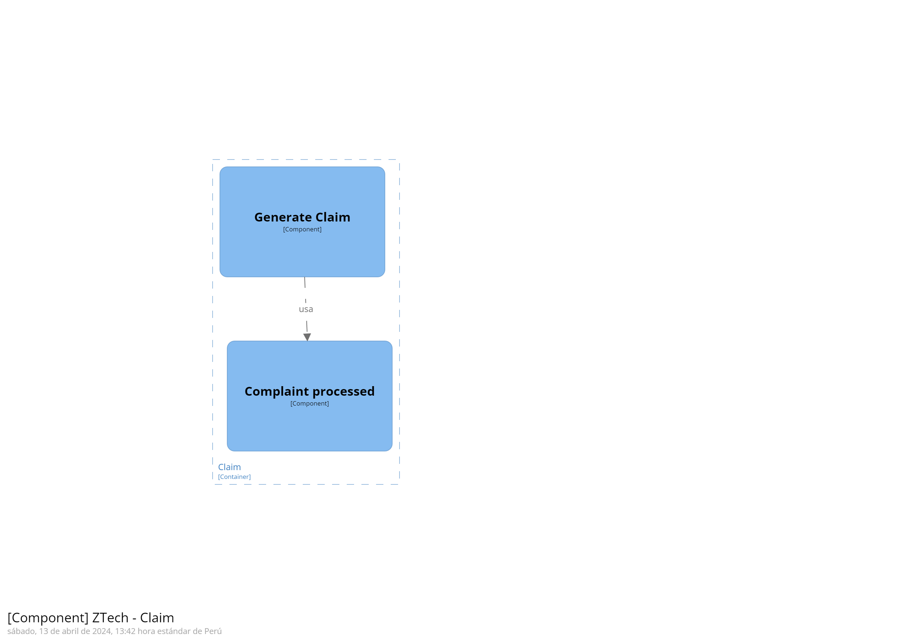
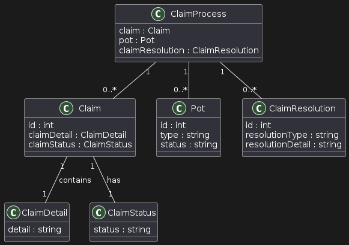
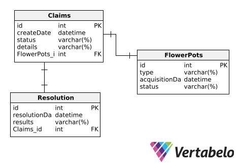

# Capítulo IV: Solution Software Design
---
## 4.1. Strategic-Level Domain-Driven Design
---
### 4.1.1. EventStorming
---
#### 4.1.1.1 Candidate Context Discovery
---
#### 4.1.1.2 Domain Message Flows Modeling
---
#### 4.1.1.3 Bounded Context Canvases
---
### 4.1.2. Context Mapping
---
### 4.1.3. Software Architecture
---
#### 4.1.3.1. Software Architecture System Landscape Diagram
---
#### 4.1.3.2. Software Architecture Context Level Diagrams
---
#### 4.1.3.3. Software Architecture Container Level Diagrams
---
#### 4.1.3.4. Software Architecture Deployment Diagrams
---
## 4.2. Tactical-Level Domain-Driven Design
---
### 4.2.4. Bounded Context: Claim
El Bounded Context de "Claim" aborda la gestión de reclamos relacionados con las macetas. Aquí, los propietarios pueden reportar y resolver incidentes con sus macetas, desde generar un reclamo por daños hasta la resolución del mismo, que puede resultar en el reemplazo de la maceta o en un rechazo del reclamo.

---
#### 4.2.4.1. Domain Layer
**Entities**: `Claim`, `Pot`, `ClaimResolution`.

**Value Objects**: `ClaimDetail`, `ClaimStatus`.

**Aggregates**: `ClaimProcess` que incluye `Claim`, `Pot`, y `ClaimResolution`.

**Repositories**: `ClaimRepository`, `PotRepository` para la gestión de reclamos y datos de macetas.

**Domain Services**: `ClaimService` encargado de la lógica de negocio relacionada con la creación y resolución de reclamos.

---
#### 4.2.4.2. Interface Layer
**API Endpoints**: Rutas como POST `/claims` para la creación de reclamos, GET `/claims/{id}` para obtener el estado de un reclamo.

**DTOs**: `ClaimDTO`, `ClaimResolutionDTO` para la transferencia de datos de reclamos.

**Controllers**: `ClaimController` para procesar las solicitudes relacionadas con los reclamos.

---
#### 4.2.4.3. Application Layer
**Application Services**: `ClaimApplicationService` que administra las operaciones de reclamos.

**Commands/Queries**: `CreateClaimCommand`, `QueryClaimStatus`.

**Command Handlers**: `CreateClaimHandler`, `QueryClaimStatusHandler`.

---
#### 4.2.4.4. Infrastructure Layer
**Repository Implementation**: Como `SQLClaimRepository` para la comunicación con la base de datos.

**External Services**: Integraciones con servicios de logística para seguimiento de envíos y sistemas de gestión de atención al cliente.

**Factories**: Para la creación de `Claim` y otras entidades del dominio.

**ORM / Database Access**: Herramientas como Entity Framework para el mapeo objeto-relacional.

---
#### 4.2.4.5. Bounded Context Software Architecture Component Level Diagrams

---
#### 4.2.4.6. Bounded Context Software Architecture Code Level Diagrams
---
##### 4.2.4.6.1. Bounded Context Domain Layer Class Diagrams

---
##### 4.2.4.6.2. Bounded Context Database Design Diagram

---