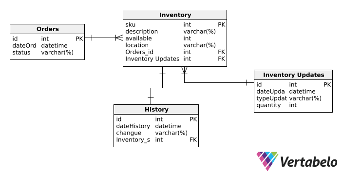

# Capítulo IV: Solution Software Design
---
## 4.1. Strategic-Level Domain-Driven Design
---
### 4.1.1. EventStorming
---
#### 4.1.1.1 Candidate Context Discovery
---
#### 4.1.1.2 Domain Message Flows Modeling
---
#### 4.1.1.3 Bounded Context Canvases
---
### 4.1.2. Context Mapping
---
### 4.1.3. Software Architecture
---
#### 4.1.3.1. Software Architecture System Landscape Diagram
---
#### 4.1.3.2. Software Architecture Context Level Diagrams
---
#### 4.1.3.3. Software Architecture Container Level Diagrams
---
#### 4.1.3.4. Software Architecture Deployment Diagrams
---
## 4.2. Tactical-Level Domain-Driven Design
---
### 4.2.2. Bounded Context: Inventory
La gestión de inventario es crucial en la operación de empresas que requieren mantener un registro actualizado de los artículos disponibles, así como la coordinación efectiva con los proveedores. Este contexto delimitado maneja desde el pedido inicial de suministros hasta la actualización y consulta del historial de órdenes y del inventario.
---
#### 4.2.2.1. Domain Layer

**Entities**: `Order`, `InventoryItem`, `InventoryUpdate`, `OrderHistory`.

**Value Objects**: `Quantity`, `ProductInformation`, `OrderStatus`.

**Aggregates**: `Order` que incluye `InventoryItem` y `OrderStatus`.

**Repositories**: `OrderRepository`, `InventoryRepository` para acceso y manipulación de los datos.

**Domain Services**: `StockManagementService` para operaciones de actualización y mantenimiento del inventario.

---
#### 4.2.2.2. Interface Layer

**API Endpoints**: Rutas como POST `/orders` para nuevos pedidos, GET `/inventory` para consulta de inventario.

**DTOs**: `OrderDTO`, `InventoryItemDTO` para la estructura de datos intercambiados.

**Controllers**: `OrderController`, `InventoryController` para manejar solicitudes API y delegar a la capa de aplicación.

---
#### 4.2.2.3. Application Layer

**Application Services**: `OrderApplicationService` que maneja la lógica de creación y procesamiento de pedidos.

**Commands/Queries**: `CreateOrderCommand`, `QueryInventoryQuery`.

**Command Handlers**: `CreateOrderHandler`, `UpdateInventoryHandler`.

---
#### 4.2.2.4. Infrastructure Layer
**Repository Implementation**: Como `OrderSQLRepository` para interacciones con la base de datos.

**External Services**: Integración con sistemas de proveedores para pedidos y actualización de inventario.

**Factories**: Creación de instancias de agregados o entidades.

**ORM / Database Access**: Herramientas para mapear objetos a registros de base de datos.

---
#### 4.2.2.5. Bounded Context Software Architecture Component Level Diagrams

---
#### 4.2.2.6. Bounded Context Software Architecture Code Level Diagrams
---
##### 4.2.2.6.1. Bounded Context Domain Layer Class Diagrams

---
##### 4.2.2.6.2. Bounded Context Database Design Diagram

---