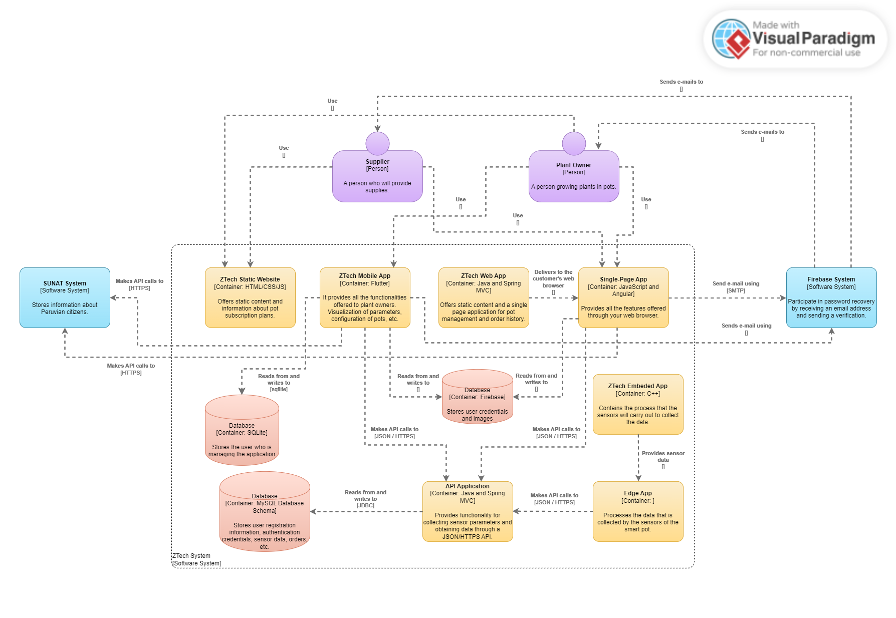

# Capítulo IV: Solution Software Design
---
## 4.1. Strategic-Level Domain-Driven Design
---
### 4.1.1. EventStorming
EventStoring es una técnica de modelado colaborativa e iterativa para simular un área problemática grande y compleja, lo que permite ahondar en la mayor cantidad de detalles y problemas posibles.
#### 4.1.1.1 Candidate Context Discovery
---  
**Step 1: Unstructured Exploration**  
Como primer paso del EventStoring comenzamos con una sesión de lluvia de ideas sobre los eventos del dominio relacionados con el negocio estudiado. Es importante formar los acontecimientos del dominio en tiempo pasado los cuales describen lo sucedido.

---
**Step 2: Timelines**  
Luego como segundo paso, revisamos los eventos de dominio generados y los organizamos en el orden en que ocurren en el dominio. Es decir, los eventos deben comenzar con un happy path los cuales describen un escenario comercial exitoso. Finalmente, una vez que se completa el happy path, se pueden agregar escenarios alternativos.

---
**Step 3: Paint Points**  
Después de organizar los eventos en una línea de tiempo, usamos esta vista amplia para identificar puntos de interés a lo largo del camino. Tales como los cuellos de botella, pasos manuales que requieren automatización, falta de documentación o falta de conocimiento del dominio.

---
**Step 4: Pivotal Points**  
Una vez terminado nuestra línea de eventos completo con paint points, buscamos eventos comerciales clave que indiquen un cambio en el contexto o la fase. Estos se denominan eventos principales los cuales los marcamos con una barra vertical que separa los eventos anteriores y posteriores al evento principal.

---
**Step 5: Commands**  
En este paso los comandos describen la causa del evento o el flujo de eventos. Es decir, los comandos describen las operaciones del sistema, diferenciándose de los eventos de dominio, se construyen en imperativo.

---
**Step 6: Policies**  
En este punto, buscamos reglas de automation policies que puedan ejecutar estos comandos. Es decir, una automation policy es un escenario en el que un evento desencadena la ejecución de un comando. En otras palabras, el comando se ejecuta automáticamente cuando ocurre un evento específico del dominio.

0

---
**Step 7: Read Models**  
En este paso, el modelo de lectura es la representación de datos en el dominio que el agente utiliza para decidir si ejecuta o no el comando. Es por eso, que definimos una vista de datos por cada comando tales como los monitores del sistema, informes, notificaciones y entre otros.

---
**Step 8: External Systems**  
Este paso completamos el modelo con sistemas externos. Es decir, un sistema externo se define como cualquier sistema que no forma parte del dominio que se está trabajando. Además, puede ejecutar comandos (entrar) o recibir notificaciones sobre eventos (salir).

---
**Step 9: Aggregates**  
Después de haber presentado todos los eventos y comandos, comenzamos a pensar en agrupar los conceptos relacionados en agregados los cuales reciben comandos y generan eventos.

---
**Step 10: Bounded Contexts**  
Como último paso buscamos agregados que sea relacionen y sean relevantes entre sí porque representan funciones estrechamente relacionadas o porque están relacionadas según políticas. Es decir, los grupos de agregados generan candidatos naturales para los límites de los contextos delimitados.

#### 4.1.1.2 Domain Message Flows Modeling
Un Domain Message Flow Diagram es una visualización simple que muestra el flujo de mensajes (commands, events, queries) entre actors, bounded contexts y systems para un escenario.

---
**Scenario: Register and Set Up Pots Correctly**

---
**Scenario: Generate a Claim for a Defective Flowerpot**

---
**Scenario: Subscription not Renewed**

---
**Scenario: Scenario: Account creation and verification**

---
**Scenario: Sort Order Stock for Inventory**

---
**Scenario: Process Order Replenishment**

---
**Scenario: Start Sensors to Collect Data**

---
**Scenario: Calculate and Send Metrics**

#### 4.1.1.3 Bounded Context Canvases
Bounded Context Canvas es una herramienta colaborativa para diseñar y documentar un único proyecto de contexto limitado. Un contexto restringido es un subsistema en una arquitectura de software que está asociado con una parte de su dominio. Canvas lo guía a través de un proceso de diseño contextual limitado, pidiéndole que revise y tome decisiones sobre los elementos clave del diseño, desde la denominación hasta las responsabilidades, las interfaces públicas y las dependencias.

---
**Account Context**

---
**Flowerpot Context**

---
**Inventory Context**

---
**Claim Context**

---
**IoT Solution Context**

### 4.1.2. Context Mapping

---
### 4.1.3. Software Architecture
---
#### 4.1.3.1. Software Architecture System Landscape Diagram

---
#### 4.1.3.2. Software Architecture Context Level Diagrams

---
#### 4.1.3.3. Software Architecture Container Level Diagrams

---
#### 4.1.3.4. Software Architecture Deployment Diagrams

---
## 4.2. Tactical-Level Domain-Driven Design
---
### 4.2.1. Bounded Context: Account
---
## 4.2.1.1. Domain Layer

**Entities:** Incluyen clases como `Account`, `User`, `PlantOwner`, y `Provider`. Cada entidad tiene sus propios atributos y comportamientos que definen qué es y qué puede hacer. `User` podría extenderse a `VerifiedUser` y `UnverifiedUser`.

**Value Objects:** Objetos inmutables que tienen atributos pero no identidad distinta, como `Address` o `SensorData`.

**Aggregates:** Un conjunto de objetos asociados que se tratan como una unidad única, por ejemplo, un agregado `Account` que incluye `User`, `UserState`, y `PlantSensorInfo`.

**Repositories:** Abstracciones para el acceso a los objetos del dominio, como `AccountRepository` o `PlantInfoRepository`.

**Services:** Incluyen servicios del dominio para operaciones que no pertenecen naturalmente a ninguna entidad, como `VerificationService` o `AccountCreationService`.

---

## 4.2.1.2. Interface Layer

**API Endpoints:** Rutas REST para manejar la creación de cuentas y los procesos de verificación, como POST `/accounts` para la creación de cuentas y PUT `/accounts/{id}/verify` para la verificación de cuentas.

**DTOs:** Objetos de transferencia de datos como `AccountCreationRequest` y `VerificationRequest` que definen la estructura de datos para las solicitudes.

**View Models:** Para enviar datos a vistas o APIs externas, como `AccountDetailsViewModel`.

**Controllers:** Que llaman a servicios de aplicación, como `AccountController` que maneja las solicitudes HTTP y delega a los servicios de aplicación.

---

## 4.2.1.3. Application Layer

**Services:** Servicios de aplicación que orquestan los servicios de dominio e interacciones de repositorio, como `AccountApplicationService` que maneja la lógica de registro y verificación de cuentas.

**Commands/Queries:** Objetos que encapsulan datos necesarios para realizar acciones, como `CreateAccountCommand` o `VerifyAccountCommand`.

**Command Handlers:** Manejan los comandos, como `CreateAccountHandler`.

**Event Handlers:** Responden a eventos del dominio, como cuando una cuenta es verificada.

---

## 4.2.1.4. Infrastructure Layer

**Persistence Mechanisms:** Implementaciones de los repositorios que interactúan con la base de datos, como `AccountSQLRepository`.

**External Service Integrations:** Tales como la comunicación con el sistema SUNAT para validación o integración con proveedores de datos de sensores.

**Factories:** Para la creación de objetos de dominio complejos.

**API Clients:** Para interactuar con otros bounded contexts o servicios externos.

---
#### 4.2.1.5. Bounded Context Software Architecture Component Level Diagrams

--- 
#### 4.2.1.6. Bounded Context Software Architecture Code Level Diagrams
---
##### 4.2.1.6.1. Bounded Context Domain Layer Class Diagrams

---
##### 4.2.1.6.2. Bounded Context Database Design Diagram

---

### 4.2.2. Bounded Context: Inventory
La gestión de inventario es crucial en la operación de empresas que requieren mantener un registro actualizado de los artículos disponibles, así como la coordinación efectiva con los proveedores. Este contexto delimitado maneja desde el pedido inicial de suministros hasta la actualización y consulta del historial de órdenes y del inventario.
---
#### 4.2.2.1. Domain Layer

**Entities**: `Order`, `InventoryItem`, `InventoryUpdate`, `OrderHistory`.

**Value Objects**: `Quantity`, `ProductInformation`, `OrderStatus`.

**Aggregates**: `Order` que incluye `InventoryItem` y `OrderStatus`.

**Repositories**: `OrderRepository`, `InventoryRepository` para acceso y manipulación de los datos.

**Domain Services**: `StockManagementService` para operaciones de actualización y mantenimiento del inventario.

---
#### 4.2.2.2. Interface Layer

**API Endpoints**: Rutas como POST `/orders` para nuevos pedidos, GET `/inventory` para consulta de inventario.

**DTOs**: `OrderDTO`, `InventoryItemDTO` para la estructura de datos intercambiados.

**Controllers**: `OrderController`, `InventoryController` para manejar solicitudes API y delegar a la capa de aplicación.

---
#### 4.2.2.3. Application Layer

**Application Services**: `OrderApplicationService` que maneja la lógica de creación y procesamiento de pedidos.

**Commands/Queries**: `CreateOrderCommand`, `QueryInventoryQuery`.

**Command Handlers**: `CreateOrderHandler`, `UpdateInventoryHandler`.

---
#### 4.2.2.4. Infrastructure Layer
**Repository Implementation**: Como `OrderSQLRepository` para interacciones con la base de datos.

**External Services**: Integración con sistemas de proveedores para pedidos y actualización de inventario.

**Factories**: Creación de instancias de agregados o entidades.

**ORM / Database Access**: Herramientas para mapear objetos a registros de base de datos.

---
#### 4.2.2.5. Bounded Context Software Architecture Component Level Diagrams

---
#### 4.2.2.6. Bounded Context Software Architecture Code Level Diagrams
---
##### 4.2.2.6.1. Bounded Context Domain Layer Class Diagrams

---
##### 4.2.2.6.2. Bounded Context Database Design Diagram

---

### 4.2.3. Bounded Context: Flowerpot

En el contexto de Flowerpot, los dueños de las macetas pueden gestionar sus pedidos, configurar sus macetas, y recibir informes sobre el estado de sus plantas. Este Bounded Context abarca desde el inicio del pedido hasta el seguimiento y reporte del estado y salud de las plantas.

---
#### 4.2.3.1. Domain Layer
**Entities**: `Pot`, `Order`, `Report`, `PotConfiguration`, `Subscription`.

**Value Objects**: `PotStatus`, `ConfigurationData`, `ReportData`.

**Aggregates**: `PotOrder` que incluye `Pot`, `PotConfiguration`, y `Subscription`.

**Repositories**: `PotRepository`, `OrderRepository`, `ReportRepository` para la persistencia de datos.

**Domain Services**: `PotManagementService` para operaciones relacionadas con las macetas y su estado.

---
#### 4.2.3.2. Interface Layer

**API Endpoints**: Rutas como POST `/orders/pot` para nuevos pedidos, GET `/reports/{id}` para consultar informes.

**DTOs**: `OrderDTO`, `PotConfigurationDTO`, `ReportDTO` para la estructura de datos intercambiados.

**Controllers**: `PotController`, `OrderController`, `ReportController` para manejar solicitudes API y delegar a la capa de aplicación.

---
#### 4.2.3.3. Application Layer

**Application Services**: `PotOrderApplicationService` que maneja la lógica de creación, seguimiento y procesamiento de pedidos de macetas.

**Commands/Queries**: `CreatePotOrderCommand`, `GenerateReportQuery`.

**Command Handlers**: `CreatePotOrderHandler`, `GenerateReportHandler`.

---
#### 4.2.3.4. Infrastructure Layer

**Repository Implementation**: Como `PotRepositorySQL` para las interacciones con la base de datos de macetas.

**External Services**: Integraciones con proveedores de sensores, servicios de mensajería para notificaciones, y plataforma externa de pago para gestionar suscripciones.

**Factories**: Para la creación de instancias complejas de entidades y agregados.

**ORM / Database Access**: Utilización de herramientas para mapear objetos a registros de base de datos.

---
#### 4.2.3.5. Bounded Context Software Architecture Component Level Diagrams

---
#### 4.2.3.6. Bounded Context Software Architecture Code Level Diagrams
---
##### 4.2.3.6.1. Bounded Context Domain Layer Class Diagrams

---
##### 4.2.3.6.2. Bounded Context Database Design Diagram

---

### 4.2.4. Bounded Context: Claim
El Bounded Context de "Claim" aborda la gestión de reclamos relacionados con las macetas. Aquí, los propietarios pueden reportar y resolver incidentes con sus macetas, desde generar un reclamo por daños hasta la resolución del mismo, que puede resultar en el reemplazo de la maceta o en un rechazo del reclamo.

---
#### 4.2.4.1. Domain Layer
**Entities**: `Claim`, `Pot`, `ClaimResolution`.

**Value Objects**: `ClaimDetail`, `ClaimStatus`.

**Aggregates**: `ClaimProcess` que incluye `Claim`, `Pot`, y `ClaimResolution`.

**Repositories**: `ClaimRepository`, `PotRepository` para la gestión de reclamos y datos de macetas.

**Domain Services**: `ClaimService` encargado de la lógica de negocio relacionada con la creación y resolución de reclamos.

---
#### 4.2.4.2. Interface Layer
**API Endpoints**: Rutas como POST `/claims` para la creación de reclamos, GET `/claims/{id}` para obtener el estado de un reclamo.

**DTOs**: `ClaimDTO`, `ClaimResolutionDTO` para la transferencia de datos de reclamos.

**Controllers**: `ClaimController` para procesar las solicitudes relacionadas con los reclamos.

---
#### 4.2.4.3. Application Layer
**Application Services**: `ClaimApplicationService` que administra las operaciones de reclamos.

**Commands/Queries**: `CreateClaimCommand`, `QueryClaimStatus`.

**Command Handlers**: `CreateClaimHandler`, `QueryClaimStatusHandler`.

---
#### 4.2.4.4. Infrastructure Layer
**Repository Implementation**: Como `SQLClaimRepository` para la comunicación con la base de datos.

**External Services**: Integraciones con servicios de logística para seguimiento de envíos y sistemas de gestión de atención al cliente.

**Factories**: Para la creación de `Claim` y otras entidades del dominio.

**ORM / Database Access**: Herramientas como Entity Framework para el mapeo objeto-relacional.

---
#### 4.2.4.5. Bounded Context Software Architecture Component Level Diagrams

---
#### 4.2.4.6. Bounded Context Software Architecture Code Level Diagrams
---
##### 4.2.4.6.1. Bounded Context Domain Layer Class Diagrams

---
##### 4.2.4.6.2. Bounded Context Database Design Diagram

---
### 4.2.5. Bounded Context: IOT Solution
El Bounded Context de "IoT Solution" se centra en la solución integral de Internet de las Cosas (IoT) para la gestión de datos de macetas inteligentes. Cubre la recolección de datos ambientales, su procesamiento y la transmisión de métricas, lo que permite a los propietarios de plantas monitorizar y ajustar las condiciones de sus macetas para un óptimo crecimiento de las plantas.

---
#### 4.2.5.1. Domain Layer

**Entities**: `Sensor`, `Metric`, `DataPoint`.

**Value Objects**: `HumidityValue`, `SunlightValue`, `TemperatureValue`.

**Aggregates**: `SensorData` que incluye lecturas de `Humidity`, `Sunlight`, y `Temperature`.

**Repositories**: `SensorRepository`, `MetricRepository` para la persistencia y recuperación de datos de sensores y métricas.

**Domain Services**: `DataCollectionService` que define cómo se recopilan y procesan los datos de los sensores.

---
#### 4.2.5.2. Interface Layer

**API Endpoints**: Rutas como GET `/metrics/{sensorId}` para obtener métricas y POST `/data` para la entrada de nuevos datos de sensores.

**DTOs**: `SensorDataDTO`, `MetricDTO` para la estructura de datos intercambiados.

**Controllers**: `SensorController`, `MetricController` para manejar solicitudes API y delegar a la capa de aplicación.

---
#### 4.2.5.3. Application Layer

**Application Services**: `MetricProcessingService` para la lógica de cómo se calculan y envían las métricas.

**Commands/Queries**: `ProcessSensorDataCommand`, `RetrieveMetricsQuery`.

**Command Handlers**: `ProcessSensorDataHandler`, `RetrieveMetricsHandler`.

---
#### 4.2.5.4. Infrastructure Layer

**Repository Implementation**: Como `SQLSensorRepository` para la interacción con la base de datos.

**External Services**: Integraciones con servicios en la nube para el almacenamiento y análisis de datos a gran escala.

**Factories**: Para la creación de instancias complejas de datos de sensores y métricas.

**ORM / Database Access**: Herramientas para mapear entidades a registros de base de datos, como Entity Framework o Hibernate.

---
#### 4.2.5.5. Bounded Context Software Architecture Component Level Diagrams

---
#### 4.2.5.6. Bounded Context Software Architecture Code Level Diagrams
---
##### 4.2.5.6.1. Bounded Context Domain Layer Class Diagrams

---
##### 4.2.5.6.2. Bounded Context Database Design Diagram

