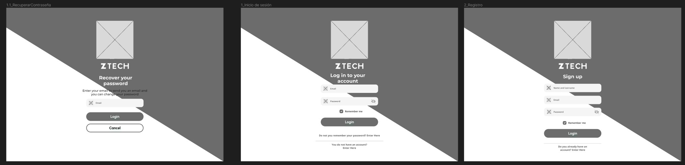
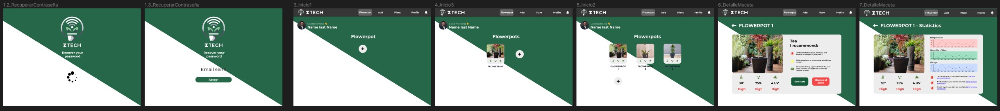

# Capítulo V: Solution UI/UX Design
---
## 5.1. Style Guidelines.
En esta sección, delineamos las pautas clave para asegurar la coherencia y la integridad de la marca ZTech en todas sus representaciones visuales y comunicacionales. La consistencia en el uso de estos elementos refuerza nuestra identidad de marca y facilita el reconocimiento instantáneo por parte de nuestros clientes y stakeholders.

---
### 5.1.1. General Style Guidelines.
#### 5.1.1.1. Branding
La marca ZTech representa la intersección de la tecnología avanzada y el cuidado paramétrico de las plantas. Nuestra imagen de marca es una de innovación, sostenibilidad y precisión. Cada elemento de nuestro branding ha sido diseñado para comunicar estos valores fundamentales y debe usarse de manera que preserve la claridad y la fuerza del mensaje de la marca.

Para mantener esta coherencia, todos los materiales y comunicaciones de la marca deben adherirse a las siguientes directrices:

- Utilizar la paleta de colores oficial de la marca que consta de verde oscuro, gris metálico y blanco.
- Aplicar la tipografía corporativa Montserrat para titulares y Open Sans para cuerpo de texto, asegurando legibilidad y una presentación limpia.
- Seguir los estándares de diseño gráfico basados en la proporción del Golden Ratio, para garantizar composiciones visualmente agradables.

---
#### 5.1.1.2. Logo
El logo de ZTech es un emblema de nuestra dedicación a la innovación y la funcionalidad en el mundo del cuidado de plantas. Presentamos dos variaciones principales del logo para su uso en diferentes contextos:

**Versión con Fondo Negro**

{ width=30% }

Esta versión está diseñada para su uso sobre fondos oscuros o de color sólido, donde el contraste maximiza el impacto visual del logo.
Los elementos gráficos y tipográficos mantienen su integridad sin modificaciones de color o forma.

**Versión con Fondo Blanco**

{ width=30% }

Ideal para contextos donde se requiere un fondo claro o neutro, como documentos oficiales, papelería y ciertos elementos de marketing.
El fondo blanco puede ser sustituido por un fondo transparente para una integración perfecta en materiales con variados colores de fondo.

---
#### 5.1.1.3. Typography
La tipografía de ZTech ha sido seleccionada para reflejar la modernidad y accesibilidad de nuestra marca. El uso consistente de estas tipografías garantiza la coherencia y el reconocimiento en todas nuestras comunicaciones.

- **Encabezados**: Utilizamos 'Montserrat', una fuente geométrica sans-serif que simboliza la innovación y profesionalismo. Esta tipografía se utiliza para títulos y subtítulos.
- **Texto Corporal**: 'Open Sans' es nuestra fuente estándar para el texto corporal. Ofrece una lectura clara en diferentes tamaños y es ideal para párrafos y descripciones detalladas.

Las fuentes deben utilizarse con los siguientes pesos tipográficos para garantizar la jerarquía visual y la legibilidad:
- **Montserrat**: Semi-Bold (600) para encabezados
- **Open Sans**: Regular (400) para texto corporal y Light (300) para subtítulos o texto secundario.

---
#### 5.1.1.4. Colors
Los colores de nuestra marca han sido cuidadosamente elegidos para evocar tecnología, naturaleza y confianza:

- **Verde Oscuro** (#276749): Representa el crecimiento y la vitalidad de las plantas.
- **Gris Metálico** (#565656): Comunica sofisticación y vanguardia tecnológica.
- **Blanco** (#FFFFFF): Aporta contraste y claridad para facilitar la lectura y destacar elementos clave.

Estos colores deben ser utilizados de manera que mantengan la armonía visual y se adapten a diferentes contextos sin perder la esencia de la marca.

{ width=30% }

---
#### 5.1.1.5. Spacing
El espaciado es esencial para crear composiciones limpias y organizadas que faciliten la navegación y la comprensión del contenido. Nuestras guías de espaciado son las siguientes:

- **Margen y Relleno**: Debe haber un espacio mínimo de 15px alrededor de los elementos de contenido para asegurar claridad y legibilidad.
- **Separación entre Elementos**: Utilizar un espaciado de 10px entre elementos relacionados para agruparlos visualmente, y un espaciado de 20px para separar secciones o elementos distintos.

---
#### 5.1.1.6. Lenguaje Común
Nuestro logo es más que una imagen; es la comunicación visual de nuestra esencia y promesas como marca. Transmite no solo nuestra identidad, sino también nuestro compromiso con la innovación, la funcionalidad y el bienestar de las plantas a través de la tecnología.

- **Innovación**: La fusión de la hoja y el símbolo de Wi-Fi en nuestro logo comunica una fusión de la naturaleza con la tecnología más avanzada, destacando nuestro enfoque innovador en el cuidado de las plantas.
- **Conectividad**: El símbolo de Wi-Fi representa nuestra promesa de ofrecer productos que conectan a los usuarios con sus plantas, brindando una experiencia de cuidado intuitiva y accesible.
- **Crecimiento**: El verde oscuro de la hoja es sinónimo de crecimiento y salud, valores que están en el corazón de ZTech y que buscamos promover con cada producto que ofrecemos.
- **Calidad**: Cada línea y curva del logo se ha diseñado siguiendo la proporción del Golden Ratio, reflejando nuestro compromiso con la calidad y la perfección estética y funcional.
- **Confianza**: La solidez de las formas y la elección de colores transmite la confianza y solidez de nuestra marca, asegurando a los clientes que están tomando la decisión correcta al elegirnos.

Al articular estas cualidades a través de nuestro lenguaje visual y verbal, reforzamos la idea de que ZTech es sinónimo de un futuro más verde y conectado. En todas nuestras comunicaciones, buscamos reflejar estos principios para forjar una relación sólida y duradera con nuestros clientes.

---
### 5.1.2. Web, Mobile and IoT Style Guidelines
---
## 5.2. Information Architecture
---
### 5.2.1. Organization Systems
---
Nuestro landing presenta una organización de contenido que aplica principios de jerarquía visual (visual hierarchy), organización secuencial (step-by-step to accomplish) y un esquema de categorización por tópicos principalmente. La jerarquía visual se evidencia en el uso sobresaliente de un llamado a la acción ("Descarga aquí") en la parte superior, seguido de bloques diferenciados que presentan las ofertas y ventajas del servicio de ZTech. Además, La organización secuencial del contenido guía al usuario a través de la información de una manera lógica: primero, ofrece una descripción general del servicio, luego detalla las características específicas del producto, y finalmente presenta testimonios y un formulario de contacto. Asimismo, la categorización por tópicos es clara, separando la información en secciones bien definidas como "Información específica sobre tus plantas", "Sensores dedicados" y "Mayor confianza para los usuarios", lo cual facilita la navegación del usuario por áreas de interés específicas. También, la organización matricial se evidencia en la sección de opiniones de usuarios en el que se emplea una forma de organización matricial al presentar múltiples puntos de vista de manera simultánea.

---
### 5.2.2. Labeling Systems
---
Los sistemas de etiquetado se utilizan para comunicar información al usuario, es decir, para que el usuario tenga una experiencia eficiente y que no se pase tanto tiempo buscando y utilizando la aplicación. 

> El aplicativo contiene encabezados en una letra más grande para recordar al usuario en que función se encuentra, además de explicar detalladamente los pasos a seguir para seguir navegando por el sistema. Utilizamos terminologías simples para que cualquier persona pueda entender y usar el aplicativo de forma sencilla.

Aplicación Móvil

Aplicación Web

---
> Estado de la Planta, para mostrar la salud y condición actual de la planta basada en los datos recopilados.

Aplicación Móvil

Aplicación Web

---
> Consejos de Cuidado, sugerencias personalizadas basadas en el análisis de los datos recogidos.

Aplicación Móvil

Aplicación Web

---
> Alertas, notificaciones importantes sobre necesidades urgentes o problemas detectados con la planta.

Aplicación Móvil

Aplicación Web

---
> Vista General de Plantas, "Tus plantas" y "Más plantas" para resaltar la sección de inicio donde los usuarios pueden ver todas las plantas que tienen agregadas. 

Aplicación Móvil

Aplicación Web

---
> Agregar Planta, "Agrégame a una maceta" como botón para el proceso de añadir nuevas plantas a la aplicación, haciendo el proceso intuitivo.

Aplicación Móvil

Aplicación Web

---
> Detalles de la Planta, "Descripción" y "Recomendaciones" como secciones claves en la vista detallada de cada planta, ofreciendo información específica y consejos de cuidado.

Aplicación Móvil

Aplicación Web

---
> Perfil de Usuario, "Perfil" con sub-etiquetas como "Nombre y apellido", "Correo electrónico", "Dirección", "Fecha de Nacimiento", "Sexo", "Teléfono", "Contraseña" y "Editar perfil", proporcionando un área clara para la gestión de la cuenta del usuario.

Aplicación Móvil

Aplicación Web

---
> Agregar Maceta, utilizado para iniciar el proceso de agregar una nueva maceta inteligente al sistema del usuario.

Aplicación Móvil

Aplicación Web

---
> Configurar Maceta, para acceder a la configuración específica de una maceta, ajustando parámetros como la imagen y nombre de la planta o maceta.

Aplicación Móvil

Aplicación Web

---
### 5.2.3. SEO Tags and Meta Tags
---
**SEO Tags y Meta Tags para la Landing Page de Ztech**
- Title: Ztech – Cuida Tus Plantas con Tecnología Avanzada
- Meta Description: Conoce Ztech, la innovadora maceta inteligente que te permite monitorear y optimizar el cuidado de tus plantas desde cualquier lugar. ¡Descarga nuestra app y transforma tu jardinería!
- Meta Keywords: tecnología para plantas, cuidado inteligente de plantas, maceta inteligente, monitoreo de plantas, app jardinería
- Author: Equipo Ztech

---
**SEO Tags y Meta Tags para la Aplicación Web de Ztech**

**Página Principal**
- Title: Ztech - La Inteligencia al Servicio de Tus Plantas
- Meta Description: Experimenta el futuro del cuidado de plantas con Ztech. Nuestra tecnología avanzada en macetas inteligentes te permite monitorizar y gestionar el bienestar de tus plantas fácilmente.
- Meta Keywords: maceta inteligente, cuidado de plantas, app de jardinería, tecnología para plantas, Ztech
- Author: Equipo Ztech

**Sección de Inicio de Sesión y Registro**
- Title: Inicia Sesión o Regístrate - Ztech
- Meta Description: Accede a tu cuenta de Ztech o crea una nueva para empezar a disfrutar de la mejor tecnología para el cuidado de tus plantas.
- Meta Keywords: iniciar sesión en Ztech, registro Ztech, cuenta Ztech
- Author: Equipo Ztech

**Sección de Configuración de Maceta**
- Title: Configura Tu Maceta Inteligente - Ztech
- Meta Description: Personaliza los ajustes de tu maceta inteligente en Ztech para adaptarla perfectamente a las necesidades específicas de tus plantas.
- Meta Keywords: configurar maceta inteligente, personalización de cuidado de plantas, Ztech configuración
- Author: Equipo Ztech

**Sección de Perfil de Usuario**
- Title: Tu Perfil en Ztech - Gestiona Tu Cuenta
- Meta Description: Gestiona tu perfil en Ztech y ajusta tus preferencias para obtener una experiencia personalizada en el cuidado de tus plantas.
- Meta Keywords: perfil Ztech, configuración de cuenta Ztech, usuario de Ztech
- Author: Equipo Ztech

**Sección de Agregar Nuevas Plantas**
- Title: Agrega Nuevas Plantas a Tu Jardín Ztech
- Meta Description: Añade nuevas plantas a tu cuenta de Ztech y utiliza nuestra avanzada tecnología para asegurar su crecimiento y salud óptimos.
- Meta Keywords: agregar plantas Ztech, nueva planta en maceta inteligente, Ztech jardinería
- Author: Equipo Ztech

**Sección de Consejos y Recomendaciones**
- Title: Consejos para el Cuidado de Plantas - Ztech
- Meta Description: Descubre consejos y recomendaciones personalizadas para el cuidado de tus plantas basados en datos reales de tus macetas inteligentes Ztech.
- Meta Keywords: consejos plantas, cuidado plantas Ztech, recomendaciones jardinería
- Author: Equipo Ztech

---
**SEO Tags y Meta Tags para la Aplicación Móvil de Ztech**
- App Title: Ztech – Cuidado Inteligente de Plantas
- App Keywords: maceta inteligente, monitor de plantas, cuidado planta app, jardinería digital, salud vegetal
- App Subtitle: Tu Jardín Tecnológico en la Palma de tu Mano
- App Description: Ztech te transforma en un experto en plantas sin esfuerzo. Con nuestra aplicación, ajustar y monitorizar las necesidades específicas de cada planta es simple y eficaz. Equipada con sensores avanzados, nuestra maceta inteligente registra y ajusta condiciones como la humedad, temperatura y luz UV para promover la salud óptima de tus plantas. Desde configuraciones detalladas de macetas hasta consejos personalizados basados en datos reales, Ztech es la herramienta esencial para todo amante de las plantas. ¡Descubre cómo Ztech puede hacer que tu jardinería sea más inteligente y conectada! 

---
### 5.2.4. Searching Systems
---
Los sistemas para buscar información son muy importantes, para que el usuario pueda buscar y encontrar lo que necesita de manera eficiente y eficaz.

> Para configurar una maceta, se tiene una barra de búsqueda ubicada en la parte superior, el cual también tiene indicaciones de lo que puedes buscar, en este caso se buscara las plantas para poder insertarlo dentro de una maceta.

Aplicación Móvil

Aplicación Web

> Luego que el usuario busque su planta mediante la barra de búsqueda, le aparecerá otro apartado de configuración de maceta, donde podrá cargar una imagen e ingresar un nombre para la maceta o planta.

Aplicación Móvil

Aplicación Web

---
> Asimismo, en otro apartado de “Tus Plantas” el usuario tendrá una barra de búsqueda ubicada en la parte inferior, el cual también tiene indicaciones de lo que puedes buscar, en este caso se buscara las plantas que el usuario desea agregar a su colección de plantas.

Aplicación Móvil

Aplicación Web

> Luego que el usuario busque más plantas mediante la barra de búsqueda, le aparecerá otro apartado más amplio donde podrá buscar y visualizar más plantas para que seleccione y agregue a su colección la planta que más le gusta.

Aplicación Móvil

Aplicación Web

---
### 5.2.5. Navigation Systems
---
En los sistemas de navegación, están los botones, interfaces que se utilizan para ir de un apartado de la aplicación a otro apartado, como los botones en la parte superior de la plataforma web y landing page para ir de una función a otra. Además, del sistema de navegación de la aplicación móvil que se ubica en la parte inferior.

Para navegar, están los botones con texto, el cual menciona la función que cumple al presionar dicho botón, y con opciones de navegado rápido para que el usuario navegue en la aplicación según el apartado que seleccione de acuerdo a su funcionalidad.

> Landing Page:
La barra de navegación se ubica en la parte superior en el cual el visitante puede dar click para visualize la funcionalidad de los siguientes botones: "Sobre Ztech" aca se muestra la información detallada y precisa de nuestro software que ofrecemos, "Nosotros" aca se muestra sobre nuestro equipo de desarrollo y la opinion que tienen nuestros usuarios sobre nuestro software, "Contacto" aca se muestra un formulario donde el visitante puede dejar sus datos para poder registrarlo y contactarlo, "Inicia Sesión" aca redirige al visitante al apartado de la plataforma web donde podra iniciar sesión en nuestra plataforma y "Registrarse" aca redirige al visitante al apartado de la plataforma web donde podra crear una cuenta para usar nuestra plataforma.

---

> Aplicación Móvil:
La barra de navegación se ubica en la parte inferior en el cual el usuario puede dar click para visualize la funcionalidad de los siguientes botones: "Macetas"  aca redirige al usuario a otro apartado donde visualizara sus macetas que tiene registradas o tambien podra registrar nuevas macetas, "Añadir" aca redirige al usuario a otro apartado donde podra configurar su maceta registrada, "Plantas" aca redirige al usuario a otro apartado donde podra visualizar sus plantas o tambien podra agregar mas plantas a su colección y "Perfil" daca redirige al usuario a otro apartado donde podra visualizar sus datos personales registrados o tambien podra editarlos en caso lo desee.

---

> Aplicación Web:
La barra de navegación se ubica en la parte superior en el cual el usuario puede dar click para visualize la funcionalidad de los siguientes botones: "Macetas"  aca redirige al usuario a otro apartado donde visualizara sus macetas que tiene registradas o tambien podra registrar nuevas macetas, "Añadir" aca redirige al usuario a otro apartado donde podra configurar su maceta registrada, "Plantas" aca redirige al usuario a otro apartado donde podra visualizar sus plantas o tambien podra agregar mas plantas a su colección y "Perfil" daca redirige al usuario a otro apartado donde podra visualizar sus datos personales registrados o tambien podra editarlos en caso lo desee.

---
## 5.3. Landing Page UI Design
---
### 5.3.1. Landing Page Wireframe

En esta Sección, se presentará el diseño del sitio web de nuestro desarrollo de software. Para brindar una mejor idea del contenido que se mostrará en la plataforma. El Landing Page es del tamaño adecuado para las pantallas de los ordenadores, así se mostrará la información centrada y será fácilmente visible para los usuarios. Asimismo, se evidencia una barra de navegación que facilitará la navegación del usuario, y así brindar la mejor experiencia.

**Menú principal de la plataforma:** Opciones de navegación

**About ZTech:** Es una sección del menú principal

**About Us:** Es una sección del menú principal

**Opinions:** Es una sección del menú principal

**Contact:** Es una sección del menú principal

**Footer:**

Link: https://www.figma.com/file/O0RYDBtcCQt4M7DPqZDYos/Landing-Page-UI-Desing?type=design&node-id=0%3A1&mode=design&t=ksMW6WXQRPQVMmbK-1 

### 5.3.2. Landing Page Mock-up

Se presentará la vista preliminar del sitio web, se va a detallar el contenido por secciones, los colores, estilos e imágenes que son coherentes con el propósito y así facilitar al usuario una mejor experiencia con el sitio web y que pueda entender fácilmente el objetivo del sitio web.

Link Landing Page desplegada: https://ztech-landing-page.netlify.app 

## 5.4. Applications UX/UI Design
---
### 5.4.1. Applications Wireframes

- Mobile App

Link de figma: https://www.figma.com/file/mVlIoKvGPrnFHP8f2xol0a/MockUp-de-Ztech---M%C3%B3vil?type=design&node-id=221%3A1749&mode=design&t=ZECfMUYs6z0DPeDc-1 

- Web application

Link de figma: https://www.figma.com/file/8fgTUDRQcKFQrW21PA2Qio/MockUp-de-Ztech---WEB?type=design&node-id=2008%3A379&mode=design&t=Nk2tykEKQHvMk96W-1 

---
### 5.4.2. Applications Wireflow Diagrams

- Mobile App

Link de figma: https://www.figma.com/file/mVlIoKvGPrnFHP8f2xol0a/MockUp-de-Ztech---M%C3%B3vil?type=design&node-id=221%3A1749&mode=design&t=ZECfMUYs6z0DPeDc-1 

- Web application

Link de figma: https://www.figma.com/file/8fgTUDRQcKFQrW21PA2Qio/MockUp-de-Ztech---WEB?type=design&node-id=2008%3A379&mode=design&t=Nk2tykEKQHvMk96W-1 

---
### 5.4.3. Applications Mock-ups

- Mobile App

Link de figma: https://www.figma.com/file/mVlIoKvGPrnFHP8f2xol0a/MockUp-de-Ztech---M%C3%B3vil?type=design&node-id=0%3A1&mode=design&t=ZECfMUYs6z0DPeDc-1

- Web application

Link de figma: https://www.figma.com/file/8fgTUDRQcKFQrW21PA2Qio/MockUp-de-Ztech---WEB?type=design&node-id=0%3A1&mode=design&t=Nk2tykEKQHvMk96W-1

---
### 5.4.4. Applications User Flow Diagrams

- Mobile App

Link de figma: https://www.figma.com/file/mVlIoKvGPrnFHP8f2xol0a/Moc.kUp-de-Ztech---M%C3%B3vil?type=design&node-id=0%3A1&mode=design&t=ZECfMUYs6z0DPeDc-1

- Web application

Link de figma: https://www.figma.com/file/8fgTUDRQcKFQrW21PA2Qio/MockUp-de-Ztech---WEB?type=design&node-id=0%3A1&mode=design&t=Nk2tykEKQHvMk96W-1

---
## 5.5. Applications Prototyping

- Aplicación móvil

Para el prototipo de la aplicación móvil se utilizó la herramienta de diseño Figma, en la cual se crearon las pantallas de la aplicación móvil de Ztech. En el prototipo se pueden observar las pantallas de inicio de sesión, registro, menú principal, perfil de usuario, catálogo de macetas, catálogo de plantas y su interacción entre ellas.

Link de figma: https://www.figma.com/file/mVlIoKvGPrnFHP8f2xol0a/MockUp-de-Ztech---M%C3%B3vil?type=design&node-id=0%3A1&mode=design&t=ZECfMUYs6z0DPeDc-1 

- Aplicación web

Para el prototipo de la aplicación web se utilizó la herramienta de diseño Figma, en la cual se crearon las pantallas de la aplicación web de Ztech. En el prototipo se pueden observar las pantallas de inicio de sesión, registro, menú principal, perfil de usuario, catálogo de macetas, catálogo de plantas y su interacción entre ellas.

Link de figma: https://www.figma.com/file/8fgTUDRQcKFQrW21PA2Qio/MockUp-de-Ztech---WEB?type=design&node-id=0%3A1&mode=design&t=Nk2tykEKQHvMk96W-1

- Link del video de la explicación del Prototyping: https://upcedupe-my.sharepoint.com/:v:/g/personal/u20201c031_upc_edu_pe/ESNUzIaUPORAoq5zlwTu3eQBWTXDTSIJPkwiJZ6u5XrD3g?e=11Dvau 

---