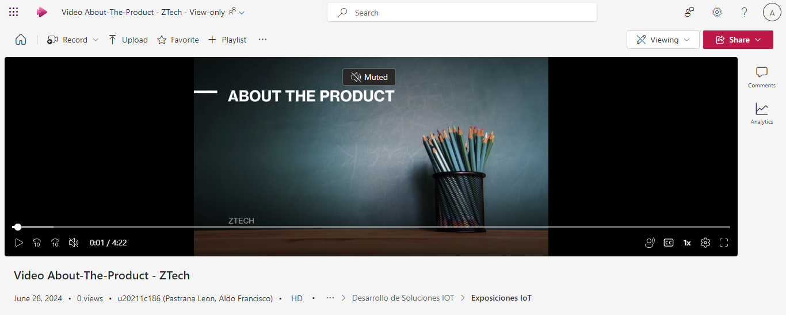

# Capítulo VI: Product Implementation, Validation & Deployment

## 6.1. Software Configuration Management

### 6.1.1. Software Development Environment Configuration

Este apartado detalla los productos de software necesarios para colaborar en el ciclo de vida de los productos digitales en el proyecto de IoT. Incluye nombres de productos, su propósito en el proyecto y las rutas de referencia/descarga para acceder a ellos.

**Visual Studio Code**

> Este editor de código será utilizado para desarrollar la landing page y las aplicaciones web y móviles. Angular se empleará para el desarrollo web, mientras que Flutter se utilizará para las aplicaciones móviles.

Link: https://code.visualstudio.com/download

**Wokwi**

> Se implementará para desarrollar nuestra solución IoT y embedded application.

Link: https://wokwi.com/

**Github**

> Esta plataforma será utilizada para gestionar el control de versiones de todos nuestros repositorios.

Link: https://github.com/

**Figma**

> Esta herramienta se emplea para la creación de prototipos de nuestras aplicaciones web y móviles.

Link: https://www.figma.com/

**Netlify**

> Contribuirá al despliegue de las aplicaciones frontend.

Link: https://www.netlify.com/

**Railway**

> Será utilizado para desplegar el servicio backend.

Link: https://railway.app/

**Miro**

> Se utiliza para realizar sesiones de lluvia de ideas y para secciones específicas del informe, como el escenario actual y el escenario deseado.

Link: https://miro.com/es/

**Uxpressia**

> Se emplea para representar las secciones de Needfinding.

Link: https://uxpressia.com/

**Lucidchart**

> Se utiliza para la creación de diagramas de clases y diagramas de bases de datos.

Link: https://www.lucidchart.com/pages

**Visual Paradigm**

> Se emplea para diagramar la arquitectura de software de nuestro proyecto.

Link: https://www.visual-paradigm.com/

### 6.1.2. Source Code Management

**Landing Page**

Link: https://github.com/LosChiferos-WS71/ztech-landing-page

**Web Services**

Link: https://github.com/LosChiferos-WS71/ztech-web-service

**Frontend Web Application**

Link: https://github.com/LosChiferos-WS71/ztech-web-application

**Frontend Mobile Application**

Link: https://github.com/LosChiferos-WS71/ztech-mobile-application

----

**Convenciones de GitHub**

The main branch:

El modelo de desarrollo se basa en prácticas establecidas. El repositorio central contiene dos ramas principales con una vida útil indefinida:

master: Esta rama es conocida por todos los usuarios de Git. Representa un estado listo para producción.
develop: Paralelamente a la rama master, la rama develop alberga los cambios de desarrollo más recientes para la próxima versión. Actúa como la rama de integración y es donde se generan las compilaciones automáticas nocturnas.
Cuando el código en la rama develop se estabiliza y está listo para ser lanzado, todos los cambios se fusionan de nuevo en master y se etiquetan con un número de versión. Esto asegura que cada fusión en master constituya un nuevo lanzamiento de producción, facilitando la automatización potencial de la implementación de software.

Feature branches:

Bifurcadas Desde: develop
Fusionadas De Nuevo En: develop
Convención de Nombres: Cualquier cosa excepto master, develop, release-, o hotfix-
Las ramas de características, también conocidas como ramas de temas, se crean para desarrollar nuevas características para lanzamientos futuros próximos o distantes. Estas ramas persisten hasta que la característica esté lista para ser incorporada en la rama develop o sea descartada si se considera inadecuada.

### 6.1.3. Source Code Style Guide & Conventions

Como convención general, todo el código realizado por los miembros del equipo debe redactarse en
completo inglés.

**HTML**

Use Lowercase Element Names: Se recomienda usar lowercase para los nombres de los elementos HTML.

Close All HTML Elements: Se recomienda cerrar todos los elementos HTML.

Use Lowercase Attribute Names: Se recomienda usar lowercase para los nombres de los atributos HTML.

Always Specify alt, width, and height for Images: Se recomienda seguir estas convenciones en caso de que la imagen no se puede mostrar y ayudar con la accesibilidad del contenido.

Spaces and Equal Signs: Se recomienda no usar espacios en blanco entre las entidades para una mejor lectura.

Para más información sobre las convenciones de HTML se usará como referencia:
https://www.w3schools.com/html/html5_syntax.asp

**CSS**

ID and Class Naming: Usar nombres de clases e ID significativos que expresen el propósito del elemento.

ID and Class Name Style: Usar nombres cortos para nombrar ID o clases, pero lo suficientemente largo para saber cuál es su
propósito.

Shorthand Properties: Usar CSS shothand properties tanto como sea posible para que el código sea más eficiente y entendible.

ID and Class Name Delimiters: Separar las palabras en ID y clases con un guión.

Selector and Declaration Separation: Separar los selectores y declaraciones en nuevas líneas.

Para más información sobre las convenciones de CSS se usará como referencia:
https://google.github.io/styleguide/htmlcssguide.html#CSS

**JavaScript**

Use expanded syntax: Cada línea de JavaScript en una nueva línea, con la llave de apertura en la misma línea de su
declaración y la llave de cierre en una nueva línea al final.

Variable naming: Para el nombre de las variables usar lowerCamelCase.

Declaring variables: Para la declaración de variables usar las palabras reservadas let y const, no usar var.

Use strict equality: Siempre usar la igualdad o inigualdad estricta.

Function naming: Para el nombre de las funciones usar lowerCamelCase.

Para más información sobre las convenciones de JavaScript se usará como referencia:
https://www.w3schools.com/js/js_conventions.asp

**TypeScript**

Camel case: Usar camelCase cuando nombramos variables y funciones. También se debe usar camelCase en los miembros de una clase y sus métodos. En la interface, el camelCase se usa para nombrar miembros.

Pascal case: Usar pascal case para nombres de clases. En la interface, sirve para nombres.

Para más información sobre las convenciones de TypeScript se usará como referencia:
https://basarat.gitbook.io/typescript/styleguide#array

**Gherkin**

Discernible Given-When-Then Blocks: Se recomienda aplicar sangría a los bloques, para saber cuándo iniciar y terminan.

Steps with Tables: Si necesitamos entrada de una tabla en nuestros pasos, para que sea reconocible, añadiremos dos puntos al final del paso.

Reducing Noise: Se recomienda usar valores predeterminados para campos que requiere el software pero que no son relevantes para el escenario.

 
Parameters in Steps: Para el ejemplo anterior, se pudo notar la inclusión de comillas simples para los parámetros en un paso, lo cual facilita la detección de estos.

Newlines within Scenarios: En caso de que el escenario se está alargando, es recomendable agregar nuevas líneas entre cada paso para que los bloques sean más legibles.

 
Newlines between scenarios and separator comments: Cuando se tienen muchos escenarios, se vuelve difícil saber el punto donde inicia o termina otro. Por ello, se recomiendo agregar una línea de separación entre escenario y un separador de comentarios.

### 6.1.4. Software Deployment Configuration

En esta sección, se detalla la configuración necesaria para llevar a cabo el despliegue satisfactorio de cada uno de los productos digitales en la solución, utilizando herramientas específicas para cada uno de ellos.

**Despliegue de la Landing Page y la Aplicación Web**

Para el despliegue de la Landing Page y la Aplicación Web, se utilizará la plataforma Netlify. A continuación, se detallan los pasos necesarios:

- Configuración del Repositorio: El código fuente de la Landing Page y la Aplicación Web se almacenará en un repositorio en la plataforma Github.
- Creación del Sitio en Netlify: Se creará un nuevo sitio en Netlify vinculado al repositorio que contiene el código fuente de la Landing Page y la Aplicación Web.
- Configuración de Build y Deploy: Netlify proporciona una integración continua (CI/CD) automatizada.
- Configuración de Dominio Personalizado: Opcionalmente, se puede configurar un dominio personalizado para el sitio web desplegado en Netlify.

**Despliegue del Web Service**

Para el despliegue del Web Service, se utilizará la plataforma Railway. A continuación, se detallan los pasos necesarios:

- Configuración del Repositorio: El código fuente del Web Service se almacenará en un repositorio en la plataforma Github.
- Creación del Proyecto en Railway: Se creará un nuevo proyecto en Railway vinculado al repositorio que contiene el código fuente del Web Service.
- Configuración de Variables de Entorno: Railway permite configurar fácilmente variables de entorno para el proyecto. Se configurarán las variables de entorno necesarias, como credenciales de base de datos u otras configuraciones específicas del entorno.
- Despliegue Automatizado: Una vez configurado el proyecto en Railway, se puede habilitar el despliegue automático para que el servicio se actualice automáticamente cada vez que se realicen cambios en el repositorio.
- Monitoreo y Escalado: Railway proporciona herramientas para monitorear el rendimiento del servicio y escalarlo según sea necesario, asegurando un funcionamiento óptimo en todo momento.

**Deployment Diagram de C4 Model**

## 6.2. Landing Page, Services & Applications Implementation
---
### 6.2.1. Sprint 1
---
#### 6.2.1.1. Sprint Planning 1
| Sprint#        | Sprint 1                      |
|----------------|-------------------------------|
| **Sprint Planning Background** |   |
| Date           | 02/04/2024                    |
| Time           | 11:00 pm                      |
| Location       | Google meet                   |
| Prepared By    | Aldo Pastrana |
| Attendees (to planning meeting) | Sebastian Ramirez / Aldo Pastrana / Pedro Perez / Josue Carrasco / Marzzio Chicana |
| **Sprint n-1 Review Summary** | Este es el primer sprint, no hay reviews anteriores. |
| **Sprint n-1 Retrospective Summary** | El equipo usará Angula para el desarrollo de la Aplicación Web y BootSctrap para el desarrollo del Landing page |
| **Sprint Goal & User Stories** |   |
| Sprint n Goal  | Realizar el desarrollo del Landing Page y Aplicación Web |
| Sprint n Velocity | 10 |
| Sum of story Points | 8 |

#### 6.2.1.2. Sprint Backlog 1
<table>
    <tr>
        <th colspan="1">Sprint #</th>
        <th colspan="5">Sprint n</th>
    </tr>
    <tr>
     <th colspan="2">User Story</th>
        <th colspan="6">Work-Item / Task</th>
    </tr>
    <tr>
        <td>Id</td>
        <td>Title</td>
        <td>Id</td>
        <td>Title</td>
        <td>Description</td>
        <td>Estimation (Hours)</td>
        <td>Assigned To</td>
        <td>Status (To-do / In-Process / To-Review Done)</td>
    </tr>
    <tr>
        <td>US001</td>
        <td>Move between landing page sections</td>
        <td>TK01</td>
        <td>Move between landing page sections</td>
        <td>As a Visitant
I want to move between the sections of the mobile application
So I can see the  functionalities</td>
        <td>1</td>
        <td>Aldo Pastrana</td>
        <td>Done</td>
    </tr>
    <tr>
        <td>US002</td>
        <td>View the benefits of the application	</td>
        <td>TK01</td>
        <td>View the benefits of the application	</td>
        <td>As a Visitant
I want to see the benefits that using the application offers,
So you have information to be able to use it.</td>
        <td>1</td>
        <td>Marzzio Chicana</td>
        <td>Done</td>
    </tr>
    <tr>
        <td>US003</td>
        <td>View information about company members	</td>
        <td>TK01</td>
        <td>View information about company members	</td>
        <td>As a Visitant
I want to obtain information about the developers of the application,
So I can feel more secure</td>
        <td>1</td>
        <td>Josue Carrasco</td>
        <td>Done</td>
    </tr>
    <tr>
        <td>US004</td>
        <td>Collect user contact information via a form	</td>
        <td>TK01</td>
        <td>Collect user contact information via a form	</td>
        <td>As a Visitant,
I want to contact the developers,
So we can have a sales agreement</td>
        <td>1</td>
        <td>Sebastian Ramirez</td>
        <td>Done</td>
    </tr>
    <tr>
        <td>US005</td>
        <td>Add new flowerpot	</td>
        <td>TK01</td>
        <td>Add new flowerpot	</td>
        <td>As a Plant Owner
I want to add a new pot to my account in the web application
So I can configure it according to the needs of my plant</td>
        <td>3</td>
        <td>Pedro Perez</td>
        <td>Done</td>
    </tr>
    <tr>
        <td>US012</td>
        <td>Recover password	</td>
        <td>TK01</td>
        <td>Recover password	</td>
        <td>As a Plant Owner
I want to be able to recover my password if it is lost in the web application
So that I do not lose my data or my already made subscriptions.</td>
        <td>3</td>
        <td>Pedro Perez</td>
        <td>Done</td>
    </tr>
</table>

#### 6.2.1.3. Development Evidence for Sprint Review

| Repository          | Branch            | Commit Id | Commit Message           | Commit Message Body                                  | Committed on (Date) |
|---------------------|-------------------|-----------|--------------------------|------------------------------------------------------|---------------------|
| https://github.com/LosChiferos-WS71/ztech-landing-page | main | 9a3460fa33188d95b895d02750e9eaac699cc935  | Add Header | Agregar encabezado | 03/05/2024         |
| https://github.com/LosChiferos-WS71/ztech-landing-page | main | bc30f54238c06628c35569697a521f64fbbfe1e0  | add animate | Agregar animaciones | 03/05/2024         |
| https://github.com/LosChiferos-WS71/ztech-landing-page | main | e065ce648fffc8be412374ecf393eca544858b4d  | feat(add): Update Jquery.min.js | Agregar el Jquery | 03/05/2024         |
| https://github.com/LosChiferos-WS71/ztech-landing-page | main | 76d259212937a87422d07849bc48113e12aa74b5  | Add Main JavaScript | Agregar el main de JavaScript | 03/05/2024         |
| https://github.com/LosChiferos-WS71/ztech-landing-page | main | 568c2a6294696bd95fece6725f07e3f1e2dee815  | update text to english | Actualizar texto a ingles | 03/05/2024         |
| https://github.com/LosChiferos-WS71/ztech-web-application | main | bf09cbdeb2e922b3fda8b3ac3d78e602e746d96c  | feat: Add project basis | Agregar proyecto basse | 03/05/2024         |
| https://github.com/LosChiferos-WS71/ztech-web-application | main | e63f61ebded0c7abfa3c3fdd2b47a010f4c9fe4a  | add register view | Agregar vista de registro | 03/05/2024         |
| https://github.com/LosChiferos-WS71/ztech-web-application | main | 3acc2160e49f47adfd010fad6ff8125fa4afdf83  | Add Application Web | Agregar vista de login | 03/05/2024         |
| https://github.com/LosChiferos-WS71/ztech-web-application | main | 90f78a2b77cbca2ccb9507e72a80e4f926751591  | feat(add): Add component home without css | Agregar component home con CSS | 03/05/2024         |
| https://github.com/LosChiferos-WS71/ztech-web-application | main | 31c2c0791d2a0cfc0ccbb0dfa62dcb7b5232460a  | add register styles | Agregar estilos de la vista registro | 03/05/2024         |

#### 6.2.1.4. Testing Suite Evidence for Sprint Review

Para esta entrega no se ha presentado un backend funcional, se presento un fake API, por lo que los unit tests, integration tests y acceptance tests automaizados, para web services relacionados con los user stories no realizara en esta entrega.

#### 6.2.1.5. Execution Evidence for Sprint Review
>Se realizó el landing page enfocado a nuestra propuesta como startup, evidenciando nuestro compromiso como equipo. 
Las tareas a realizar en cada sprint para la elaboración del landing page fueron:
- Planteamiento y desarrollo sobre nuestros componentes de estrategia empresarial como lo que es la presentacion de las ofertas y ventajas del servicio de ZTech.
-  Ofrecemos una descripción general del servicio, luego detallamos las características específicas del producto, y finalmente presentamos testimonios y un formulario de contacto.
- Presentamos información en secciones bien definidas lo cual facilita la navegación del usuario por áreas de interés específicas.

>Asimismo, se realizo la aplicación web enfocado en el usuario final para ofrecerle un servicio eficaz y de calidad. 
Las tareas a realizar en cada sprint para la elaboración de la aplicación web fueron:
- La interfaz de "Add Flowerpot Maceta" en el cual el usuario podra ingresar el codigo de su maceta para asi registrarlo a su cuenta.

- La interfaz de "Recover your password" en el cual el usuario podra recuperar su contraseña en caso se olvide.

#### 6.2.1.6. Services Documentation Evidence for Sprint Review
El landing page y aplicación web de nuestro proyecto se realizó utilizando el sistema de versiones de git. El cuál se puede evidenciar el repositorio del proyecto respectivamente:
https://github.com/LosChiferos-WS71/ztech-landing-page 
https://github.com/LosChiferos-WS71/ztech-web-application

- Por otro lado, utilizamos HTML, CSS, JavaScript y BootStrap para realizar la página de nuestro landing page.

- Asimismo, utilizamos Angular para realizar las páginas de nuestro aplicación web.

#### 6.2.1.7. Software Deployment Evidence for Sprint Review

En este Sprint, se ha completado el despliegue de la landing page y la aplicación web. Esto ha implicado la creación de cuentas, la configuración de recursos en proveedores de nube y la configuración de proyectos de desarrollo para la integración.

Hemos seguido los mismos pasos para los dos despliegues.

1. Crear una cuenta en Netlify:
Acceder a https://www.netlify.com/ y nos creamos una cuenta

|

2. Conectar Netlify con el repositorio:
En Netlify, hacer clic en "New site".
Seleccionar "Import from Git".
Conectar la cuenta de GitHub.
Seleccionamos el repositorio que contiene nuestra landing page y aplicación web.
Hacer clic en "Deploy site".

3. Configurar el sitio web:
Netlify te asignará una URL temporal a nuestro sitio web.

4. Desplegar el sitio web:
Cuando hemos realizado todos los cambios necesarios, hacer clic en "Deploy".

#### 6.2.1.8. Team Collaboration Insights during Sprint

**Landing Page**

Hemos desarrollado la implementacion de la Landing Page en ramas de la siguiente manera

Commits hechos

Collaboration

**Web App**

Hemos desarrollado la implementacion de la Web App en ramas de la siguiente manera

Commits hechos

Collaboration

### 6.2.2. Sprint 2

---

#### 6.2.2.1. Sprint Planning 2

| Sprint#        | Sprint 1                      |
|----------------|-------------------------------|
| **Sprint Planning Background** |   |
| Date           | 02/04/2024                    |
| Time           | 11:00 pm                      |
| Location       | Google meet                   |
| Prepared By    | Aldo Pastrana |
| Attendees (to planning meeting) | Sebastian Ramirez / Aldo Pastrana / Pedro Perez / Josue Carrasco / Marzzio Chicana |
| **Sprint n-1 Review Summary** | Este es el primer sprint, no hay reviews anteriores. |
| **Sprint n-1 Retrospective Summary** | El equipo usará Angula para el desarrollo de la Aplicación Web y BootSctrap para el desarrollo del Landing page |
| **Sprint Goal & User Stories** |   |
| Sprint n Goal  | Realizar el desarrollo del Landing Page y Aplicación Web |
| Sprint n Velocity | 10 |
| Sum of story Points | 8 |

#### 6.2.2.2. Sprint Backlog 2

<table>
    <tr>
        <th colspan="1">Sprint #</th>
        <th colspan="5">Sprint 2</th>
    </tr>
    <tr>
     <th colspan="2">User Story</th>
        <th colspan="6">Work-Item / Task</th>
    </tr>
    <tr>
        <td>Id</td>
        <td>Title</td>
        <td>Id</td>
        <td>Title</td>
        <td>Description</td>
        <td>Estimation (Hours)</td>
        <td>Assigned To</td>
        <td>Status (To-do / In-Process / To-Review Done)</td>
    </tr>
    <tr>
        <td>US007</td>
        <td>Set up the flowerpot</td>
        <td>TK02</td>
        <td>Set up the flowerpot</td>
        <td>As a Plant Owner
I want to be able to configure the pot with my plant details in the web application
So that my plant has good care</td>
        <td>3</td>
        <td>Aldo Pastrana</td>
        <td>Done</td>
    </tr>
    <tr>
        <td>US011</td>
        <td>Receive notifications</td>
        <td>TK02</td>
        <td>Receive notifications</td>
        <td>As a Plant Owner
I want to receive notifications related to the status of my plant in the mobile app
So that I know about the situation of my plant.</td>
        <td>2</td>
        <td>Marzzio Chicana</td>
        <td>Done</td>
    </tr>
    <tr>
        <td>US013</td>
        <td>Recover password</td>
        <td>TK02</td>
        <td>Recover password</td>
        <td>As a Plant Owner
I want to be able to recover my password in case of loss in the mobile app
So that I do not lose my data or my already made subscriptions.</td>
        <td>1</td>
        <td>Sebastian Ramirez</td>
        <td>Done</td>
    </tr>
    <tr>
        <td>TS022</td>
        <td>Add Plant Owner through RESTful API</td>
        <td>TK02</td>
        <td>Add Plant Owner through RESTful API</td>
        <td>As a Developer
I want to add a Plant Owner through API
So that it can be available to build features for my applications</td>
        <td>3</td>
        <td>Pedro Perez</td>
        <td>Done</td>
    </tr>
    <tr>
        <td>TS023</td>
        <td>Delete Plant Owner through RESTful API</td>
        <td>TK02</td>
        <td>Delete Plant Owner through RESTful API</td>
        <td>As a Developer
I want to delete a Plant Owner through API
So that I can keep my applications database updated</td>
        <td>3</td>
        <td>Sebastian Ramirez</td>
        <td>Done</td>
    </tr>
    <tr>
        <td>TS024</td>
        <td>Add Plant through RESTful API</td>
        <td>TK02</td>
        <td>Add Plant through RESTful API</td>
        <td>As a Developer
I want to add a Plant through API
So that users can create their own inventory of plants</td>
        <td>3</td>
        <td>Pedro Perez</td>
        <td>Done</td>
    </tr>
    <tr>
        <td>TS025</td>
        <td>Get a list of Plants from RESTful API</td>
        <td>TK02</td>
        <td>Get a list of Plants from RESTful API</td>
        <td>As a Developer
I want to retrieve a list of plants through API
So that I can display available plant options to users</td>
        <td>3</td>
        <td>Josue Carrasco</td>
        <td>Done</td>
    </tr>
    <tr>
        <td>TS033</td>
        <td>Modify Flowerpot via RESTful API</td>
        <td>TK02</td>
        <td>Modify Flowerpot via RESTful API</td>
        <td>As a developer
I want to allow users to update the details of a flowerpot via API
So that they can keep their flowerpot information up-to-date.</td>
        <td>3</td>
        <td>Aldo Pastrana</td>
        <td>Done</td>
    </tr>
    <tr>
        <td>TS034</td>
        <td>Delete Flowerpot via RESTful API</td>
        <td>TK02</td>
        <td>Delete Flowerpot via RESTful API</td>
        <td>As a developer
I want to provide an endpoint for deleting a flowerpot via API
So that users can remove unwanted flowerpots from their accounts programmatically.</td>
        <td>3</td>
        <td>Marzzio Chicana</td>
        <td>Done</td>
    </tr>
</table>

#### 6.2.2.3. Development Evidence for Sprint Review

Hemos colocado los commits más importantes hechos en nuestros repositorios.

**Web App**

| Repository | Branch | Commit Id | Commit Message | Commit Message Body | Committed on (Date) |
|------------|--------|-----------|----------------|----------------------|---------------------|
| [ztech-web-application](https://github.com/LosChiferos-WS71/ztech-web-application) | feat/configure-pot | 236f6c5bcf8b4b91ea35ffe16734fdf9ba1a23c3 | feat: add card-flowerpot | Agregar cards flowerpot | 25/05/2024 |
| [ztech-web-application](https://github.com/LosChiferos-WS71/ztech-web-application) | feat/configure-pot | f02ba75e0ca9b0da92d62407570962c66ada2b74 | feat: add loaded-plant component | Agregar componente de loaded-plan | 25/05/2024 |
| [ztech-web-application](https://github.com/LosChiferos-WS71/ztech-web-application) | feat/notification-history | 901b9e08f7c892bd9e4cb43619b46fc5b30d0d38 | Add Notifications Components | Agregar componente de notificaciones | 24/05/2024 |
| [ztech-web-application](https://github.com/LosChiferos-WS71/ztech-web-application) | feat/notification-history | 3f92bf36f0a3aa3e8c3c795c7b83d284e5f2fdec | feat: update notification card | Mejorar las cards de notificación | 28/05/2024 |
| [ztech-web-application](https://github.com/LosChiferos-WS71/ztech-web-application) | feat/plant-section | 81a9a8a0958c76c0bb9b00750df4bfd72ff397a5 | feat(add): Create component card-plant and search-plant | Agregar componententes de cards-plant y search-plant | 24/05/2024 |
| [ztech-web-application](https://github.com/LosChiferos-WS71/ztech-web-application) | feat/plant-section | 9e7d22e54abe86727527d9c6ca11ad0353380071 | feat(add): Add custom search-container | Agregar search-container | 24/05/2024 |
| [ztech-web-application](https://github.com/LosChiferos-WS71/ztech-web-application) | feat/plant-section | adf0746e5e7321a0f4f2d278e4c8589e3b54f3d6 | feat(add): Update and add code for plant-detail | Actualizar plant-detail | 26/05/2024 |
| [ztech-web-application](https://github.com/LosChiferos-WS71/ztech-web-application) | feat/plant-section | 103995046c7145d4c6cb3773e7f8cb403ad37136 | feat(update): Update view and create another component | Actualizar vistas | 28/05/2024 |
| [ztech-web-application](https://github.com/LosChiferos-WS71/ztech-web-application) | feat/view-current-metrics | 444fa14a90e189fab6f297eebb2a6e6c05fb679c | feat (add): Add PlantRecommendationsComponent | Agregar PlantRecomendation Componente | 24/05/2024 |
| [ztech-web-application](https://github.com/LosChiferos-WS71/ztech-web-application) | feat/view-current-metrics | 3514f0ed60f74215c2b6a14e501567e995927da6 | Feat (add): Add PlantStatusComponent | Agregar PlantStatus Componente | 25/05/2024 |
| [ztech-web-application](https://github.com/LosChiferos-WS71/ztech-web-application) | feat/view-current-metrics | 565d7adbcefe839aeee4914f1a72d628e060304d | Feat (add): Add PlantConditionDashboard | Agregar el componente de PlantCondition Componente | 25/04/2024 |
| [ztech-web-application](https://github.com/LosChiferos-WS71/ztech-web-application) | feat/view-current-metrics | da054af38370225d157df70c46240ea57baa9c2b | Feat (add): Add FlowerpotDetailComponent | Agregar el componente de FlowerpotDetail | 25/05/2024 |
| [ztech-web-application](https://github.com/LosChiferos-WS71/ztech-web-application) | feat/view-current-metrics | 2c4cca22578bfdfae1f70e2acb69e64c6ad7b0d8 | Feat (add): Add FlowerpotMetricsComponent | Agregar el componente de FlowerpotMetric | 25/05/2024 |
| [ztech-web-application](https://github.com/LosChiferos-WS71/ztech-web-application) | feat/add-pot | 9f67e95994ba9ff0d54e64ddf408487e4c3b6bdf | add add-pot | Agregar add pot | 24/05/2024 |
| [ztech-web-application](https://github.com/LosChiferos-WS71/ztech-web-application) | feat/add-pot | 5b5feba52934c866bf35cc251e5c51f19601db45 | add add-pot-input component | Agregar el componente de Add-pot-input | 24/05/2024 |
| [ztech-web-application](https://github.com/LosChiferos-WS71/ztech-web-application) | feat/user-login | 958d31788ba427ce3c1cab82b8d3361ae51b595b | add login-form | Agregar un formulario del login | 24/05/2024 |
| [ztech-web-application](https://github.com/LosChiferos-WS71/ztech-web-application) | feat/password-reset | 25cdcf36c9bf948789f2d1531fce73f1aa454ea0 | add recover-password-form | Agregar formulario de recuperar contraseña | 25/05/2024 |
| [ztech-web-application](https://github.com/LosChiferos-WS71/ztech-web-application) | feat/password-reset | 148f28e0419e1e0414bc0abc0c2a7e65ebf12c29 | add recover-password-confirmation | Agregar confirmación de recuperar contraseña | 27/05/2024 |
| [ztech-web-application](https://github.com/LosChiferos-WS71/ztech-web-application) | develop | 3eae8c204ced437c67cd4bfa658a405686400e0c | add welcome-user | Agregar pantalla de bienvenida | 30/05/2024 |

**Mobile App**

| Repository | Branch | Commit Id | Commit Message | Commit Message Body | Committed on (Date) |
|------------|--------|-----------|----------------|----------------------|---------------------|
| [ztech-mobile-application](https://github.com/LosChiferos-WS71/ztech-mobile-application) | feat/add-pot | c53b15a0bc55450591c92a26b73cc10212172a89 | add add pot screen | Agregar la vista de añadir maceta | 07/06/2024 |
| [ztech-mobile-application](https://github.com/LosChiferos-WS71/ztech-mobile-application) | feat/add-pot | 157bb907dc759912dcf28ebd13ed9fda80bf64e5 | update add pot screen | Actualizar vista de añadir maceta | 07/06/2024 |
| [ztech-mobile-application](https://github.com/LosChiferos-WS71/ztech-mobile-application) | feat/add-pot | fc84fd818b1bded192d49d78f5dca9ac5220177a | add splash add pot screen and automatic navigation between code fields while typing | Añadir pantallas de carga y automatizar el texto del código | 08/06/2024 |
| [ztech-mobile-application](https://github.com/LosChiferos-WS71/ztech-mobile-application) | feat/notification-history | c53b15a0bc55450591c92a26b73cc10212172a89 | add notification screen | Agregar la vista de notificaciones | 07/06/2024 |
| [ztech-mobile-application](https://github.com/LosChiferos-WS71/ztech-mobile-application) | feat/password-reset | d1c3dd2f44ff2691fd1b34b291b86b6f78f8d191 | add recover password screen | Agregar la vista de recuperar contraseña | 07/06/2024 |
| [ztech-mobile-application](https://github.com/LosChiferos-WS71/ztech-mobile-application) | feat/password-reset | 67707cb5d42cfe1e80c408b6bf5551a71cec0ee0 | add email sent screen | Agregar la vista de correo enviado | 07/06/2024 |
| [ztech-mobile-application](https://github.com/LosChiferos-WS71/ztech-mobile-application) | feat/edit-profile | f2b6b5c35d2d0d8f50ead1473a928cdb456f2ab3 | Add Profile Screen | Agregar vista del perfil | 06/06/2024 |
| [ztech-mobile-application](https://github.com/LosChiferos-WS71/ztech-mobile-application) | feat/edit-profile | 9eb8bbf886de3b695e67917e82e118b66ab0415a | Add Edit Profile Screen | Editar el perfil | 07/06/2024 |
| [ztech-mobile-application](https://github.com/LosChiferos-WS71/ztech-mobile-application) | feat/view-current-metrics | 80637df342c6fa32456398ca3f4651f1de154bdc | Add Flowerpot Detail Screen | Agregar vista de detalle de la maceta | 07/06/2024 |
| [ztech-mobile-application](https://github.com/LosChiferos-WS71/ztech-mobile-application) | feat/view-current-metrics | 3eacfe940fbbcc11ad6d3f6a25b939d038743917 | Add Flowerpot Metrics Screen | Agregar la vista de las métricas de la planta | 07/06/2024 |
| [ztech-mobile-application](https://github.com/LosChiferos-WS71/ztech-mobile-application) | feat/list-pots | acb06b95934fe70ab86714584ebb8a686f5a2903 | feat(add): Add widget of presentation User | Agregar la presentación del usuario | 07/06/2024 |
| [ztech-mobile-application](https://github.com/LosChiferos-WS71/ztech-mobile-application) | feat/list-pots | 248e87216a4783af9208329b8664779c34ce2e39 | feat(add): add widget card_plant | Agregar la carta de plantas | 07/06/2024 |
| [ztech-mobile-application](https://github.com/LosChiferos-WS71/ztech-mobile-application) | feat/list-pots | 24dd2a93357d6733a210ceae16a50a1f7ea467fd | feat(add): add button of list_pots | Añadir el botón de la lista de macetas | 07/06/2024 |
| [ztech-mobile-application](https://github.com/LosChiferos-WS71/ztech-mobile-application) | view-current-metrics | 6e0ae97e384f645c02994bb0b1933c69828e2b4f | feat(add): add view of plants | Añadir la vista de plantas | 07/06/2024 |
| [ztech-mobile-application](https://github.com/LosChiferos-WS71/ztech-mobile-application) | view-current-metrics | d46e0596f0d1ac459a55ac89cfd60f5a811257a3 | feat(add): Add more plants in view plant | Agregar más plantas en la vista de plants | 07/06/2024 |

#### 6.2.2.4. Testing Suite Evidence for Sprint Review

Usamos la herramienta Swagger para documentar, visualizar y consumir nuestros servicios.

#### 6.2.2.5. Execution Evidence for Sprint Review

>Se realizó el backend y el aplicativo móvil enfocado a nuestra propuesta como startup, evidenciando nuestro compromiso como equipo. 
Las tareas a realizar en este sprint para la elaboración de ambos fueron:
- Desarrollo del software de ZTech con el enfoque DDD.

-  Presentamos una aplicación móvil que intuitiva y fácil de usar para el usuario.

#### 6.2.2.6. Services Documentation Evidence for Sprint Review

El web service y el aplicativo móvil de nuestro proyecto se relizaron utilizando el sistema de versiones de git. El cuál se puede evidenciar el repositorio del proyecto respectivamente:
https://github.com/LosChiferos-WS71/ztech-web-service
https://github.com/LosChiferos-WS71/ztech-mobile-application

- Por otro lado, utilizamos Java junto a Spring Boot para realizar nuestro web service.

- Asimismo, utilizamos Dart para realizar las vistas de nuestro aplicacativo móvil.

- Por ultimo, utilizamos Wokwi para hacer el desarrollo de nuestro embedded application.

#### 6.2.2.7. Software Deployment Evidence for Sprint Review

> Mobile Application

En este Sprint, se ha completado el despliegue de la aplicación móvil. Esto ha implicado la creación de cuentas, la configuración de recursos en proveedores de nube y la configuración de proyectos de desarrollo para la integración.

Hemos seguido los mismos pasos para el despliegue.

1. Para el despliegue del Application Mobile primero se loguea dentro de Firebase y se crea un nuevo proyecto.

2. Se coloca el nombre del proyecto.

3. Se desactiva del Google analytics.

4. Una vez realizado todos los pasos anteriores se ingresa al dashboard de nuestro proyecto.

5. Se da click en el botón de flutter para agregar nuestro proyecto.

6. Seguimos todos los pasos relacionados a la instalación de Firebase CLI y accedemos a nuestra cuenta.

7. Se realiza la instalación atravez del comando de CLI (Requiere node18).

8. Continuando se realiza el login mediante el comando y para asegurarse se coloca el segundo comando.

9. En el segundo paso se ejecuta el primer comando en cualquier directorio para instalar el CLI de FlutterFire.

10. Luego esto en nuestro directorio de nuestra aplicación.

11. Cuando se creen los archivos necesarios y realicemos el tercer paso estará listo nuestra aplicación correctamente asociada a nuestro proyecto en firebase.

12. Luego nos dirigimos a App distribution dentro de los productos de Ejecución.

13. Insertamos nuestro apk generado mediante el comando flutter build apk.

14. Agregamos verificadores para que puedan testear nuestra aplicación debido a que ellos le llegarán un correo con la invitación a nuestra app para realizar la descarga y probarlo.

Deploy Link: https://appdistribution.firebase.dev/i/8298a65df289a4ca 

> Web Service Application

Adicionalmente, en esta entrega hemos realizado el despliegue de nuestro servicio backend, el cual fue implementado en Railway. A continuación, detallamos los pasos seguidos:

1. Primero nos logueamos o creamos una cuenta en Railway.

2. Luego creamos un nuevo proyecto en nuestro dashboard

3. Seleccionamos el tipo de proyecto que queremos crear. En primer lugar se debe crear la base de datos.

4. Luego creamos el contenedor del repositorio en railway

5. Esperamos a que cargue el proceso de deploy

6. Por ultimo, tendriamos nuestro backend desplegado listo para usar

#### 6.2.2.8. Team Collaboration Insights during Sprint

**App Web**

Hemos desarrollado la implementacion de la App Web en ramas de la siguiente manera

Commits hechos
Estos son algunos de los commits hechos en el repositorio.

Collaboration

**App Mobile**

Hemos desarrollado la implementacion de la App Mobile en ramas de la siguiente manera

Commits hechos
Estos son algunos de los commits hechos en el repositorio.

---

### 6.2.3. Sprint 3

---

#### 6.2.3.1. Sprint Planning 3

| Sprint#        | Sprint 3                      |
|----------------|-------------------------------|
| **Sprint Planning Background** |   |
| Date           | 20/06/2024                    |
| Time           | 11:00 am                      |
| Location       | Google Meet                   |
| Prepared By    | Marzzio Pastrana              |
| Attendees (to planning meeting) | Sebastian Ramirez, Aldo Pastrana, Pedro Perez, Josue Carrasco, Marzzio Chicana |
| **Sprint 3-2 Review Summary** | Durante este sprint, el equipo logró completar la integración inicial del backend con la aplicación móvil, destacándose la implementación fluida de los servicios RESTful y la configuración inicial de la autenticación. |
| **Sprint 3-2 Retrospective Summary** | Se exploraron nuevas prácticas de integración continua para optimizar el flujo de trabajo. Además, se acordó implementar reuniones diarias breves para mejorar la comunicación y la transparencia del equipo. |
| **Sprint Goal & User Stories** |   |
| Sprint 3 Goal  | Terminar de realizar el Edge Server y unirla con el embedded application Realizar la integración inicial del backend con la aplicación móvil |
| Sprint 3 Velocity | 10 |
| Sum of Story Points | 21 |

#### 6.2.3.2. Sprint Backlog 3

<table>
    <tr>
        <th colspan="1">Sprint #</th>
        <th colspan="7">Sprint 3</th>
    </tr>
    <tr>
        <th colspan="2">User Story</th>
        <th colspan="6">Work-Item / Task</th>
    </tr>
    <tr>
        <td>Id</td>
        <td>Title</td>
        <td>Id</td>
        <td>Title</td>
        <td>Description</td>
        <td>Estimation (Hours)</td>
        <td>Assigned To</td>
        <td>Status (To-do / In-Process / To-Review / Done)</td>
    </tr>
    <tr>
        <td>US009</td>
        <td>Generate report</td>
        <td>TK03</td>
        <td>Implementar Generación de Reportes en la Aplicación Web</td>
        <td>Desarrollar la funcionalidad para generar reportes de humedad, temperatura y luz solar para las plantas en la aplicación web.</td>
        <td>5</td>
        <td>Marzzio</td>
        <td>Done</td>
    </tr>
    <tr>
        <td>US014</td>
        <td>File claims</td>
        <td>TK03</td>
        <td>Crear Sistema de Reclamos en la Aplicación Web</td>
        <td>Implementar un módulo para que los usuarios puedan presentar reclamos a través de la aplicación web.</td>
        <td>2</td>
        <td>Aldo</td>
        <td>Done</td>
    </tr>
    <tr>
        <td>US015</td>
        <td>File claims</td>
        <td>TK03</td>
        <td>Desarrollar Función de Reclamos en la Aplicación Móvil</td>
        <td>Integrar un sistema de presentación de reclamos en la aplicación móvil para los usuarios.</td>
        <td>2</td>
        <td>Sebas</td>
        <td>Done</td>
    </tr>
    <tr>
        <td>US016</td>
        <td>Check stock</td>
        <td>TK03</td>
        <td>Implementar Consulta de Acciones en la Aplicación Web</td>
        <td>Crear una función en la aplicación web que permita a los proveedores consultar las acciones de la empresa.</td>
        <td>2</td>
        <td>Pedro</td>
        <td>Done</td>
    </tr>
    <tr>
        <td>US017</td>
        <td>Check stock</td>
        <td>TK03</td>
        <td>Añadir Verificación de Acciones en la Aplicación Móvil</td>
        <td>Desarrollar una característica en la aplicación móvil para que los proveedores puedan verificar las acciones de la empresa.</td>
        <td>2</td>
        <td>Josue</td>
        <td>Done</td>
    </tr>
    <tr>
        <td>US020</td>
        <td>Consult user complaints</td>
        <td>TK03</td>
        <td>Implementar Consulta de Reclamos de Usuarios en la Web</td>
        <td>Crear una sección en la aplicación web donde los proveedores puedan ver y analizar los reclamos de los usuarios.</td>
        <td>2</td>
        <td>Pedro</td>
        <td>Done</td>
    </tr>
    <tr>
        <td>TS026</td>
        <td>Get Humidity Sensor Data from RESTful API</td>
        <td>TK03</td>
        <td>Implementar Endpoint para Datos de Humedad</td>
        <td>Desarrollar un endpoint en la API RESTful para obtener datos del sensor de humedad.</td>
        <td>3</td>
        <td>Aldo</td>
        <td>Done</td>
    </tr>
    <tr>
        <td>TS027</td>
        <td>Get Temperature Sensor Data from RESTful API</td>
        <td>TK03</td>
        <td>Crear Endpoint para Datos de Temperatura</td>
        <td>Implementar un endpoint en la API RESTful para recuperar datos del sensor de temperatura.</td>
        <td>3</td>
        <td>Sebas</td>
        <td>Done</td>
    </tr>
    <tr>
        <td>TS028</td>
        <td>Get Sunlight Sensor Data from RESTful API</td>
        <td>TK03</td>
        <td>Desarrollar Endpoint para Datos de Luz Solar</td>
        <td>Crear un endpoint en la API RESTful para obtener datos del sensor de luz solar.</td>
        <td>3</td>
        <td>Marzzio</td>
        <td>Done</td>
    </tr>
    <tr>
        <td>TS029</td>
        <td>Add Supply through RESTful API</td>
        <td>TK03</td>
        <td>Implementar Endpoint para Añadir Suministros</td>
        <td>Desarrollar un endpoint en la API RESTful para agregar nuevos suministros al inventario.</td>
        <td>2</td>
        <td>Marzzio</td>
        <td>Done</td>
    </tr>
    <tr>
        <td>TS030</td>
        <td>Update stock of Supply through RESTful API</td>
        <td>TK03</td>
        <td>Crear Endpoint para Actualizar Inventario</td>
        <td>Implementar un endpoint en la API RESTful para actualizar el stock de suministros.</td>
        <td>2</td>
        <td>Pedro</td>
        <td>Done</td>
    </tr>
    <tr>
        <td>TS031</td>
        <td>Add Order Through RESTful API</td>
        <td>TK03</td>
        <td>Desarrollar Endpoint para Crear Pedidos</td>
        <td>Implementar un endpoint en la API RESTful para añadir nuevos pedidos al sistema.</td>
        <td>2</td>
        <td>Sebas</td>
        <td>Done</td>
    </tr>
    <tr>
        <td>TS032</td>
        <td>Add Flowerpot via RESTful API</td>
        <td>TK03</td>
        <td>Integrar Endpoint API para Añadir Maceta vía RESTful API</td>
        <td>Proveer un endpoint API para permitir a los usuarios añadir nuevas macetas programáticamente.</td>
        <td>2</td>
        <td>Aldo</td>
        <td>Done</td>
    </tr>
    <tr>
        <td>TS035</td>
        <td>Add Ownership via RESTful API</td>
        <td>TK03</td>
        <td>Desarrollar Endpoint para Crear Registros de Propiedad</td>
        <td>Implementar un endpoint en la API RESTful para establecer relaciones de propiedad entre usuarios y macetas.</td>
        <td>3</td>
        <td>Marzzio</td>
        <td>Done</td>
    </tr>
    <tr>
        <td>TS036</td>
        <td>Delete Ownership Record via RESTful API</td>
        <td>TK03</td>
        <td>Crear Endpoint para Eliminar Registros de Propiedad</td>
        <td>Desarrollar un endpoint en la API RESTful que permita eliminar relaciones de propiedad entre usuarios y macetas.</td>
        <td>3</td>
        <td>Marzzio</td>
        <td>Done</td>
    </tr>
</table>

#### 6.2.3.3. Development Evidence for Sprint Review

Para este entregable se finalizó el desarrollo del Edge Server así como su comunicación con Wokwi:
| Repository | Branch | Commit Id | Commit Message | Commit Message Body | Committed on (Date) |
|------------|--------|-----------|----------------|----------------------|---------------------|
| [ztech-edge-server](https://github.com/LosChiferos-WS71/ztech-edge-server) | main | 6ee1f98a0f8651df927a744a79fd95b50cc44cc1 | feat: add createFlowerpotLink method | add createFlowerpotLink method | 20/06/2024 |
| [ztech-edge-server](https://github.com/LosChiferos-WS71/ztech-edge-server) | main | d2d89e4d5a636c5a2b8b71469c05547141d270d9 | feat: commit before Jackson dependency | commit before Jackson dependency | 22/06/2024 |
| [ztech-edge-server](https://github.com/LosChiferos-WS71/ztech-edge-server) | main | 49ab5c2bbd56fb8824f70f828506c39b643ba65d | feat: add connection with ztech cloud server | add connection with ztech cloud server | 23/06/2024 |
| [ztech-edge-server](https://github.com/LosChiferos-WS71/ztech-edge-server) | main | 57446fbdd61735547deb8759fda578b91a1d57ae | feat: update temperature list size | update temperature list size | 26/06/2024 |
| [ztech-edge-server](https://github.com/LosChiferos-WS71/ztech-edge-server) | main | add37bf1ad2b385d4c7db1dab143e50a74abf04a | feat(add): add cors config | add cors config | 26/06/2024 |
| [ztech-edge-server](https://github.com/LosChiferos-WS71/ztech-edge-server) | main | 9e7d22e54abe86727527d9c6ca11ad0353380071 | feat(add): add createHumiditySensor and createSunlightSensor method | add createHumiditySensor and createSunlightSensor method | 26/06/2024 |
| [ztech-edge-server](https://github.com/LosChiferos-WS71/ztech-edge-server) | main | 9b14906f64f829884e04cdf033b863a4bcecdb0b | feat(add): add swagger documentation | add swagger documentation | 27/05/2024 |

En este repositorio se realizo el embedded aplication en Wokwi usando POO.
| Repository | Branch | Commit Id | Commit Message | Commit Message Body | Committed on (Date) |
|------------|--------|-----------|----------------|----------------------|---------------------|
| [ztech-embedded-application](https://github.com/LosChiferos-WS71/ztech-embedded-application) | develop | 61f9dc5b141e4192a3adf161641a4b1753b9bd0b | feat: add custom temperature sensor | add custom temperature sensor | 27/06/2024 |
| [ztech-embedded-application](https://github.com/LosChiferos-WS71/ztech-embedded-application) | feat/flowerpot | f76c8033fff5d2ac50659211308a1876bd365af4 | feat: add flowerpot class | add flowerpot class | 27/06/2024 |
| [ztech-embedded-application](https://github.com/LosChiferos-WS71/ztech-embedded-application) | feat/humidity-sensor | 3c6528f03cfd7ce87bdf43e2b53b32299b33c934 | feat: Add HumiditySensor.h and HumiditySensor.cpp | Add HumiditySensor.h and HumiditySensor.cpp | 27/06/2024 |
| [ztech-embedded-application](https://github.com/LosChiferos-WS71/ztech-embedded-application) | feat/humidity-sensor | e88f10c3ccc163ee2eae079bbfafd660bae9395f | feat(add): Add Humidity sensor | Add Humidity sensor | 27/06/2024 |
| [ztech-embedded-application](https://github.com/LosChiferos-WS71/ztech-embedded-application) | feat/humidity-sensor | 8174db899704c82d49bed1f3b05b0464fa6046b1 | feat(add): Merge branch 'feat/humidity-sensor' of https://github.com/LosChiferos-WS71/ztech-embedded-application into feat/humidity-sensor | Merge branch 'feat/humidity-sensor' of https://github.com/LosChiferos-WS71/ztech-embedded-application into feat/humidity-sensor | 27/06/2024 |

#### 6.2.3.4. Testing Suite Evidence for Sprint Review

En este ultimo sprint no se han aplicado tests.

#### 6.2.3.5. Execution Evidence for Sprint Review

Comunicación del Edge Server con Wokwi:

Wokwi con el Edge Server:

---

#### 6.2.3.6. Services Documentation Evidence for Sprint Review

Para el sprint 3 se ha realizado la documentación del servicio de EdgeService de la siguiente manera:

Y nuestra base de datos cuando exporta los valores del iot cada 5 minutos:

---

#### 6.2.3.7. Software Deployment Evidence for Sprint Review

Para nuestra comunicación del Edge Server con Wokwi se ha realizado la siguiente configuración dentro del código en spring boot:

El cual crea un túnel para que se comunique con nuestro web service y este pueda recibir los datos del iot.

#### 6.2.3.8. Team Collaboration Insights during Sprint

**Embedded Application**
Hemos desarrollado la implementacion del Embbeded en ramas de la siguiente manera por ramas para poder realizar una POO.

**Edge Server**
Hemos desarrollado la implementacion del Edge Server en los siguientes commits.

Collaboración de repositorios:

## 6.3. Validation Interviews

---

### 6.3.1. Diseño de Entrevistas

En esta sección, se establecen los elementos a incluir en las sesiones de validación para cada segmento objetivo. Se validarán la Landing Page, la App Web y la App Mobile. Además, se especifican los user flows de las aplicaciones que formarán parte del proceso de validación.

#### Elementos a Incluir en la Sesión de Validación:

##### Para el Landing Page:
1. **Presentación del Landing Page:**
   - ¿Cómo describirías la forma en que se presenta la información en la página de inicio?

2. **Navegación y Usabilidad:**
   - ¿Encuentras que la navegación del sitio es intuitiva y fácil de entender?

3. **Valor Propuesto:**
   - ¿Entiendes claramente cuál es el valor del servicio ofrecido al ver la página de inicio?

4. **Captación de Datos:**
   - ¿Consideras que la página captura de manera efectiva la información necesaria de los usuarios?

##### Para las Aplicaciones (Web y Móvil):
5. **User Flows:**
   - Se muestra el User Flow a validar.

6. **Funcionalidades Clave:**
   - ¿Esta funcionalidad de la aplicación es comprensible y fácil de usar para ti?

7. **Interacción y Diseño:**
   - ¿Encuentras que el diseño y la forma en que interactúas con la aplicación son intuitivos?

8. **Feedback del Usuario:**
   - ¿Cuál es tu feedback en cuanto a esta funcionalidad?

#### User Flows de las Aplicaciones:

##### App Web:
1. **Iniciar Sesión:**
   - Usuario introduce credenciales.
   - Usuario inicia sesión correctamente.

2. **Registrarse:**
   - Usuario completa el formulario de registro.
   - Usuario recibe confirmación de registro.
   - Usuario es redirigido correctamente tras el registro.

3. **Recuperar Contraseña:**
   - Usuario solicita recuperar contraseña.
   - Usuario completa el proceso de recuperación.

4. **Detalle de Planta:**
   - Usuario busca y selecciona una planta.
   - Usuario ve detalles de la planta seleccionada.

5. **Estadística de la Planta:**
   - Usuario accede a las estadísticas de una planta.
   - Usuario interpreta la información presentada.

6. **Agregar Maceta:**
   - Usuario añade una nueva maceta.
   - Usuario completa el proceso de añadir una maceta correctamente.

7. **Ver Perfil:**
   - Usuario accede a su perfil.
   - Usuario edita información en su perfil si es necesario.

8. **Ver Notificaciones:**
   - Usuario revisa las notificaciones recibidas.
   - Usuario entiende el propósito y contenido de las notificaciones.

9. **Cerrar Sesión:**
   - Usuario cierra sesión correctamente.
   - Confirmación de cierre de sesión.

### 6.3.2. Registro de Entrevistas

**Propietarios de plantas:**

Entrevista 1:

https://youtu.be/0QQEgyh_968

En esta detallada entrevista, tenemos el placer de conversar con nuestro Plant Owner, Carlos Alejandro De La Cruz Villarreal, quien, a sus 21 años, expresa su entusiasmo y admiración por nuestra plataforma web. Carlos Alejandro destaca la innovación y relevancia de la plataforma, especialmente para aquellos apasionados por la jardinería. Enfatiza cómo la plataforma no solo captura el interés de los entusiastas, sino que también proporciona herramientas esenciales para el cuidado óptimo de las plantas. Según nos relata, el registro de cada planta mediante un código único es de gran importancia, ya que permite almacenar métricas específicas y enviar notificaciones personalizadas sobre el cuidado necesario para cada especie. Estas funcionalidades, señala, son cruciales para mantener la salud y el bienestar de las plantas, asegurando así una experiencia enriquecedora y efectiva para los usuarios de la plataforma.

Entrevista 2:

https://youtu.be/qnIZH7Y_YNk

En esta entrevista, tenemos el placer de conversar con nuestro Plant Owner, Wilver Arana Ramos, quien, a la joven edad de 23 años, ofrece una perspectiva valiosa sobre nuestra plataforma web. Wilver destaca que la plataforma está excelentemente formulada y equipada con todas las funciones necesarias que uno esperaría. Además, expresa su satisfacción con la aplicación web, señalando que está muy bien diseñada, permitiendo a los usuarios ver en detalle cada aspecto de las plantas que gestionan. Wilver también hace hincapié en la eficacia de las características de seguridad de la plataforma, incluyendo un sistema robusto de logeo, registro y recuperación de contraseña, lo cual considera esencial para la protección de la información del usuario. Estos elementos, según él, no solo mejoran la experiencia del usuario, sino que también fortalecen la confianza en nuestra plataforma, haciendo que sea una herramienta indispensable para los entusiastas de la jardinería.

Entrevista 3:

https://www.youtube.com/watch?v=ryeC3Tmb6Ms

En esta entrevista, Jesus Sanchez Serna, tiene 23 años. Jesús destaca que la plataforma está excelentemente formulada y equipada con todas las funciones necesarias que uno esperaría. Además, expresa su satisfacción con la landing page, señalando que está muy bien diseñada, permitiendo a los usuarios ver en detalle de lo que trata Ztech. Jesús también hace hincapié en la eficacia de las características de seguridad de la plataforma web, incluyendo un sistema robusto de logeo, registro y recuperación de contraseña, lo cual considera esencial para la protección de la información del usuario. Estos elementos, según él, mejoran la experiencia del usuario y fortalecen la confianza en nuestra plataforma, haciendo que sea una herramienta indispensable para los entusiastas de la jardinería.

### 6.3.3. Evaluaciones según heurísticas

### UX Heuristics & Principles Evaluation

**Usability – Inclusive Design – Information Architecture**

**CARRERA:** Ingeniería de Software  
**CURSO:** Desarrollo de Soluciones IoT  
**SECCIÓN:** WS71  
**PROFESORES:** Todos  
**AUDITOR:** Los Chiferos  
**CLIENTE(S):** Los Chiferos  

**SITE o APP A EVALUAR:**  
Ztech

**TAREAS A EVALUAR:**  
El alcance de esta evaluación incluye la revisión de la usabilidad de las siguientes tareas:

1. Iniciar Sesión
2. Registrarse
3. Recuperar Contraseña
4. Detalle de Planta
5. Estadística de la Planta
6. Agregar Maceta
7. Ver Perfil
8. Ver Notificaciones
9. Cerrar Sesión

### ESCALA DE SEVERIDAD:

Los errores serán puntuados tomando en cuenta la siguiente escala de severidad:

| Nivel | Descripción |
|-------|-------------|
| **1** | Problema superficial: puede ser fácilmente superado por el usuario o ocurre con muy poca frecuencia. No necesita ser arreglado a no ser que exista disponibilidad de tiempo. |
| **2** | Problema menor: puede ocurrir un poco más frecuentemente o es un poco más difícil de superar para el usuario. Se le debería asignar una prioridad baja para resolverlo de cara al siguiente reléase. |
| **3** | Problema mayor: ocurre frecuentemente o los usuarios no son capaces de resolverlo. Es importante que sea corregido y se le debe asignar una prioridad alta. |
| **4** | Problema muy grave: un error de gran impacto que impide al usuario continuar con el uso de la herramienta. Es imperativo que sea corregido antes del lanzamiento. |

### Evaluación de Problemas

| #  | Problema                                                                                 | Escala de Severidad | Heurística/Principio Violada(o)                   |
|----|------------------------------------------------------------------------------------------|---------------------|---------------------------------------------------|
| 1  | Tiempos de respuestas largos por el alojamiento del servidor.                             | 3                   | Usability: Eficiencia y Control del Usuario       |
| 2  | La sección de notificaciones no permite borrar los mensajes de las notificaciones que salen. | 2                   | Usability: Flexibilidad y Eficiencia de Uso       |
| 3  | En la sección de Configure Flowerpot hay una mala distribución de espacios.               | 2                   | Usability: Diseño Estético y Minimalista          |

### DESCRIPCIÓN DE PROBLEMAS:

#### PROBLEMA #1: Tiempos de respuestas largos por el alojamiento del servidor
- **Severidad:** 3
- **Heurística/Principio Violado(o):** Usabilidad - Eficiencia y Control del Usuario

**Problema:**
Los tiempos de respuesta al interactuar con la aplicación son demasiado largos debido al alojamiento del servidor. Esto provoca una experiencia frustrante para el usuario, ya que las acciones tardan demasiado en completarse, lo que puede llevar a una percepción negativa sobre la aplicación.

**Recomendación:**
Optimizar el alojamiento del servidor para reducir los tiempos de respuesta y mejorar la experiencia del usuario.

#### PROBLEMA #2: La sección de notificaciones no permite borrar los mensajes de las notificaciones que salen
- **Severidad:** 2
- **Heurística/Principio Violado(o):** Usabilidad - Flexibilidad y Eficiencia de Uso

**Problema:**
Los usuarios no pueden eliminar los mensajes de las notificaciones que aparecen, lo que puede llevar a una acumulación de mensajes no deseados y dificultar la gestión de las notificaciones.

**Recomendación:**
Agregar la funcionalidad para que los usuarios puedan eliminar o gestionar las notificaciones de manera efectiva.

#### PROBLEMA #3: En la sección de Configure Flowerpot hay una mala distribución de espacios
- **Severidad:** 2
- **Heurística/Principio Violado(o):** Usabilidad - Diseño Estético y Minimalista

**Problema:**
La distribución de espacios en la sección de Configure Flowerpot no es adecuada, lo que puede hacer que la interfaz se vea desordenada y dificultar la comprensión de la información.

**Recomendación:**
Revisar y ajustar la distribución de espacios para mejorar la organización y la estética de la interfaz.

## 6.4. Video About-the-Product

Link Microsoft Stream: https://upcedupe-my.sharepoint.com/:v:/g/personal/u202022228_upc_edu_pe/ESPHi5ZnwxpIvjBGDpsDfBABhT58EsbN_YmxFk8HhxBbaQ?e=ttwd3u&nav=eyJyZWZlcnJhbEluZm8iOnsicmVmZXJyYWxBcHAiOiJTdHJlYW1XZWJBcHAiLCJyZWZlcnJhbFZpZXciOiJTaGFyZURpYWxvZy1MaW5rIiwicmVmZXJyYWxBcHBQbGF0Zm9ybSI6IldlYiIsInJlZmVycmFsTW9kZSI6InZpZXcifSwicGxheWJhY2tPcHRpb25zIjp7InN0YXJ0VGltZUluU2Vjb25kcyI6MS44MX19

Link YouTube: https://youtu.be/kTZ7VzPEfZc

    Timing de inicio de cada integrante:

    Ramirez Zapata, Sebastián Jesús: 0:05 - 0:42

    Pastrana León, Aldo Francisco: 0:43 - 1:53

    Chicana Romero, Marzzio Braulio: 1:54 - 2:29

    Carrasco Hernandez, Florentino Josue: 2:30 - 3:58

    Perez Pizarro, Pedro Jeremy: 3:59 - 4:22