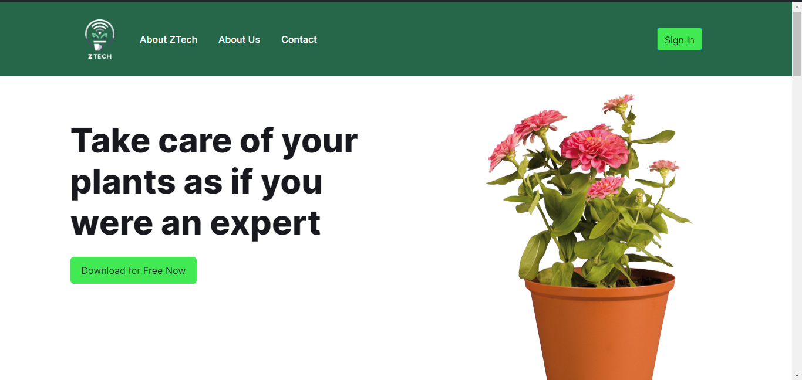
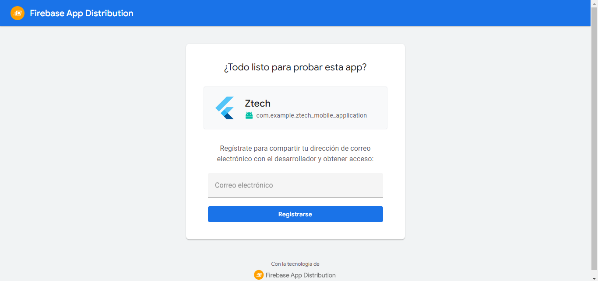

# Avance de Conclusiones, Bibliografía y Anexos
---
**Conclusiones**
- La descripción detallada de la startup y los perfiles de los integrantes del equipo (Capítulo I) son cruciales para entender la capacidad de la empresa para llevar a cabo la solución propuesta. La diversidad de habilidades y experiencias en el equipo puede proporcionar una base sólida para la innovación y la adaptabilidad en el dinámico campo del IoT.
- La implementación del proceso Lean UX (Capítulo I), incluyendo la definición de problemas, suposiciones, hipótesis y el uso del Lean UX Canvas, es esencial para asegurar que el diseño del producto esté alineado con las necesidades reales de los usuarios y que se optimice para iteraciones rápidas y efectivas. Este enfoque ayuda a reducir riesgos y dirigir los esfuerzos de desarrollo hacia características que realmente valoran los usuarios.
- La realización de un análisis competitivo y la formulación de estrategias frente a competidores (Capítulo II) son fundamentales para posicionar la solución de manera efectiva en el mercado. Paralelamente, técnicas como entrevistas, needfinding y la creación de User Personas y Journey Maps son indispensables para una profunda comprensión de las experiencias y necesidades de los usuarios, lo cual es vital para el éxito del producto final.
- El detallado proceso de especificación de requisitos (Capítulo III), incluyendo la creación de User Stories y el Impact Mapping, es crucial para traducir las necesidades y expectativas de los usuarios en funcionalidades concretas que serán desarrolladas. Este proceso no solo asegura que el producto final sea relevante y útil para el usuario final, sino que también facilita la planificación y la gestión del desarrollo del producto.
- La adopción de un diseño estratégico y táctico de Domain-Driven Design (Capítulo IV) ayuda a estructurar la solución de software de manera que esté alineada con el dominio del negocio. Las técnicas como EventStorming y Context Mapping permiten identificar y modelar flujos críticos de negocio, mientras que la definición detallada de la arquitectura de software asegura que el sistema sea escalable, mantenible y seguro.
- El Capítulo V, titulado "Solution UI/UX Design", proporciona una cobertura exhaustiva de los elementos esenciales del diseño de interfaz de usuario e interfaz de usuario para aplicaciones, enfocándose especialmente en la integración y optimización de experiencias de usuario en web, móviles y sistemas IoT. Este capítulo ofrece directrices estilísticas generales y específicas que aseguran la coherencia y accesibilidad del diseño. Se abordan también aspectos estructurales como la arquitectura de información, sistemas de organización, etiquetado, SEO, y sistemas de navegación, todos cruciales para el desarrollo eficaz de interfaces que mejoren la interacción del usuario final con la tecnología IoT. La sección también incluye métodos prácticos para la creación de wireframes, mock-ups, diagramas de flujo de aplicaciones, y prototipos, proporcionando a los estudiantes herramientas fundamentales para conceptualizar y refinamiento visual de soluciones antes de su implementación efectiva.
- El Capítulo VI, "Product Implementation, Validation & Deployment", detalla minuciosamente el proceso de implementación, validación y despliegue de productos software en el contexto de soluciones IoT. Este capítulo abarca desde la gestión de configuración de software y el manejo del código fuente hasta la definición de estilos y convenciones, lo cual es fundamental para mantener la integridad y coherencia del código en proyectos complejos y colaborativos. También se profundiza en la configuración de despliegues de software y se detalla cómo preparar y ejecutar sprints dentro de un entorno ágil, incluyendo la planificación, gestión de backlogs y la generación de evidencia de desarrollo para revisiones de sprint. Adicionalmente, se enfoca en la validación del producto mediante entrevistas, diseño de entrevistas, y evaluaciones heurísticas, asegurando que las soluciones no solo cumplan con las expectativas técnicas sino también con las necesidades del usuario final. Este enfoque integral capacita a los estudiantes para ejecutar proyectos de IoT desde la conceptualización hasta la implementación real y evaluación, destacando la importancia de la colaboración efectiva y el seguimiento riguroso de buenas prácticas a lo largo del ciclo de vida del desarrollo de software.
- Los puntos de aplicaciones web, aplicaciones móviles, aplicaciones embebidas, edge backend y backend general abarcan un espectro integral de desarrollo tecnológico necesario para implementar soluciones de IoT efectivas y completas. Las aplicaciones web y móviles permiten una interfaz accesible y funcional para los usuarios, garantizando que puedan interactuar de manera eficiente con la tecnología IoT desde cualquier dispositivo y ubicación. Las aplicaciones embebidas, por su parte, son cruciales para el funcionamiento autónomo y en tiempo real de los dispositivos IoT, integrando software y hardware para operaciones específicas y eficientes. Por otro lado, el backend de edge y el backend general son esenciales para el procesamiento y la gestión de datos en la periferia y en la nube, respectivamente. Esto permite una recopilación y análisis de datos más rápidos y seguros, facilitando decisiones en tiempo real que son fundamentales para muchos sistemas IoT, como aquellos en el sector ambiental y servicio urbano.

---
**Recomendaciones**
- Asegúrate de que la descripción de tu startup esté bien definida, incluyendo su misión, visión, y los problemas específicos que busca resolver. También es crucial tener perfiles detallados de cada integrante del equipo que resalten sus habilidades únicas y experiencia relevante. Esto no solo facilitará una mejor colaboración interna, sino que también fortalecerá las propuestas de valor ante posibles inversores y clientes.
- Utiliza el proceso Lean UX para iterar rápidamente sobre el diseño y desarrollo del producto. Esto incluye: Crear declaraciones de problema claras y concisas, definir suposiciones y validarlas tempranamente, formular hipótesis que puedan ser probadas con usuarios reales y utilizar el Lean UX Canvas para visualizar y comunicar la estrategia de experiencia de usuario y alineación del equipo.
Estas prácticas ayudarán a asegurar que estás desarrollando un producto que realmente satisface las necesidades de tus usuarios.
- Identifica y estudia a tus competidores para entender sus fortalezas y debilidades. Utiliza esta información para desarrollar estrategias y tácticas que te diferencien en el mercado. Considera tanto competidores directos como indirectos y busca oportunidades para innovar en áreas donde otros no han logrado satisfacer completamente las necesidades del usuario.
- La elicitación y análisis de requisitos son fundamentales para el éxito de cualquier proyecto de desarrollo de soluciones IoT. Dedica tiempo a: Diseñar y realizar entrevistas detalladas para entender profundamente las necesidades de los usuarios, desarrollar y utilizar user personas y user journey maps para capturar y analizar las experiencias y expectativas de los usuarios  y utilizar el mapeo de empatía y escenarios 'As-is' para obtener una comprensión más profunda de los usuarios y su contexto.
- Utiliza técnicas de Domain-Driven Design para estructurar tu arquitectura de software de manera que refleje las necesidades del negocio y sea adaptable a cambios futuros. El EventStorming, el mapeo de contextos y la definición clara de las capas de dominio, interfaz, aplicación e infraestructura son esenciales para desarrollar una solución robusta, escalable y mantenible. 
- En el Capítulo V, "Solution UI/UX Design", se recomienda concentrarse en comprender a fondo las guías de estilo para garantizar coherencia visual y funcional a través de diferentes plataformas. Es esencial profundizar en la arquitectura de la información para estructurar de manera lógica y accesible los datos, facilitando así la usabilidad en sistemas IoT complejos. Desarrolla sistemas de navegación y búsqueda intuitivos que permitan a los usuarios acceder fácilmente a la información necesaria. Además, perfecciona tus habilidades en la creación de prototipos y utiliza diagramas de flujo de usuario y mock-ups para visualizar y testear las interfaces antes de su implementación, lo que te permitirá realizar ajustes basados en feedback real y mejorar la experiencia del usuario final.
- Para el Capítulo VI, "Product Implementation, Validation & Deployment", se recomienda enfocarse en comprender y aplicar efectivamente cada aspecto del proceso de implementación y despliegue de software. Asegúrate de manejar adecuadamente la configuración del software y la gestión del código fuente, utilizando ambientes de desarrollo y convenciones de estilo para mantener la calidad y coherencia del código. Profundiza en las técnicas de configuración de despliegues de software para asegurar que tus aplicaciones se integren y funcionen correctamente en el entorno de producción. Además, es vital que te familiarices con la planificación y ejecución de sprints ágiles, asegurándote de mantener un backlog organizado y generar evidencias de desarrollo que soporten las revisiones de sprint. No olvides la importancia de la validación a través de entrevistas, diseño de entrevistas y evaluaciones heurísticas para asegurar que el producto final cumpla con los requisitos del usuario y las expectativas del mercado.
- Se recomienda diseñar interfaces intuitivas para las aplicaciones web y móviles que mejoren la interacción del usuario y mantengan coherencia entre dispositivos, optimizando la responsividad y accesibilidad. En cuanto a las aplicaciones embebidas, enfócate en integrar efectivamente sensores y actuadores, priorizando la optimización del consumo de energía y la seguridad. Para el edge backend, desarrolla habilidades en procesamiento de datos en el borde de la red para facilitar respuestas rápidas y reducir la latencia, crucial en aplicaciones de tiempo real. Fortalece también tus conocimientos en arquitecturas de servidor y gestión de bases de datos en el backend general, aprendiendo a implementar microservicios o arquitecturas serverless que aseguren escalabilidad y mantenibilidad.

---
**Bibliografía**
- Gothelf, J., & Seiden, J. (2013). Lean UX: Applying lean principles to improve user experience. O'Reilly Media, Inc.
- Cooper, A., Reimann, R., Cronin, D., & Noessel, C. (2014). About face: The essentials of interaction design. John Wiley & Sons.
- Kim, G. J. (2015). Designing virtual reality systems: The structured approach. Springer.
- Podeswa, H. (2009). The business analyst's handbook. Cengage Learning.
- Rubin, K. S. (2012). Essential Scrum: A practical guide to the most popular Agile process. Addison-Wesley.
- Adzic, G. (2011). Impact mapping: Making a big impact with software products and projects. Provoking Thoughts.
- Fowler, M. (2003). Patterns of enterprise application architecture. Addison-Wesley Longman Publishing Co., Inc.
- Vernon, V. (2013). Implementing domain-driven design. Addison-Wesley.
- Young, A. (2017). EventStorming: An act of deliberate collective learning. Leanpub.
- Patton, J. (2014). User story mapping: Discover the whole story, build the right product. O'Reilly Media, Inc.

---
**Anexos**

- **TB1**

---

[Anexo C4 Model](https://c4model.com/)

---

[Lean UX Process](https://link.springer.com/chapter/10.1007/978-3-030-58817-5_37)

---

[Needfinding](https://www.cambridge.org/core/journals/proceedings-of-the-design-society/article/needfinding-practice-enhancing-students-problem-framing-skills-through-iterative-observation-for-business-innovation/62607D2BB63421821769202E85BA6DCA)

---

[User Stories](https://link.springer.com/chapter/10.1007/978-3-319-30282-9_14)

---

[EventStorming](https://d1wqtxts1xzle7.cloudfront.net/59311660/Event_Storming_Case_Studies20190519-70833-1rtyiru-libre.pdf?1558264829=&response-content-disposition=inline%3B+filename%3DIntroducing_EventStorming_An_act_of_Deli.pdf&Expires=1719486406&Signature=goFX~KXlwLGqUrkm4nigVK7QIvlMN~U5Ayzr18djq7bITp6LtYmIqaKlogw4SuMkH1fNHenSdCyHHqie2W9wKvxK1kc0kNGfp-Gaf7aQgdE-ejHbSWKZsPOcJkvt9g4uYJx8u8LmoDFGAfmsyF0mtTXJkDbqAmLvb4d-wbrIV2T6i~V06-yMnZXw4iz5t6w6b0MeQiYF4LhGPd8KQbqGKmkk-~DXOSeEvfjzPRnOXGcveMWJWyATr9KKC47JtgUC3kR59P4oWx4e-l~tj8xwAuVJjirWCBIencguF3FU~wR32dBkV4jnUk0fABgNlWKO4u7rEtfJTK7Vovvrp5rrgQ__&Key-Pair-Id=APKAJLOHF5GGSLRBV4ZA)

---

[Project Report GitHub](https://github.com/LosChiferos-WS71/ztech-reports)

---

[Registro de entrevistas](https://upcedupe-my.sharepoint.com/personal/u202022228_upc_edu_pe/_layouts/15/stream.aspx?id=%2Fpersonal%2Fu202022228%5Fupc%5Fedu%5Fpe%2FDocuments%2FDesarrollo%20de%20Soluciones%20IOT%2FEntrevistas%2FENTREVISTA%20COMPLETA%20PT1%2Emp4&nav=eyJyZWZlcnJhbEluZm8iOnsicmVmZXJyYWxBcHAiOiJPbmVEcml2ZUZvckJ1c2luZXNzIiwicmVmZXJyYWxBcHBQbGF0Zm9ybSI6IldlYiIsInJlZmVycmFsTW9kZSI6InZpZXciLCJyZWZlcnJhbFZpZXciOiJNeUZpbGVzTGlua0NvcHkifX0&ga=1&referrer=StreamWebApp%2EWeb&referrerScenario=AddressBarCopied%2Eview%2E681a2b4c%2D34a5%2D44a6%2D8021%2Db8f5b2f61b38)

---

[Video de exposición TB1](https://upcedupe-my.sharepoint.com/personal/u202022228_upc_edu_pe/_layouts/15/stream.aspx?id=%2Fpersonal%2Fu202022228%5Fupc%5Fedu%5Fpe%2FDocuments%2FDesarrollo%20de%20Soluciones%20IOT%2FExposiciones%20IoT%2Fupc%2Dpre%2D202401%2Dsi572%2Dws71%2Dloschiferos%2Dexpo%2Dtb1%2Emkv&referrer=StreamWebApp%2EWeb&referrerScenario=AddressBarCopied%2Eview%2E62ff986f%2D868f%2D4e78%2D9a7c%2D7602ae37de15)

- **TP1**

---

[Landing Page](https://ztech-landing-page.netlify.app/)

---

[Web Application](https://ztech-web-app.netlify.app/)

---

[Web Application Wireframe](https://www.figma.com/design/8fgTUDRQcKFQrW21PA2Qio/MockUp-de-Ztech---WEB?node-id=2008-379&t=6lYXXqZonJIwNxw8-0)

---

[Web Application Mockup](https://www.figma.com/design/8fgTUDRQcKFQrW21PA2Qio/MockUp-de-Ztech---WEB?node-id=0-1&t=6lYXXqZonJIwNxw8-0)

---

[Mobile Application Wireframe](https://www.figma.com/design/mVlIoKvGPrnFHP8f2xol0a/MockUp-de-Ztech---M%C3%B3vil?node-id=221-1749&t=pja0WpeLrcjaHf31-0)

---

[Mobile Application Mockup](https://www.figma.com/design/mVlIoKvGPrnFHP8f2xol0a/MockUp-de-Ztech---M%C3%B3vil?node-id=0-1&t=pja0WpeLrcjaHf31-0)

---

[Video de exposición TP1](https://upcedupe-my.sharepoint.com/personal/u202022228_upc_edu_pe/_layouts/15/stream.aspx?id=%2Fpersonal%2Fu202022228%5Fupc%5Fedu%5Fpe%2FDocuments%2FDesarrollo%20de%20Soluciones%20IOT%2FExposiciones%20IoT%2Fupc%2Dpre%2D202401%2Dsi572%2Dws71%2Dloschiferos%2Dexpo%2Dtp1%2Emkv&referrer=StreamWebApp%2EWeb&referrerScenario=AddressBarCopied%2Eview%2E144e3339%2D4d80%2D487c%2Db0fe%2D395834d3e597)

- **TB2**

---

[Landing Page GitHub](https://github.com/LosChiferos-WS71/ztech-landing-page)

---

[Web Service GitHub](https://github.com/LosChiferos-WS71/ztech-web-service)

---

[Mobile Application GitHub](https://github.com/LosChiferos-WS71/ztech-mobile-application)

---

[Edge Server GitHub](https://github.com/LosChiferos-WS71/ztech-edge-server)

---

[Embedded Application GitHub](https://github.com/LosChiferos-WS71/ztech-edge-server)

---

[Web Application GitHub](https://github.com/LosChiferos-WS71/ztech-edge-server)

---

[Firebase App Distribution](https://appdistribution.firebase.google.com/pub/i/8298a65df289a4ca)

---

[Web Service](https://ztech-web-service-production.up.railway.app/swagger-ui/index.html)

---

[Video de exposición TB2](https://upcedupe-my.sharepoint.com/personal/u202022228_upc_edu_pe/_layouts/15/stream.aspx?id=%2Fpersonal%2Fu202022228%5Fupc%5Fedu%5Fpe%2FDocuments%2FDesarrollo%20de%20Soluciones%20IOT%2FExposiciones%20IoT%2Fupc%2Dpre%2D202401%2Dsi572%2Dws71%2Dloschiferos%2Dexpo%2Dtb2%2Emp4&referrer=StreamWebApp%2EWeb&referrerScenario=AddressBarCopied%2Eview%2E8713aa8c%2D8bdd%2D410e%2Da1be%2Dbe0c3321f475)

- **TF1**

---

[Video de exposición TF1]()

